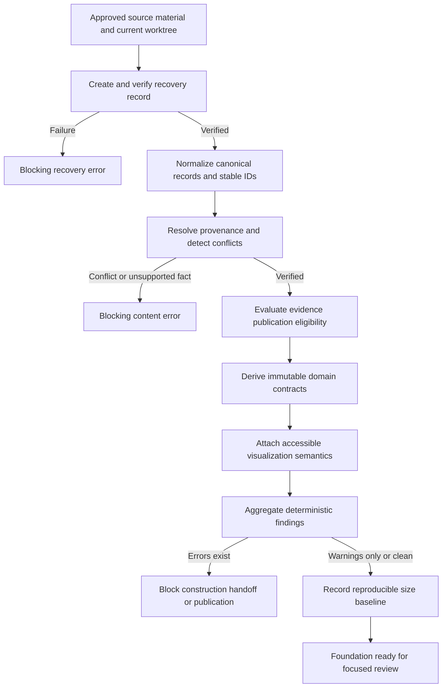

# Business Logic Model - U-01 Foundation and Safe Migration

## Functional Objective

U-01 establishes a trustworthy publication boundary before any rejected presentation is replaced. It determines which facts and evidence may feed the future portfolio, how relationships are derived, how accessibility and loading obligations attach to published information, how the current worktree remains recoverable, and which validation findings block later construction.

## Actors and Outcomes

| Actor | Input or action | Required outcome |
| --- | --- | --- |
| Student owner | Supplies or approves portfolio facts and evidence | Only reviewed information becomes canonical or published. |
| Supporting maintainer | Updates typed records, manifest entries, or foundation contracts | Deterministic validation explains whether the update is publishable. |
| Reviewer | Encounters future claims, visuals, and evidence actions | Information traces to verified content and remains accessible. |
| Build/test workflow | Evaluates source, relationships, assets, and output sizes | Blocking errors stop publication; warnings record safe omissions. |
| Construction workflow | Replaces the rejected presentation incrementally | The starting worktree remains recoverable until approved cleanup. |

## End-to-End Foundation Flow

### Text Alternative

The unit first creates and verifies a recovery record. A failure blocks progress. It then normalizes canonical records, resolves provenance, and blocks unsupported or conflicting facts. Eligible evidence is selected, immutable domain contracts are derived, and accessible visualization semantics are attached. Validation aggregates errors and warnings. Errors block the handoff; warnings may accompany safe omissions. A reproducible size baseline is recorded before the foundation becomes review-ready.

## Workflow 1 - Recoverable Migration

### Inputs

- The current repository revision.
- Modified tracked files, staged changes if any, and relevant untracked files belonging to the rejected attempt.
- An exclusion policy for dependency folders, build output, caches, and unrelated machine files.

### Process

1. Resolve the exact workspace revision and enumerate relevant tracked and untracked state without changing it.
2. Classify each item as rejected-attempt state, approved documentation, pre-existing unrelated user state, or excluded generated material.
3. Capture the rejected-attempt state using the exact mechanism approved in the later Code Generation plan.
4. Produce a recovery manifest containing source revision, capture time, included paths, exclusions, byte sizes, integrity values where appropriate, and restoration instructions.
5. Verify that every relevant enumerated item is represented and that the recovery material is readable.
6. Mark recovery `verified` only when the completeness check passes.
7. Prohibit application-entry switching, replacement, or cleanup while recovery is absent or invalid.

### Outputs

- `RecoverySnapshotRecord` with `pending`, `verified`, or `invalid` state.
- Deterministic findings for missing paths, unreadable material, mismatched integrity values, or incomplete restoration instructions.
- An explicit set of paths protected from cleanup until a later approved unit proves them unused.

## Workflow 2 - Canonical Content Verification

### Inputs

- Existing Minh Tam data records.
- Explicitly reviewed evidence and source documents.
- Approved requirements prohibiting former-owner content, invented metrics, unsupported outcomes, and fabricated scientific values.

### Process

1. Normalize whitespace and accepted URL/date representations without changing factual meaning.
2. Assign or validate stable typed IDs for every referencable record.
3. Attach one or more provenance references to facts that can become visible claims.
4. Compare duplicate claims across approved sources.
5. If values conflict, create a blocking `CONTENT_CONFLICT` finding; do not choose by file age or merge values.
6. Reject former-owner facts, placeholder text, unsupported scientific measurements, unverified authorship, invented proficiency, and unapproved destinations.
7. Validate required identity and all ten section definitions.
8. Produce immutable canonical records for pure selector input.

### Result Rules

- Required invalid data produces an error and no publishable foundation.
- Optional unsupported data is omitted and produces a warning when the omission matters to maintenance.
- No presentation copy may become an alternate factual source.

## Workflow 3 - Evidence Publication Selection

### Eligibility Decision

An asset is publishable only when all required conditions are true:

1. It has a stable `EvidenceId`.
2. Its publication status is explicitly `published`.
3. Provenance and kind are present and valid.
4. Title, caption, and accessible text are meaningful and verified.
5. Its full source exists, is readable, and uses an approved local asset scheme.
6. Its loading strategy is `lazy` or `on-demand` and matches the asset kind.
7. Any preview reference resolves to an approved derivative; a preview is not required.
8. No domain component must import a raw source-archive path to expose it.

### Decision Outcomes

| Condition | Outcome | Severity |
| --- | --- | --- |
| Required manifest field missing | Exclude evidence and block publication | Error |
| Status is not `published` | Exclude evidence | No runtime finding; warning if referenced |
| Full source missing or unsafe | Exclude evidence and block its reference | Error |
| Optional preview absent | Keep text and full action if otherwise eligible | Warning |
| Optional evidence ID absent from a record | Keep verified record and omit action | Warning when expected by an approved relationship |
| Private or raw-only asset encountered | Exclude from active graph | Error if referenced for publication |

## Workflow 4 - Immutable Domain Derivation

1. Accept only a validated `VerifiedPortfolioSource` and eligible evidence manifest.
2. Select records for one approved domain by stable ID and explicit relationship.
3. Resolve evidence IDs through the publication boundary.
4. Omit unavailable optional evidence while preserving verified textual records.
5. Derive only values computable from canonical records, such as ordered categories or evidence counts.
6. Freeze or otherwise treat returned view models as read-only contracts.
7. Return deterministic ordering based on approved order fields, not filesystem order.

Selectors never read the DOM, mutate source data, infer unsupported claims, load files dynamically, or contain layout instructions.

## Workflow 5 - Accessible Visualization Semantics

1. Receive a typed series of verified or derived values plus a declared purpose.
2. Classify the graphic as `informational` or `decorative`.
3. For informational graphics, require a concise title, description, data categories that do not rely on color alone, and a paired semantic list or table derived from the identical values.
4. For decorative graphics, require exclusion from the accessibility tree and prohibit unique information.
5. Reject fabricated biological sequences, measurements, scales, confidence, or result-like encodings.
6. Produce a validation error if informational meaning is unavailable through the paired semantic representation.

## Workflow 6 - Validation Aggregation

### Finding Model

Every finding contains a stable rule code, `error` or `warning` severity, affected entity or path, concise explanation, and actionable resolution. Results are deterministic: identical inputs produce the same sorted findings.

### Aggregation

1. Run source, relationship, evidence, asset, visualization, import-boundary, style-boundary, and recovery rules.
2. De-duplicate findings by rule code and target.
3. Sort by severity, rule code, and stable target.
4. Set `canProceed` to `false` when any error exists.
5. Preserve warnings in the validation report when `canProceed` remains true.

## Workflow 7 - Performance Baseline

1. Record the current source revision, package-lock integrity, runtime/tool versions, build command, base-path inputs, and capture time.
2. Run the reproducible current production build without changing source content.
3. Measure exact bytes for emitted JavaScript, CSS, and the complete deployable output; also record minified and compressed figures where the build process produces them deterministically.
4. Record asset categories separately so large evidence does not hide initial-code changes.
5. Treat a failed baseline build or incomplete measurement as a blocking finding to diagnose, not as permission to reuse the approximate 893 kB figure.
6. Store the baseline as comparison evidence; later units append measurements without redefining it.

## External and Persistence Boundary

- No runtime API, database, CMS, analytics, upload, authentication, or remote publication service exists.
- Browser storage is not a content or evidence source.
- U-01 may describe build tools and local filesystem inputs, but exact technical commands belong to the later Code Generation plan.
- Visitor data is neither collected nor persisted by this unit.

## Functional Scenarios

| Scenario | Expected behavior |
| --- | --- |
| Two approved sources disagree on a date | Emit a blocking conflict and preserve neither as an inferred public value. |
| Required identity is empty | Emit a blocking error. |
| Optional evidence is missing | Keep verified text, omit its action, and emit a warning. |
| Evidence is present but not published | Keep it outside the active graph; error if a visible record references it. |
| Preview is missing but the full published file is valid | Preserve the full on-demand action and emit a warning. |
| Informational graphic lacks a semantic equivalent | Emit a blocking error. |
| Decorative graphic contains unique information | Reclassify as informational and require an equivalent, or remove the meaning. |
| Recovery manifest omits a relevant untracked file | Mark recovery invalid and block replacement work. |
| Baseline build fails | Emit a blocking baseline finding and diagnose before comparison. |
| Identical validation inputs run twice | Return findings with identical codes, targets, severities, and order. |

## Story and Requirement Coverage

| Area | Stories | Requirements |
| --- | --- | --- |
| Content trust and privacy | ST-013 | NFR-006, NFR-007, AR-004 |
| Semantic and operable foundations | ST-016 | NFR-001, FR-016 |
| Visualization equivalence | ST-017 | FR-013, NFR-001, NFR-006 |
| Baseline and loading contracts | ST-018 | NFR-002, FR-017 |
| Responsive foundations | ST-019 | FR-016, NFR-001, NFR-008 |
| Deterministic fallbacks | ST-020 | NFR-005, NFR-008, FR-008, FR-018 |
| Safe maintenance and migration | ST-021 | FR-017, FR-018, NFR-003, NFR-004, AR-001, AR-002, AR-003, AR-005 |

## Extension Compliance

- **Security Baseline**: Skipped because it is disabled in the active workflow state.
- **Property-Based Testing**: Skipped because it is disabled in the active workflow state.
