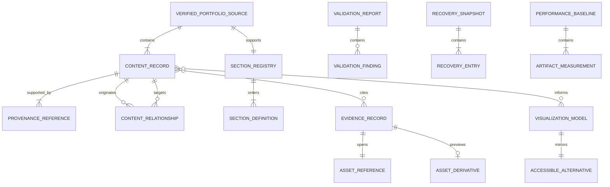

# Domain Entities - U-01 Foundation and Safe Migration

## Domain Boundary

The U-01 domain is publication trust, not visual presentation. Its entities describe verified facts, relationships, evidence eligibility, accessible information, validation outcomes, recovery state, and measurable build baselines. Later units consume these immutable contracts and own their distinct compositions.

## Entity Relationship Overview

### Text Alternative

The verified portfolio source contains content records supported by provenance and linked through typed relationships. The source supports one registry containing ten section definitions. Content may cite published evidence, which opens a full asset and may have a preview derivative. Content may also inform visualization models, each paired with an accessible alternative. Validation reports contain findings. A recovery snapshot contains recovery entries, and a performance baseline contains artifact measurements.

## Identity and Value Types

| Type | Meaning | Invariant |
| --- | --- | --- |
| `ContentId` | Stable identity for a canonical record | Nonempty, unique, normalized, and unchanged by presentation. |
| `EvidenceId` | Stable identity for a publication record | Unique across the manifest and never derived from a display filename. |
| `SectionId` | One approved continuous-page domain | Exactly one of the ten approved IDs. |
| `RelationshipId` | Stable identity for a typed source-to-target link | Unique and references existing compatible records. |
| `RuleCode` | Stable validation rule identifier | Matches one documented rule and remains stable for tests. |
| `RelativeAssetPath` | Repository-local published asset reference | Normalized, non-traversing, within an approved asset boundary. |
| `IntegrityValue` | Digest or equivalent completeness value | Includes algorithm and value; cannot be empty when required. |
| `ByteCount` | Exact nonnegative file or category size | Integer greater than or equal to zero. |
| `NormalizedDate` | Verified date or period representation | Preserves source precision; unknown day/month is not invented. |

## `VerifiedPortfolioSource`

### Purpose

Aggregate root for all canonical portfolio facts that later selectors may expose.

### Attributes

| Attribute | Cardinality | Rule |
| --- | --- | --- |
| identity | Exactly one | Required, verified, and Minh Tam-specific. |
| records | One or more | Stable IDs and explicit domain kinds. |
| relationships | Zero or more | Typed, valid, and non-circular where the relationship kind forbids cycles. |
| provenance catalog | One or more | Every visible factual record resolves to approved provenance. |
| schema version | Exactly one | Changes only through an approved contract amendment. |

### Invariants

- Contains no former-owner identity or unsupported portfolio record.
- Does not import or encode presentation geometry.
- Is treated as immutable after validation.
- Does not embed raw private file content.
- Provides sufficient data for all ten approved domain selectors, with optional records explicitly optional.

## `ContentRecord`

### Purpose

Represents one verified identity, question, project, laboratory activity, data story, academic item, tool context, fieldwork activity, leadership activity, journal summary, or contact fact.

| Attribute | Requirement |
| --- | --- |
| id | Unique `ContentId`. |
| kind | One approved content-record kind. |
| label/title | Verified semantic label; nonempty when the kind requires it. |
| facts | Read-only set of provenanced factual values. |
| date or period | Optional and precision-preserving. |
| relationship IDs | Existing, compatible targets only. |
| evidence IDs | Existing published evidence or safely absent optional references. |
| source status | `verified`, `conflicted`, or `excluded`. |

Only `verified` records are selector inputs. `conflicted` records block publication when required or referenced. `excluded` records remain outside public view models.

## `ProvenanceReference`

### Purpose

Explains why a fact is trusted without publishing private source material.

| Attribute | Requirement |
| --- | --- |
| provenance ID | Stable and unique. |
| source category | Approved canonical record, reviewed evidence, or explicit owner confirmation. |
| source locator | Maintainer-facing local reference or description; never an unsafe public URL. |
| supported fact keys | One or more precise fields or claims. |
| review state | `approved`, `conflicted`, or `excluded`. |

Conflicting approved provenance does not resolve by recency. It produces a blocking finding and requires explicit review.

## `ContentRelationship`

### Purpose

Connects content without duplicating its facts.

| Attribute | Requirement |
| --- | --- |
| id | Unique `RelationshipId`. |
| source ID | Existing `ContentId`. |
| target ID | Existing `ContentId` or `EvidenceId` permitted by kind. |
| kind | Approved relationship such as `motivates`, `uses-method`, `uses-tool`, `supported-by`, `documented-in`, or `continues-as-note`. |
| order | Optional deterministic sequence. |

Relationships cannot introduce claims absent from the linked records. A relationship type defines compatible source and target kinds.

## `SectionRegistry` and `SectionDefinition`

### Purpose

Provide the immutable ten-domain navigation and composition contract.

The registry contains exactly these ordered definitions:

1. `identity`
2. `questions`
3. `computational-projects`
4. `laboratory-research`
5. `data-stories`
6. `academic-trajectory`
7. `evidence-library`
8. `tools`
9. `fieldwork-leadership`
10. `contact`

Each definition has one unique ID, label, short label, hash, order, and component key. Its hash cannot overlap the journal-detail namespace.

## `EvidenceRecord`

### Purpose

Represents one item explicitly eligible for publication.

| Attribute | Requirement |
| --- | --- |
| id | Unique `EvidenceId`. |
| publication status | Exactly `published` for an active record. |
| kind | Publication, poster, presentation, certificate, transcript, scholarship, or field image. |
| provenance | Nonempty approved context. |
| title and caption | Verified, concise, and non-duplicative. |
| accessible text | Describes the asset's supported purpose without extra claims. |
| full asset | Required valid `AssetReference`. |
| preview | Optional valid `AssetDerivative`. |
| load strategy | `lazy` or `on-demand`; full large files are on demand. |

Candidate, private, rejected, and raw-only items are not instances of active `EvidenceRecord`; they remain outside the published manifest.

## `AssetReference` and `AssetDerivative`

### `AssetReference`

- Identifies a readable, approved, repository-local published file.
- Contains relative path, media kind, byte count when measured, and optional integrity value.
- Cannot traverse outside the approved asset boundary.
- Cannot point directly into a raw source archive from an active component.

### `AssetDerivative`

- Links to one full source asset through provenance.
- Records intended use, dimensions when visual, media kind, and byte count.
- Must not alter the factual content or create misleading context.
- Is optional; its absence cannot invalidate an otherwise eligible full evidence action.

## `DomainViewModel`

### Purpose

Read-only result of a pure domain selector.

### Invariants

- Belongs to exactly one `SectionId`.
- Contains verified display data and resolved published evidence summaries only.
- Has deterministic ordering.
- Contains no raw source path, mutation method, persistence handle, network client, or layout instruction.
- Keeps verified text when optional evidence is omitted.

Concrete domain view models are defined by later units against this base contract.

## `VisualizationModel`

### Purpose

Represents an informational or decorative scientific visual without fabricating data.

| Attribute | Informational | Decorative |
| --- | --- | --- |
| purpose | `informational` | `decorative` |
| title | Required | Omitted from accessibility tree |
| description | Required | Omitted from accessibility tree |
| typed values | Required | May contain visual-only parameters with no unique meaning |
| categories/states | Distinguishable without color alone | No semantic category |
| accessible alternative | Required | Not applicable |

Informational types may model verified relationships, ordered categorical stages, or counts derived from the published manifest. They never imply actual genomic sequences, measured biological values, experimental outcomes, or statistical confidence unless such data is explicitly approved.

## `AccessibleAlternative`

### Purpose

Provides the semantic equivalent of one informational visualization.

- Has a one-to-one relationship with an informational `VisualizationModel`.
- Uses a list for relationships or a table for repeated comparable fields.
- Is derived from the same typed values as the visual.
- Preserves labels, ordering, categories, and relationships.
- Remains operable and understandable without color, shape, or motion.

## `ValidationFinding` and `ValidationReport`

### `ValidationFinding`

| Attribute | Requirement |
| --- | --- |
| code | Stable `RuleCode`. |
| severity | `error` or `warning`. |
| target | Stable entity ID or normalized path. |
| message | Concise explanation of the failed rule. |
| resolution | Actionable maintainer guidance. |

### `ValidationReport`

- Contains deterministically sorted, de-duplicated findings.
- Exposes counts by severity.
- Sets `canProceed` to false when any error exists.
- Retains warnings when `canProceed` is true.
- Contains no mutable entity references.

## `RecoverySnapshotRecord` and `RecoveryEntry`

### `RecoverySnapshotRecord`

| Attribute | Requirement |
| --- | --- |
| snapshot ID | Unique and stable for the capture. |
| state | `pending`, `verified`, or `invalid`. |
| source revision | Exact repository revision at enumeration. |
| captured at | Timestamp with timezone. |
| entries | One or more relevant `RecoveryEntry` values. |
| exclusions | Explicit paths and rationales. |
| restoration instructions | Complete and testable without relying on editor undo. |

The state can move from `pending` to `verified` only after completeness and readability checks. Any mismatch moves it to `invalid` until recaptured or corrected.

### `RecoveryEntry`

- Records normalized path, state category, byte size, capture location, and integrity value where appropriate.
- Classifies the source as tracked modification, staged change, relevant untracked item, or explicitly preserved unrelated user state.
- Never authorizes deletion of the original.

## `PerformanceBaseline` and `ArtifactMeasurement`

### `PerformanceBaseline`

Contains source revision, lockfile identity, runtime and build-tool versions, build command, base-path input, capture time, build outcome, and artifact measurements. A failed build yields an invalid baseline with a blocking finding.

### `ArtifactMeasurement`

| Attribute | Requirement |
| --- | --- |
| path or category | Stable emitted path or named aggregate. |
| category | JavaScript, CSS, initial asset, evidence asset, or total deployable output. |
| exact bytes | Required nonnegative integer. |
| compressed bytes | Optional supplemental value. |
| initial-path status | Explicit boolean or not-applicable classification. |

## `SemanticTokenContract`

### Purpose

Defines meaning shared by later styles without defining their geometry.

It includes semantic roles for canvas, elevated surface, primary and secondary text, accent, focus, rule, positive/neutral/caution data categories, typography, spacing scale, motion duration, reduced-motion behavior, and elevation. Every color role has light and dark values designed for later contrast validation. Tokens cannot encode domain-specific layout or rejected selector names.

## Aggregate Ownership and Mutation

| Aggregate | Created or validated by | Runtime mutation |
| --- | --- | --- |
| Verified portfolio source | Maintainer input plus U-01 validation | None |
| Section registry | U-01 approved contract | None |
| Evidence manifest | Maintainer publication decision plus U-01 validation | None |
| Domain view models | Pure selectors | None |
| Visualization models | Pure transforms in owning units | None |
| Validation report | Deterministic validation aggregation | None |
| Recovery snapshot | Approved construction workflow | None after verification |
| Performance baseline | Approved build measurement workflow | None; later comparisons append separately |

## Extension Compliance

- **Security Baseline**: Skipped because it is disabled in the active workflow state.
- **Property-Based Testing**: Skipped because it is disabled in the active workflow state.
