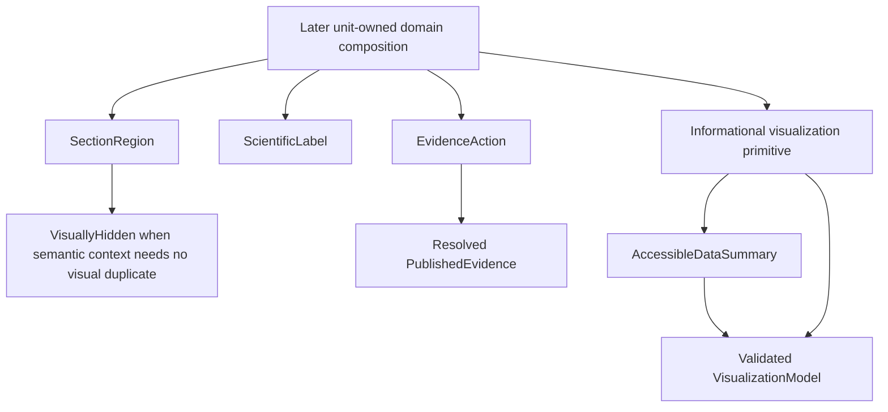
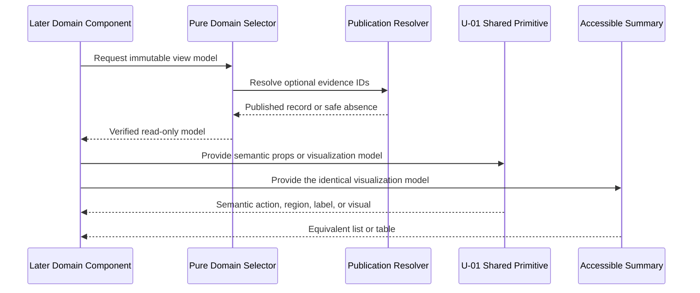

# Frontend Components - U-01 Foundation and Safe Migration

## Frontend Boundary

U-01 defines small semantic primitives and typed visualization contracts that later units may compose. It does not implement the observatory shell, navigation, identity, or any final content-domain layout. Shared components standardize accessibility and publication behavior without producing a generic visual system.

## Conceptual Hierarchy

### Text Alternative

A later unit owns each domain composition. It may use SectionRegion, ScientificLabel, EvidenceAction, or an informational visualization. Every informational visualization and its AccessibleDataSummary consume the same validated visualization model. EvidenceAction consumes resolved published evidence. SectionRegion may use VisuallyHidden for semantic context that would otherwise duplicate visible copy.

## Component Ownership Matrix

| Component or contract | U-01 owns | Later unit owns |
| --- | --- | --- |
| `SectionRegion` | Landmark, ID, heading association, optional review seam | Section content and all visual geometry |
| `EvidenceAction` | Valid published-evidence action semantics and safe absence | Placement, surrounding caption, and domain composition |
| `ScientificLabel` | Semantic label/caption relationship | Domain terminology and placement |
| `VisuallyHidden` | Correct visually-hidden behavior | Decision that hidden copy is necessary and non-duplicative |
| `AccessibleDataSummary` | Semantic list/table rendering contract | Verified labels, values, relationships, and presentation choice |
| Visualization base contract | Title, description, purpose, semantic-equivalent association | Specific chart/network/track transform and unique domain composition |
| Semantic tokens | Meaning for both themes, focus, motion, and data roles | Component geometry and local responsive behavior |

## `SectionRegion`

### Purpose

Provide a correct section landmark and heading relationship without prescribing layout.

### Props Contract

| Prop | Required | Rule |
| --- | --- | --- |
| `id` | Yes | One approved `SectionId`. |
| `labelledBy` | Yes | References the visible section heading ID. |
| `children` | Yes | Unit-owned semantic content. |
| `reviewId` | Optional | Stable purpose-based review seam, not a layout selector. |

### State

None. The region does not know active navigation, progress, theme, or route state.

### Validation

- The ID and heading reference are nonempty and unique in the composed page.
- The component cannot add card, timeline, ledger, sidebar, or shared section geometry.
- A later section cannot change semantic order through CSS.

## `EvidenceAction`

### Purpose

Expose an accessible on-demand action for one already resolved published evidence record.

### Props Contract

| Prop | Required | Rule |
| --- | --- | --- |
| `evidence` | Yes | Valid `PublishedEvidence`, never a raw filename or candidate record. |
| `actionLabel` | Yes | Names the evidence and expected action or file context. |
| `descriptionId` | Optional | Associates caption, type, or file context. |
| `testId` | Optional | Stable purpose-based evidence boundary only. |

### State

No persisted state. A browser-level activation may open the valid local asset. Modal, gallery, or preview state is not owned by U-01.

### Interaction Flow

1. A domain selector resolves an evidence ID through the manifest.
2. If resolution returns safe absence, the domain retains verified text and omits the action.
3. If it returns `PublishedEvidence`, the action exposes a clear accessible name and context.
4. Activation follows the approved full source on demand without collecting visitor information.

### Validation

- The component cannot accept unpublished evidence.
- Disabled links and broken placeholders are not valid fallback states; the action is omitted instead.
- Full documents are never embedded or prefetched by this primitive.

## `ScientificLabel`

### Purpose

Associate concise scientific classification or provenance text with content using ordinary semantics.

### Props Contract

- `children`: Required verified label text.
- `as`: Restricted semantic text element appropriate to the owning context.
- `describes`: Optional ID association when the label describes another element.

### State and Interaction

None. A label is not a tooltip, badge control, filter, or proficiency score.

### Validation

- It cannot encode meaning by color alone.
- It cannot invent a category absent from canonical data.
- It supplies no fixed pill, card, or repeated-grid geometry.

## `VisuallyHidden`

### Purpose

Keep necessary semantic content available to assistive technology when a visible duplicate would be redundant.

### Props Contract

- `children`: Required meaningful text or inline semantic content.

### Rules

- Content remains in the accessibility tree and cannot use `display: none`, `visibility: hidden`, zero-size clipping that loses focus, or `aria-hidden`.
- Interactive children are prohibited unless a later Functional Design explicitly demonstrates a correct use.
- It does not repair an unlabeled control whose visible label should be improved instead.

## `AccessibleDataSummary`

### Purpose

Render the semantic equivalent of one informational visualization from the identical typed values.

### Props Contract

| Prop | Required | Rule |
| --- | --- | --- |
| `model` | Yes | Valid informational `VisualizationModel`. |
| `format` | Yes | `list` for relationships or `table` for repeated comparable fields. |
| `heading` or accessible label | Yes | Identifies the summary's purpose. |
| `visualId` | Yes | Associates the summary with its visual counterpart. |
| `initiallyVisible` | Yes | Defaults to visible unless a later accessible disclosure is justified. |

### State

Stateless when visible. If a later unit uses a disclosure, that owning unit controls disclosure state and must keep the control operable with keyboard and assistive technology.

### Validation

- Summary labels, values, relationships, and order exactly match the visual model.
- Tables have header associations; lists have meaningful item structure.
- It cannot summarize data not present in the typed model.

## Informational Visualization Base Contract

### Purpose

Define the common semantic requirements for later unique SVG visualizations such as relationship networks, ordered categorical tracks, and evidence distributions.

### Props Contract

| Prop | Required | Rule |
| --- | --- | --- |
| `model` | Yes | Valid `VisualizationModel` derived from approved data. |
| `title` | Yes | Concise accessible name. |
| `description` | Yes | Explains the supported relationship, ordering, or counts. |
| `summaryId` | Yes | References the paired `AccessibleDataSummary`. |
| `reducedMotion` | Yes | Preserves meaning while removing nonessential motion. |

### State

The base contract owns no selection, tooltip, zoom, animation, or navigation state. A later unit may propose interaction only through its approved Functional Design, including keyboard, focus, fallback, and equivalent-information rules.

### Validation

- Data and category semantics do not depend on color alone.
- Title/description IDs are unique.
- Derived values match the paired summary.
- Decorative marks inside an informational SVG are hidden without hiding the SVG's semantic identity.
- The model contains no fabricated sequence, measurement, outcome, scale, or confidence.

## Decorative Visualization Contract

A decorative graphic declares `purpose: decorative`, is excluded from the accessibility tree, cannot receive focus, and conveys no unique relationship, state, label, or instruction. It does not require `AccessibleDataSummary` because removing it must leave all meaning intact.

## Semantic Token Contract

U-01 provides semantic roles rather than component styling:

- Canvas, elevated surface, primary text, secondary text, accent, focus, and rule.
- Positive, neutral, caution, and scientific data-category roles distinguishable beyond hue.
- Typography roles, spacing scale, border and elevation roles.
- Motion duration and reduced-motion behavior.
- Light and dark values under one root theme attribute.

Later components consume tokens in local styles. They cannot add theme-specific render branches or use shared tokens as permission to repeat geometry.

## Frontend Validation Flow

### Text Alternative

A later domain asks a pure selector for a view model. The selector resolves optional evidence through the publication boundary and returns verified immutable data. The domain passes semantic data to an appropriate U-01 primitive. When the primitive is an informational visualization, the domain also passes the same model to an accessible list or table.

## Failure and Fallback Behavior

| Failure | Component behavior | Validation behavior |
| --- | --- | --- |
| Evidence resolves to safe absence | Omit EvidenceAction; preserve verified surrounding text | Warning when the relationship was expected but optional |
| Informational visual lacks summary | Do not treat the visual slice as complete | Blocking VIS-003 finding |
| Invalid section ID | SectionRegion contract is invalid | Blocking SEC finding |
| Missing visible label | Improve the visible label; do not hide a compensating guess | Blocking semantic finding |
| Reduced motion active | Remove nonessential transitions; preserve values and state | Blocking if meaning changes |
| System font used | Preserve hierarchy, wrapping, and reachability | Later responsive check verifies behavior |

## API and Persistence Integration

- **Backend endpoints**: None.
- **Runtime network requests**: None required by U-01.
- **Database or CMS**: None.
- **Analytics or tracking**: None.
- **Upload or form submission**: None.
- **Browser persistence**: None for content, evidence, validation, or recovery.
- **Static asset integration**: Only resolved published asset references reach future actions; build-time access does not become a browser API.

## Explicit Non-Components

U-01 does not create a generic card, section template, timeline, ledger, sidebar, drawer, casebook, notebook, Quarto frame, layout switcher, app shell, profile hero, domain content section, modal system, toast system, gallery, carousel, data-fetching client, or state store.

## Test Seams

- Prefer semantic roles, names, headings, and table/list structure.
- Purpose-based test IDs are permitted only at evidence, visualization-alternative, or review boundaries where semantics do not uniquely identify the behavior.
- Tests must not select generated CSS Module names or decorative DOM depth.
- Contract tests compare visualization values with semantic-summary values.
- Boundary tests reject prohibited imports, selectors, and raw assets.

## Extension Compliance

- **Security Baseline**: Skipped because it is disabled in the active workflow state.
- **Property-Based Testing**: Skipped because it is disabled in the active workflow state.
