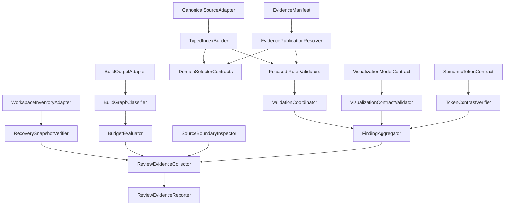

# Logical Components - U-01 Foundation and Safe Migration

## Component Model

U-01 uses local pure modules plus narrowly scoped build/test adapters. It introduces no runtime infrastructure service. Browser-facing modules never access the filesystem, enumerate directories, execute build commands, capture recovery data, or read machine-level environment state.

## Logical Dependency Diagram

### Text Alternative

The canonical source adapter feeds a typed index builder. Indexed data and the evidence publication resolver feed focused validators and future selector contracts. Validators run through a coordinator and deterministic finding aggregator. Visualization contracts and token contrast verification also feed findings. Separate build/test adapters inventory the workspace, verify recovery, classify build output, evaluate budgets, and inspect source boundaries. Those results and validation findings feed an evidence collector and final review reporter.

## Execution Boundaries

| Boundary | May run in browser bundle | May access filesystem/build metadata | May terminate a check on failure |
| --- | --- | --- | --- |
| Canonical types and immutable source | Yes | No | No |
| Typed index and pure validators | Yes when later runtime validation is justified; preferred at test/build time | No | No |
| Evidence publication resolver | Yes | No; consumes explicit manifest imports | No |
| Selector and visualization contracts | Yes | No | No |
| Semantic primitives and tokens | Yes | No | No |
| Workspace inventory and recovery verifier | No | Yes | Yes, through the calling approved check |
| Build classifier and budget evaluator | No | Yes | Yes, through the calling approved check |
| Source/deployable boundary inspector | No | Yes | Yes, through the calling approved check |
| Review evidence collector/reporter | No | Yes to approved result files | Yes when required evidence is incomplete |

## Browser-Safe Domain Components

## `CanonicalSourceAdapter`

- **Purpose**: Convert existing verified Minh Tam records into the canonical U-01 aggregate without presentation metadata.
- **Inputs**: Explicit approved source modules and provenance references.
- **Outputs**: Immutable `VerifiedPortfolioSource` or typed invalid result.
- **Depends on**: Domain types and normalization helpers only.
- **Failure behavior**: Returns blocking findings for required absence, conflict, former-owner data, unsafe values, or unsupported claims; never guesses.
- **Performance**: Normalizes each input once.
- **Boundary**: No React, DOM, CSS, asset-directory enumeration, runtime I/O, or presentation imports.

## `TypedIndexBuilder`

- **Purpose**: Create immutable lookup indexes for content, provenance, relationships, sections, and evidence.
- **Inputs**: Normalized read-only arrays.
- **Outputs**: Read-only maps plus duplicate-ID findings.
- **Depends on**: Stable ID and entity contracts.
- **Failure behavior**: Duplicate keys remain findings; later records never silently overwrite earlier records.
- **Scalability**: One predictable pass per collection and keyed relationship lookup.

## `EvidenceManifest`

- **Purpose**: Declare the only assets eligible for future publication.
- **Inputs**: Explicit maintainer-authored records and approved local asset references.
- **Outputs**: Read-only candidate manifest for validation.
- **Depends on**: Evidence, asset, provenance, and loading-strategy types.
- **Failure behavior**: Invalid records do not become published values.
- **Boundary**: Does not enumerate raw directories or infer publication from file presence.

## `EvidencePublicationResolver`

- **Purpose**: Resolve stable IDs to validated `PublishedEvidence` values or safe optional absence.
- **Inputs**: Validated manifest and requested IDs.
- **Outputs**: Published record, safe absence, and applicable warning.
- **Depends on**: Evidence validator and typed index.
- **Failure behavior**: Required invalid or unsafe records yield errors; optional absence preserves verified surrounding content.
- **Performance**: Constant-time indexed lookup after manifest validation.

## `DomainSelectorContracts`

- **Purpose**: Define how six later units derive read-only domain view models.
- **Inputs**: Validated canonical aggregate, typed indexes, and publication resolver.
- **Outputs**: Deterministically ordered immutable view models.
- **Depends on**: Domain entities, stable relationships, and published evidence summaries.
- **Failure behavior**: Does not produce required invalid aggregates; omits optional evidence without omitting verified text.
- **Boundary**: Concrete domain selectors may be implemented incrementally by owning units, but cannot change the base invariants silently.

## `VisualizationModelContract`

- **Purpose**: Represent verified informational or decorative graphics independently of SVG geometry.
- **Inputs**: Verified or exactly derived typed values, purpose, labels, and relationship categories.
- **Outputs**: Informational model with title/description/summary contract or decorative model with no semantic information.
- **Depends on**: Stable content IDs and visualization value types.
- **Failure behavior**: Fabricated measurements, missing purpose, or incomplete informational semantics produce invalid models.

## `VisualizationContractValidator`

- **Purpose**: Prove that informational visuals and semantic summaries use identical values and that decorative visuals contain no unique meaning.
- **Inputs**: Visualization model and accessible-summary representation.
- **Outputs**: VIS-family findings.
- **Depends on**: Visualization and summary contracts only.
- **Failure behavior**: Missing titles/descriptions, mismatched values, or color-only meaning are blocking errors.

## `SemanticPrimitiveContracts`

- **Purpose**: Define accessible region, action, label, hidden-text, evidence, and data-summary behavior.
- **Inputs**: Verified labels, IDs, published evidence, and typed visualization models.
- **Outputs**: Typed props and semantic rendering obligations for later components.
- **Depends on**: Native HTML/SVG semantics and domain types.
- **Failure behavior**: Invalid IDs, unlabeled actions, unpublished evidence, or inaccessible alternatives are contract errors.
- **Boundary**: No generic card, timeline, ledger, sidebar, section layout, or domain geometry.

## `SemanticTokenContract`

- **Purpose**: Provide global semantic roles for light/dark color, focus, typography, spacing, motion, borders, elevation, and data categories.
- **Inputs**: Explicit token definitions for both themes.
- **Outputs**: Stable CSS custom-property contract and review fixtures.
- **Depends on**: No component implementation.
- **Failure behavior**: Missing mode values or invalid token relationships block foundation acceptance.
- **Boundary**: Does not encode later unit geometry or rejected selector names.

## Validation Components

## Focused Rule Validators

| Validator | Inputs | Findings | Key boundary |
| --- | --- | --- | --- |
| `RecoveryRuleValidator` | Recovery record | REC | Build/test only; does not capture or modify files. |
| `ContentRuleValidator` | Canonical source and provenance indexes | CNT | No presentation imports. |
| `SectionRuleValidator` | Section registry | SEC | Enforces exact ten-domain order. |
| `EvidenceRuleValidator` | Candidate manifest and asset reference facts | EVD | Cannot publish or load an asset itself. |
| `DerivationRuleValidator` | Source/index/selector contract results | DRV | Checks purity-facing invariants and ordering. |
| `VisualizationRuleValidator` | Visualization and summary models | VIS | No SVG layout ownership. |
| `SemanticUiRuleValidator` | Primitive/token contracts and focused render results | UI | Checks semantics, not visual sameness. |
| `BoundaryRuleValidator` | Normalized inspection results | BND | Pure evaluation; filesystem scan is adapter-owned. |
| `PerformanceRuleValidator` | Baseline and budget comparisons | PER | Pure math; build access is adapter-owned. |
| `IntegrationRuleValidator` | Import/persistence/integration facts | INT | Enforces local static boundary. |

All focused validators return data. They do not print, terminate processes, retry, write files, or mutate the inspected input.

## `ValidationCoordinator`

- **Purpose**: Invoke applicable validator families with explicit immutable contexts.
- **Inputs**: Validated/normalized entity contexts and inspection facts.
- **Outputs**: Ordered collections of raw findings by family.
- **Depends on**: Focused validators.
- **Failure behavior**: An unexpected validator exception is surfaced to the test/check boundary and blocks acceptance; it is not swallowed.
- **Scalability**: Runs each family once per assessment.

## `FindingAggregator`

- **Purpose**: Produce one deterministic `ValidationReport`.
- **Inputs**: Findings from all applicable families.
- **Outputs**: De-duplicated, sorted findings, counts, and `canProceed`.
- **Depends on**: Stable rule codes, target normalization, and severity ordering.
- **Failure behavior**: Unknown severities or malformed findings are programmer errors surfaced by tests.
- **Determinism**: Errors precede warnings, then rule code and normalized target define order.

## Build/Test Adapters and Inspectors

## `WorkspaceInventoryAdapter`

- **Purpose**: Read the current revision and relevant tracked, staged, untracked, excluded, and unrelated state without modifying it.
- **Inputs**: Explicit workspace root and approved classification rules.
- **Outputs**: Normalized `WorkspaceInventory`.
- **Depends on**: Local version-control/filesystem commands selected in the Code Generation plan.
- **Failure behavior**: Incomplete or unreadable enumeration blocks recovery verification.
- **Safety**: Read-only; never resets, checks out, cleans, stashes, deletes, or rewrites the worktree.

## `RecoveryCaptureAdapter`

- **Purpose**: Execute only the exact non-destructive capture mechanism approved in the Code Generation plan.
- **Inputs**: Verified inventory and explicit destination.
- **Outputs**: Capture references and integrity facts for the recovery record.
- **Depends on**: Local tools already available or separately approved.
- **Failure behavior**: Partial capture remains invalid and cannot authorize replacement.
- **Safety**: Does not remove or mutate original in-scope files.

## `RecoverySnapshotVerifier`

- **Purpose**: Reconcile inventory, capture, integrity values, exclusions, and restoration instructions.
- **Inputs**: Workspace inventory and pending recovery record.
- **Outputs**: Verified or invalid snapshot result plus findings and restoration evidence.
- **Depends on**: Pure recovery validator and read-only capture inspection.
- **Failure behavior**: Any unrepresented relevant item, mismatch, unreadable input, or failed rehearsal blocks acceptance.

## `BuildOutputAdapter`

- **Purpose**: Run or inspect the approved production build and expose normalized artifact metadata.
- **Inputs**: Exact build command, source revision, lockfile identity, tool versions, base path, and output directory.
- **Outputs**: Build result and artifact graph facts.
- **Depends on**: Existing Vite/TypeScript toolchain.
- **Failure behavior**: Failed or incomplete build creates a blocking baseline finding.
- **Boundary**: Does not mutate source or redefine measurement categories.

## `BuildGraphClassifier`

- **Purpose**: Classify emitted files as initial JavaScript, initial CSS, other initial assets, lazy code, preview assets, full evidence, or other deployable output.
- **Inputs**: Normalized Vite metadata/entry references and exact file sizes.
- **Outputs**: Deterministically ordered categorized measurements.
- **Depends on**: Build output facts and manifest metadata.
- **Failure behavior**: An unclassifiable eager artifact blocks reliable budget evaluation.

## `BudgetEvaluator`

- **Purpose**: Apply absolute and regression budgets.
- **Inputs**: Categorized measurements, 460,800-byte JavaScript limit, 76,800-byte CSS limit, latest approved comparable baseline, and 10-percent threshold.
- **Outputs**: Budget status, exact differences, percentages, and PER findings.
- **Depends on**: Pure numeric comparison only.
- **Failure behavior**: Absolute breaches and unapproved regressions greater than 10 percent are blocking.

## `SourceBoundaryInspector`

- **Purpose**: Produce normalized facts about imports, asset paths, URL schemes, selectors, `!important`, runtime dependencies, and deployable files.
- **Inputs**: Explicit approved source roots, manifest, build output, and prohibited-pattern catalog.
- **Outputs**: Inspection facts consumed by pure BND/INT/EVD validators.
- **Depends on**: Narrow local scanning selected in the Code Generation plan.
- **Failure behavior**: Scan failure or incomplete scope blocks the relevant check; it is not reported as clean.

## `TokenContrastVerifier`

- **Purpose**: Evaluate declared foreground/background and meaningful-graphic token pairs in both themes.
- **Inputs**: Resolved semantic color tokens and required pair matrix.
- **Outputs**: Exact contrast ratios and accessibility findings.
- **Depends on**: Pure color parsing/luminance logic or an approved dev-only tool.
- **Failure behavior**: Invalid colors, missing pairs, or ratios below their requirement block approval.
- **Boundary**: Token success does not replace later rendered-component contrast review.

## Review Evidence Components

## `ReviewEvidenceCollector`

- **Purpose**: Combine exact commands, versions, focused results, finding counts, recovery state, accessibility checks, dependency facts, and byte measurements.
- **Inputs**: Stable result objects from approved checks plus manual-review outcomes.
- **Outputs**: Versioned machine-readable evidence record.
- **Depends on**: No browser module.
- **Failure behavior**: Missing required evidence marks the review package incomplete.

## `ReviewEvidenceReporter`

- **Purpose**: Convert the evidence record into the concise U-01 Code Generation summary.
- **Inputs**: Complete evidence record, changed-file inventory, NFR/story traceability, warning dispositions, and approval boundaries.
- **Outputs**: Markdown review summary with no hidden assumptions.
- **Depends on**: Evidence schema and stable formatting rules.
- **Failure behavior**: Does not claim pass when P0 findings, incomplete recovery, missing measurements, or undispositioned warnings remain.

## Manual Accessibility Review Matrix

The evidence collector records manual results for applicable U-01 primitives and tokens:

| Check | Required evidence |
| --- | --- |
| Keyboard operation | Tab/Shift+Tab/Enter/Space behavior for any U-01 interactive primitive. |
| Visible and unobscured focus | Both themes and representative viewport constraints. |
| Contrast | Calculated token pairs plus rendered-state confirmation when a primitive is visible. |
| 200-percent zoom | No loss of semantic content or action. |
| 320-CSS-pixel reflow | No two-dimensional scrolling for ordinary content. |
| Pointer targets | At least 24 by 24 CSS pixels or documented applicable exception. |
| Reduced motion | No lost relationship, state, or operation. |
| Visualization equivalence | Visual and semantic-summary values, labels, order, and relationships match. |
| System-font fallback | Hierarchy and reachability remain usable. |

## Logical Component Dependency Rules

- Pure domain modules depend only on types and pure helpers.
- Adapters may depend on local environment tools but return normalized data to pure evaluators.
- Pure evaluators never import filesystem, process execution, React, CSS, or rejected presentation.
- Browser-safe evidence resolution never enumerates or reads directories.
- Review reporting depends on results, not on re-running hidden checks.
- No logical component introduces a cache server, queue, circuit breaker, database, API gateway, monitoring agent, or runtime service.

## Requirement Coverage

| Logical components | NFR coverage |
| --- | --- |
| Source adapter, index builder, validators, aggregator | U01-NFR-SCL-001, U01-NFR-REL-001, U01-NFR-MNT-001 |
| Manifest and publication resolver | U01-NFR-SCL-001, U01-NFR-PER-003, U01-NFR-SEC-001 |
| Recovery adapters and verifier | U01-NFR-AVL-001, U01-NFR-EVD-001 |
| Build adapter, classifier, evaluator | U01-NFR-PER-001 through U01-NFR-PER-004, U01-NFR-EVD-001 |
| Boundary inspector | U01-NFR-SEC-001, U01-NFR-MNT-001 |
| Semantic contracts and contrast verifier | U01-NFR-USE-001, U01-NFR-CMP-001 |
| Evidence collector and reporter | U01-NFR-EVD-001 and all acceptance methods |

## Extension Compliance

- **Security Baseline**: Skipped because it is disabled; product-specific privacy controls remain represented.
- **Property-Based Testing**: Skipped because it is disabled; deterministic example and doubled-volume fixture tests remain represented.
