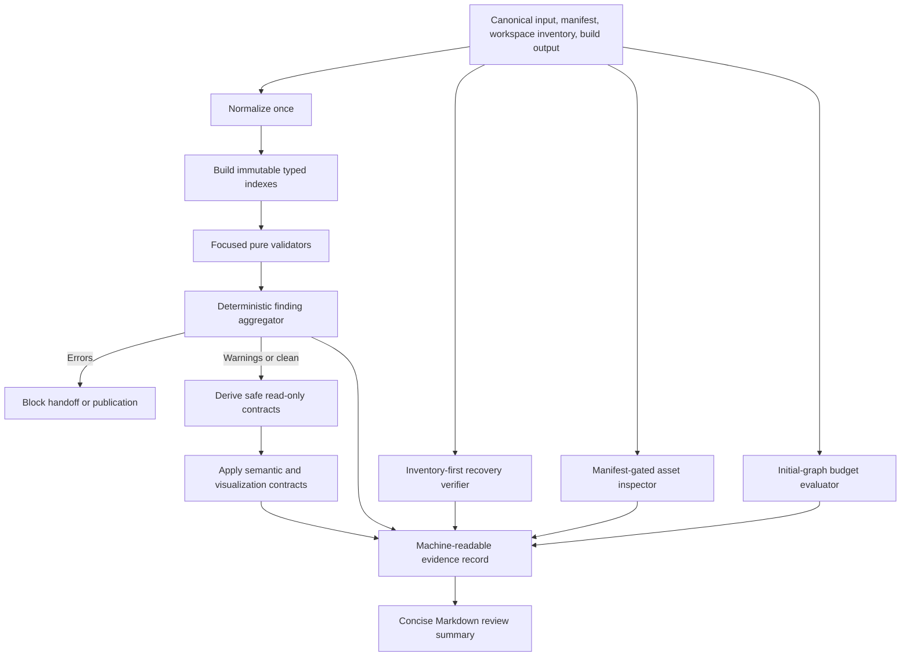

# NFR Design Patterns - U-01 Foundation and Safe Migration

## Design Objective

U-01 converts the approved quality targets into deterministic local patterns. Runtime browser code remains small and service-free; build/test boundaries perform recovery verification, content validation, asset inspection, boundary enforcement, and exact measurement. Required invalid state fails closed, while approved optional absence remains usable and visible as a warning.

## Pattern Overview

### Text Alternative

Inputs are normalized once and indexed immutably. Focused validators feed a deterministic aggregator. Errors block handoff or publication, while clean or warning-only results can derive safe read-only contracts. Semantic and visualization contracts apply to those results. Recovery, asset, and budget inspectors run at build/test boundaries. Their results, validator findings, and accessibility evidence feed a machine-readable record and concise Markdown review summary.

## Pattern P-01 - Typed Result and Fail-Closed Core

### Intent

Prevent partial publication and uncaught failures without retrying deterministic local work.

### Structure

- Every validator returns findings rather than throwing for expected invalid content.
- Every derivation boundary returns either a validated value or a typed invalid result.
- Required invalid state produces an error and no publishable output for that aggregate.
- Optional evidence resolution returns a value or safe absence plus a warning when appropriate.
- Unexpected programmer faults may surface to tests; they are not converted into silent warnings.

### Retry Policy

No retry is used for normalization, validation, selector derivation, manifest resolution, local inventory, or byte calculation. Repeating identical local input cannot repair it and would weaken determinism. External network recovery is not applicable because U-01 introduces no runtime network dependency.

### Supports

U01-NFR-REL-001, U01-NFR-SEC-001, U01-NFR-MNT-001.

## Pattern P-02 - Normalize, Index, Validate, Derive

### Intent

Support at least twice launch data volume with predictable passes and stable output.

### Stages

1. Normalize accepted strings, URLs, dates, and paths once without changing factual precision.
2. Freeze normalized record collections conceptually before validation.
3. Build typed keyed indexes for content, provenance, relationships, sections, and evidence.
4. Detect duplicate IDs during index creation instead of overwriting them.
5. Validate each collection and relationship in stable ID/rule order.
6. Derive read-only domain contracts by keyed lookup rather than repeated global scans.

### Complexity Boundary

- Index construction is linear in record count.
- Record validation is linear apart from sorting required for deterministic reporting.
- Relationship validation uses keyed lookup and is linear in relationship count.
- Finding ordering may use deterministic comparison with conventional `n log n` sorting.
- No component-render loop scans raw asset directories or the full canonical aggregate.

### Supports

U01-NFR-SCL-001, U01-NFR-REL-001, U01-NFR-MNT-001.

## Pattern P-03 - Focused Validator Pipeline

### Intent

Keep business rules testable and attributable.

### Rule Families

- Recovery validity.
- Canonical content and provenance.
- Section registry.
- Evidence eligibility and asset references.
- Relationship and selector contracts.
- Visualization purpose and semantic equivalence.
- Semantic UI foundations.
- Import, path, and style boundaries.
- Performance baseline and regression budgets.
- Static integration and persistence exclusions.

Each validator owns one documented family, receives only its required immutable context, and returns stable findings. It cannot render, log directly, mutate data, terminate the process, or hide a downstream error.

### Aggregation

The aggregator flattens results, de-duplicates by rule code and target, sorts errors before warnings and then by code and target, derives counts, and sets `canProceed` to false when any error exists.

### Supports

U01-NFR-REL-001, U01-NFR-MNT-001, U01-NFR-EVD-001.

## Pattern P-04 - Inventory-First Recovery

### Intent

Make the rejected attempt recoverable before replacement without relying on editor history or an external service.

### Structure

1. A read-only workspace inventory identifies revision, tracked modifications, staged state, relevant untracked paths, excluded reproducible output, and unrelated user state.
2. The approved capture mechanism represents every in-scope inventory entry.
3. A manifest records inclusions, exclusions with reasons, byte sizes, capture locations, and integrity values where appropriate.
4. A verifier reconciles inventory with the manifest and confirms recovery material is readable.
5. Restoration instructions are exercised through a non-destructive rehearsal or equivalently strong verification.
6. The snapshot state becomes `verified` only after all checks pass and the 30-minute restoration objective is demonstrated.

### Failure Isolation

An absent entry, unreadable capture, integrity mismatch, incomplete instruction, or failed rehearsal marks the record invalid and blocks replacement. It does not modify the original worktree while attempting recovery verification.

### Supports

U01-NFR-AVL-001, U01-NFR-REL-001, U01-NFR-EVD-001.

## Pattern P-05 - Manifest-Gated Publication

### Intent

Ensure only approved, traceable evidence becomes reachable while keeping large files out of the initial graph.

### Three-Layer Asset Model

- **Metadata**: Eagerly safe typed title, kind, provenance, caption, accessibility text, status, and loading strategy.
- **Preview**: Optional optimized derivative, loaded lazily when its later component enters a relevant context.
- **Full source**: Required for published evidence but opened on demand after explicit visitor action.

Only the publication resolver turns an `EvidenceId` into a `PublishedEvidence` value. Domain components never enumerate directories, import raw archives, or construct paths. Generated build metadata is reconciled with the manifest to detect unintended assets.

### Supports

U01-NFR-SCL-001, U01-NFR-PER-003, U01-NFR-SEC-001, U01-NFR-REL-001.

## Pattern P-06 - Initial-Graph Budget Guard

### Intent

Measure performance from build evidence rather than filenames or console estimates.

### Structure

1. Record source revision, lockfile identity, tool versions, build command, base-path input, and timestamp.
2. Read deterministic Vite output metadata or entry references.
3. Traverse eager entry dependencies and classify initial JavaScript, initial CSS, other initial assets, lazy code, previews, full evidence, and total deployable output.
4. Sum exact filesystem bytes by category.
5. Compare initial JavaScript with 460,800 bytes and initial CSS with 76,800 bytes.
6. Compare each category with the latest approved like-for-like measurement.
7. Fail the automated review check for an absolute budget breach or an unapproved regression greater than 10 percent.
8. Record compressed totals only as supplemental evidence.

U-01 does not switch the entry; its foundation source is expected to remain absent from the current active entry graph until U-02.

### Supports

U01-NFR-PER-001, U01-NFR-PER-002, U01-NFR-PER-003, U01-NFR-PER-004, U01-NFR-EVD-001.

## Pattern P-07 - Static Boundary Defense in Depth

### Intent

Enforce the approved privacy and integrity boundary without a runtime security service.

### Controls

- Typed URL parsing and explicit scheme allowlists.
- Safe new-tab relationship behavior and a focused shared action contract.
- Manifest eligibility checks and active/deployable asset reconciliation.
- Prohibited import checks for rejected templates, Chakra UI, rejected CSS, raw archives, and cross-domain presentation.
- Prohibited selector and routine-`!important` checks in new styles.
- Scoped secret-pattern and dependency-audit evidence during delivery.
- No browser persistence of content, evidence, validation, recovery, or visitor values.

### Failure Policy

Unsafe schemes, private or raw referenced assets, prohibited imports, or shipped secrets are errors. Audit findings are recorded and dispositioned; package remediation is not performed unless explicitly approved.

### Supports

U01-NFR-SEC-001, U01-NFR-MNT-001, U01-NFR-EVD-001.

## Pattern P-08 - Accessibility by Contract

### Intent

Make accessibility a property of shared data and semantic boundaries without imposing repeated layout.

### Contract Layers

- `SectionRegion` contract requires an approved ID and visible heading association.
- `EvidenceAction` accepts only resolved published evidence and exposes a clear name and context.
- Informational visualization models require title, description, typed values, category semantics beyond color, and a paired list/table ID.
- `AccessibleDataSummary` renders from the identical visualization model.
- Decorative graphics are explicitly non-informational and excluded from the accessibility tree.
- Token fixtures evaluate light/dark contrast roles before later components consume them.
- Foundation styles encode visible focus, unobscured-focus allowance, reduced motion, reflow-safe defaults, and system-font fallback.

### Verification Layers

- Pure contract tests compare visual and semantic-summary values.
- Component tests use roles, names, headings, lists, and tables.
- Token tests calculate required contrast ratios for declared role pairs.
- A reusable manual matrix covers keyboard, focus, 200-percent zoom, 320-CSS-pixel reflow, reduced motion, pointer targets, and both themes.

### Supports

U01-NFR-USE-001, U01-NFR-CMP-001, U01-NFR-EVD-001.

## Pattern P-09 - Semantic Tokens with Local Geometry

### Intent

Replace layered global presentation styles with one coherent semantic foundation while preserving unique sections.

### Structure

- One global token source defines named color, text, focus, data category, typography, spacing, motion, border, and elevation roles.
- One root theme attribute selects light or dark values.
- One small foundation layer owns document defaults, focus, reduced motion, and system-font behavior.
- Every later visible component owns geometry and states in its CSS Module.
- Static style checks reject rejected selectors, cross-domain reach, and routine `!important`.

### Supports

U01-NFR-PER-002, U01-NFR-MNT-001, U01-NFR-USE-001.

## Pattern P-10 - Compatibility Through Capability Fallbacks

### Intent

Preserve meaning in the approved evergreen matrix when optional browser capabilities or resources are unavailable.

### Structure

- Use native broadly supported HTML, CSS, and SVG as the baseline.
- Treat system fonts as the primary functional fallback.
- Avoid storage dependencies in U-01.
- Use reduced-motion media behavior without JavaScript dependency for foundational motion.
- Require later observer-based navigation to own a no-observer fallback.
- Retain hash-based static routing compatible with GitHub Pages.

Exact browser versions are captured during final verification because the policy targets the latest two stable majors and current mobile versions at that time.

### Supports

U01-NFR-CMP-001, U01-NFR-USE-001, U01-NFR-REL-001.

## Pattern P-11 - Dual-Format Review Evidence

### Intent

Make gate evidence reproducible for tools and understandable to a reviewer.

### Outputs

- A stable machine-readable result contains command identity, environment versions, finding codes, counts, byte measurements, budget comparisons, recovery status, and warning dispositions.
- A concise Markdown code summary links those results to stories, NFR IDs, exact changed files, manual checks, limitations, and approval boundaries.
- Local and CI executions use the same deterministic checks and measurement definitions.

Screenshots may supplement visual review but cannot replace commands, measurements, structured findings, or an inspectable implementation.

### Supports

U01-NFR-EVD-001 and all NFR acceptance methods.

## Pattern-to-NFR Matrix

| Pattern | SCL | PER | AVL | SEC | REL | MNT | USE | CMP | EVD |
| --- | --- | --- | --- | --- | --- | --- | --- | --- | --- |
| P-01 Typed result | - | - | - | Yes | Yes | Yes | - | - | Yes |
| P-02 Normalize/index | Yes | - | - | - | Yes | Yes | - | - | Yes |
| P-03 Validator pipeline | Yes | - | - | Yes | Yes | Yes | - | - | Yes |
| P-04 Recovery | - | - | Yes | - | Yes | Yes | - | - | Yes |
| P-05 Publication gateway | Yes | Yes | - | Yes | Yes | Yes | - | - | Yes |
| P-06 Budget guard | - | Yes | - | - | Yes | Yes | - | - | Yes |
| P-07 Boundary controls | - | - | - | Yes | Yes | Yes | - | - | Yes |
| P-08 Accessibility contract | - | - | - | - | Yes | Yes | Yes | Yes | Yes |
| P-09 Tokens/local geometry | - | Yes | - | - | - | Yes | Yes | Yes | Yes |
| P-10 Capability fallback | - | - | Yes | - | Yes | - | Yes | Yes | Yes |
| P-11 Dual-format evidence | - | Yes | Yes | Yes | Yes | Yes | Yes | Yes | Yes |

## Explicitly Excluded Patterns

- Runtime retries, circuit breakers, queues, caches, service discovery, API gateways, databases, server sessions, monitoring agents, background synchronization, or remote configuration.
- A generic shared card, timeline, ledger, sidebar, or domain-layout framework.
- Runtime directory enumeration, dynamic raw-archive fetching, and browser storage as a source of truth.
- Swallowed validator exceptions, warning-only handling of required invalid state, and manual-only budget estimation.

## Extension Compliance

- **Security Baseline**: Skipped because it is disabled; product-specific static boundary controls remain included.
- **Property-Based Testing**: Skipped because it is disabled; deterministic example and growth-fixture tests are used.
