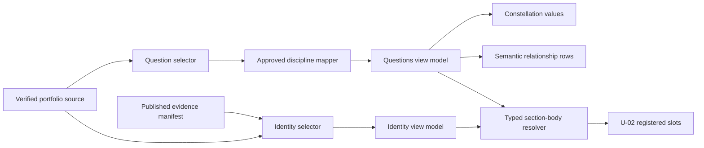

# U-03 Business Logic Model

## Purpose and Boundary

U-03 turns U-01 verified records into two finished U-02 section bodies: Research Identity and Questions I Explore. It does not read legacy portfolio modules directly, infer research results, change shell geometry, or implement any later portfolio domain.

## Deterministic Content Flow

Text alternative: the verified source supplies identity and question selectors, while the published evidence manifest also supplies the identity selector. Identity data becomes an identity view model. Questions pass through a fixed discipline mapper to one questions view model, which supplies both the constellation and its semantic rows. The two view models enter the U-02 shell through a typed section-body resolver.

## Workflow 1 - Assemble the Research Identity

1. Select the single verified identity referenced by the portfolio source.
2. Reject zero, duplicate, or broken identity references as validation findings.
3. Preserve the verified name, role, location, and summary without converting interests into achievements.
4. Produce a `Currently exploring` statement only from the supported summary themes: molecular science, data-driven research, public health, and sustainability.
5. Produce the `Fields in exploration` sequence from the same approved themes. The label is mandatory because these are interests, not completed methods or findings.
6. Resolve the published portrait evidence. Its runtime loading failure is non-blocking because all identity information remains in text.
7. Resolve the published academic transcript evidence. A missing, raw-only, or invalid record blocks acceptance.
8. Create two actions: `Download academic record` for the manifest asset and `Explore research questions` for the registered `questions` locus.

## Workflow 2 - Build Question and Discipline Relationships

The three verified question records remain in approved source order and retain their exploratory wording. A closed mapping converts each approved domain label into presentation coordinates; it does not use free-text classification or runtime inference.

| Approved source domain | Presentation coordinates |
| --- | --- |
| Computational biology / drug screening | Computational biology; Molecular science |
| Natural products / sustainability | Natural products; Sustainability |
| Data science / visual analytics | Data science; Visual analytics |

For every question:

1. Require a stable question identifier, nonempty question text, approved domain, and exploratory status.
2. Resolve its domain through the closed mapping above; an unknown domain is a blocking validation finding.
3. Create one relationship per question-coordinate pair.
4. Generate constellation nodes, connecting paths, and semantic relationship rows from the same immutable relationship collection.
5. Keep every question and relationship available without filtering. Focus and hover may emphasize a path but never reveal otherwise-hidden information.

This shared-source rule prevents the visual and its text alternative from disagreeing.

## Workflow 3 - Resolve Actions

### Academic record

- Resolve only the approved `academic-transcript.pdf` manifest entry.
- Present the visible label `Download academic record`; never substitute `résumé` or `CV`.
- Use a native same-origin anchor with download semantics and the approved filename.
- Retain an accurate accessible name and document description.

### Explore research questions

- Target the registered `questions` section through the U-02 navigation contract.
- Reuse the shell's focus transfer, history, and reduced-motion behavior.
- Preserve a valid `#questions` anchor destination if enhanced navigation is unavailable.

## Workflow 4 - Replace Registered Slot Bodies

The shell owns a typed, partial section-body map. U-03 registers bodies for only `identity` and `questions`. The resolver returns these bodies when their registered section identifiers are encountered and retains the U-02 temporary body for the other eight sections. It does not alter section order, navigation geometry, progress calculation, header behavior, or theme state.

## Validation and Failure Outcomes

| Condition | Outcome |
| --- | --- |
| Portrait image fails at runtime | Hide the broken visual surface and retain the complete text-first identity composition. |
| Identity is absent, duplicated, or unresolved | Blocking validation finding; do not synthesize a replacement. |
| Academic record is absent or not published | Blocking validation finding; do not render a misleading action. |
| A verified question is absent or empty | Blocking validation finding; do not silently shorten the set. |
| A question domain has no approved mapping | Blocking validation finding; do not guess coordinates. |
| A relationship points to an unknown question or coordinate | Blocking validation finding. |
| Enhanced locus navigation is unavailable | Preserve native anchor navigation to `#questions`. |

## Scenario Outcomes

- On first arrival, identity, scientific direction, portrait treatment, and both actions form the first editorial reading field.
- Direct navigation to `#questions` lands on the questions heading and exposes all three questions plus the semantic relationship alternative.
- Keyboard visitors can reach both identity actions and the question relationship content in source order.
- Reduced-motion visitors receive immediate emphasis and navigation changes without animated tracing or scrolling.
- On narrow viewports, visual asymmetry becomes one intentional reading sequence; information and actions remain complete.

## Traceability

This model implements ST-001, ST-004, and ST-014; FR-004, FR-005, FR-013, and the truthful publication intent of FR-017; and inherited content-integrity, accessibility, resilience, responsive, and maintainability safeguards.
