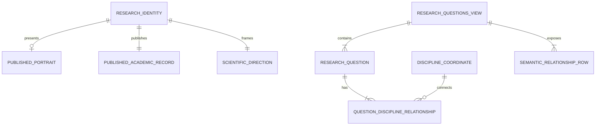

# U-03 Domain Entities

## View Contracts

The signatures below define design contracts. Exact implementation naming may change during Code Generation if traceability and invariants remain intact.

```ts
type ExplorationTopic =
  | "Molecular science"
  | "Data-driven research"
  | "Public health"
  | "Sustainability";

interface ScientificDirection {
  readonly label: "Currently exploring";
  readonly topics: readonly ExplorationTopic[];
  readonly statement: string;
}

interface PublishedPortrait {
  readonly evidenceId: "evidence-profile-portrait";
  readonly src: string;
  readonly alt: string;
  readonly caption: string;
}

interface PublishedAcademicRecord {
  readonly evidenceId: "evidence-academic-transcript";
  readonly href: string;
  readonly filename: string;
  readonly label: "Download academic record";
  readonly description: string;
}

interface ResearchIdentityViewModel {
  readonly id: string;
  readonly name: string;
  readonly role: string;
  readonly location: string;
  readonly summary: string;
  readonly direction: ScientificDirection;
  readonly fieldsInExploration: readonly ExplorationTopic[];
  readonly portrait?: PublishedPortrait;
  readonly academicRecord: PublishedAcademicRecord;
  readonly questionsTarget: "questions";
}
```

The portrait is optional in the render model so a runtime image failure can degrade safely. Its manifest relationship is still validated during assembly. The academic record is required because its absence would make an approved primary action untruthful.

```ts
type DisciplineCoordinateId =
  | "computational-biology"
  | "molecular-science"
  | "natural-products"
  | "sustainability"
  | "data-science"
  | "visual-analytics";

interface DisciplineCoordinate {
  readonly id: DisciplineCoordinateId;
  readonly label: string;
  readonly visualToken: string;
  readonly order: number;
}

interface ResearchQuestionViewModel {
  readonly id: string;
  readonly text: string;
  readonly status: "Question under exploration";
  readonly sourceDomain: string;
  readonly coordinateIds: readonly DisciplineCoordinateId[];
  readonly order: number;
}

interface QuestionDisciplineRelationship {
  readonly id: string;
  readonly questionId: string;
  readonly coordinateId: DisciplineCoordinateId;
}

interface SemanticRelationshipRow {
  readonly questionId: string;
  readonly question: string;
  readonly disciplines: readonly string[];
}

interface ResearchQuestionsViewModel {
  readonly questions: readonly ResearchQuestionViewModel[];
  readonly coordinates: readonly DisciplineCoordinate[];
  readonly relationships: readonly QuestionDisciplineRelationship[];
  readonly semanticRows: readonly SemanticRelationshipRow[];
  readonly visualization: InformationalVisualization;
}
```

`InformationalVisualization` is the U-01 visualization contract. Its values must be computed from `relationships`, never maintained as a second handwritten data set.

## Selection Results

```ts
interface FunctionalValidationFinding {
  readonly code: string;
  readonly severity: "blocking" | "recoverable";
  readonly message: string;
  readonly recordId?: string;
}

type SelectionResult<T> =
  | { readonly ok: true; readonly value: T; readonly findings: readonly [] }
  | { readonly ok: false; readonly findings: readonly FunctionalValidationFinding[] };

interface IdentityQuestionsSelection {
  readonly identity: ResearchIdentityViewModel;
  readonly questions: ResearchQuestionsViewModel;
}
```

Selection fails closed for missing identity, required academic record, verified questions, coordinate mapping, or relationship targets. Portrait rendering failure is handled by the presentation boundary and does not mutate verified data.

## Slot Integration Contract

```ts
type U03SectionId = "identity" | "questions";

interface SectionBodyRegistration<TBody> {
  readonly sectionId: U03SectionId;
  readonly body: TBody;
}

type SectionBodyRegistry<TBody> = Readonly<
  Partial<Record<PortfolioSectionId, TBody>>
>;
```

The registry is partial by design. The U-02 resolver uses registered U-03 bodies for `identity` and `questions` and the existing temporary body elsewhere.

## Entity Relationships



Text alternative: one research identity may present one portrait, must publish one academic record, and has one scientific direction. Each research question has one or more relationships, and each discipline coordinate may connect to multiple questions. The questions view contains the questions and equivalent semantic relationship rows.

## Invariants

- Identity fields are nonempty and source-backed.
- The direction label and question status are explicit interest-state markers.
- Every question has at least one valid coordinate and every relationship resolves both ends.
- Question order is stable and matches verified source order.
- Semantic rows contain exactly the labels represented by the visual relationships.
- Evidence identifiers resolve through the published manifest.
- Section registrations cannot claim ownership beyond `identity` and `questions`.
