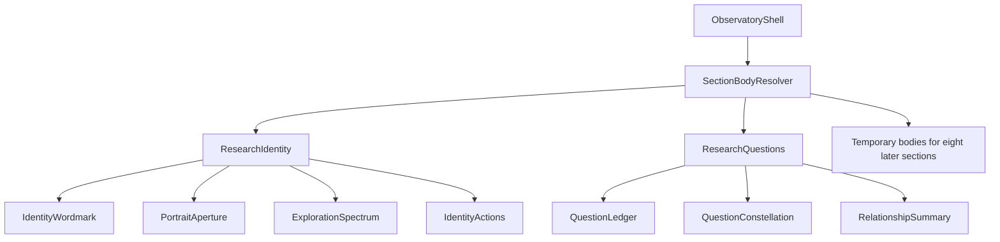

# U-03 Frontend Component Design

## Composition

Text alternative: the observatory shell delegates section content to a resolver. U-03 supplies Research Identity and Research Questions while eight later sections retain temporary bodies. Research Identity combines a wordmark, portrait aperture, exploration spectrum, and actions. Research Questions combines the question ledger, visual constellation, and semantic relationship summary.

## ResearchIdentity

`ResearchIdentity` receives one `ResearchIdentityViewModel` and occupies the complete registered identity slot. It uses an editorial specimen-field composition:

- an oversized name and verified role establish the primary reading edge;
- location and `Currently exploring` form a horizontal metadata sequence on wide screens;
- the summary crosses the grid as an editorial annotation rather than a card paragraph;
- `PortraitAperture` intersects the typographic field through a microscopy-inspired crop and calibrated scientific markings;
- `ExplorationSpectrum` renders interests as a typographic continuum labelled `Fields in exploration`, not badges;
- `IdentityActions` places the academic-record download and question-locus action in the first viewport.

No panel chrome, conventional centered hero, circular avatar, sidebar, or repeated card is permitted.

### PortraitAperture

Props are the optional published portrait and an image-failure callback local to the presentation. The component uses a semantic figure when the image renders. Its caption identifies the portrait without adding biography. A local image-error flag removes the failed image surface; the complete text identity remains untouched. Decorative calibration marks are hidden from assistive technology.

### ExplorationSpectrum

Props are the explicit direction and ordered topics. It is a semantic labelled list laid out along a horizontal typographic rule on wide screens and a vertical reading rhythm on narrow screens. It has no selection state.

### IdentityActions

Props are the required academic record and the `questions` target. The document is a native download anchor with the approved filename. The question action is a native anchor enhanced through the U-02 navigation callback. Both retain visible focus styles and truthful accessible names.

## ResearchQuestions

`ResearchQuestions` receives one `ResearchQuestionsViewModel`. Its layout is a research-coordinate field rather than a tile grid:

- `QuestionLedger` numbers and displays all three questions as continuous editorial entries;
- `QuestionConstellation` places question loci and shared discipline coordinates in a lightweight SVG/CSS field;
- `RelationshipSummary` presents the exact same relationships in a semantic table on roomy viewports and a labelled vertical list on narrow viewports.

All information exists on initial render. There is no filter, disclosure, carousel, dialog, or selected-question state.

### QuestionLedger

Each entry contains the unchanged question text and the explicit status `Question under exploration`. Entries expose stable identifiers used by visual relationships and keyboard focus emphasis. They are not individually boxed.

### QuestionConstellation

Props are the coordinates, relationships, and U-01 visualization description. The SVG is informational but supplementary: it supplies a concise title and description while `RelationshipSummary` carries the complete textual mapping. Paths use line style, marker shape, labels, and spatial connection in addition to color.

Focus within a question entry or matching semantic row may apply a shared emphasis token to related SVG paths. Pointer hover mirrors that emphasis. Nonmatching content remains legible, and no relationship appears only in an emphasized state. Under reduced motion, emphasis changes are immediate.

### RelationshipSummary

Props are `semanticRows` created from the same relationship collection as the SVG. Each row states a complete question-to-disciplines mapping. At narrow widths it changes presentation, not DOM meaning or data. This component is the full text alternative for the relationship visual.

## SectionBodyResolver Integration

The resolver accepts the registered section descriptor, the U-03 body registry, and the existing temporary-body renderer. It performs an identifier lookup only:

- `identity` resolves to `ResearchIdentity`;
- `questions` resolves to `ResearchQuestions`;
- every other registered identifier resolves to the unchanged temporary body.

The shell remains responsible for headings, section landmarks, locus navigation, progress, theme, active-section observation, focus transfer, and section order. U-03 does not duplicate those responsibilities.

## Responsive Behavior

| Viewport condition | Identity | Questions |
| --- | --- | --- |
| Wide | Asymmetric multi-column specimen field with intersecting portrait and horizontal spectrum | Side-by-side ledger and relationship field with shared coordinates |
| Intermediate | Compressed asymmetry; metadata and actions wrap within their local regions | Ledger remains primary; constellation and semantic summary reflow without clipping |
| Narrow | One editorial sequence: identity, portrait, direction, spectrum, actions | Questions read vertically; constellation simplifies spatially; semantic mapping remains complete |

No breakpoint introduces a sidebar, drawer, centered profile card, repeated generic cards, or horizontal page scrolling.

## State and Interaction

- Local state is limited to recoverable portrait load failure and transient relationship emphasis.
- Verified content and relationships are immutable inputs, never duplicated into editable component state.
- Native anchors remain functional without JavaScript enhancement.
- Focus, hover, and reduced-motion behavior reuse U-02 theme and motion contracts.
- No network request, backend endpoint, analytics call, or new dependency is required.

## Test Seams

- Selectors can be tested with missing, duplicate, and broken-reference fixtures.
- The domain mapper can be tested as a closed exhaustive mapping.
- Identity rendering can be tested with and without a successfully loaded portrait.
- Academic-record semantics can be asserted for label, target, and filename.
- The question count, exact text, and status labels can be asserted from the view model.
- SVG relationships and semantic rows can be compared by normalized relationship identifiers.
- Keyboard focus, native anchor fallback, and reduced-motion classes can be tested independently.
- The resolver can prove that only two slot bodies are replaced and eight remain temporary.

## Acceptance Traceability

| Concern | Design coverage |
| --- | --- |
| ST-001 / FR-004 | ResearchIdentity composition, verified copy, portrait fallback, and first-viewport hierarchy |
| ST-004 / FR-005 | ResearchQuestions, unchanged exploratory questions, constellation, and semantic mapping |
| ST-014 / FR-013 | Shared relationship model, non-color cues, semantic equivalence, and focus behavior |
| FR-017 publication intent | Truthful native `Download academic record` action using published evidence |
| Inherited safeguards | Typed seam, fail-closed validation, keyboard access, reduced motion, responsive transformation, and no new runtime service |
