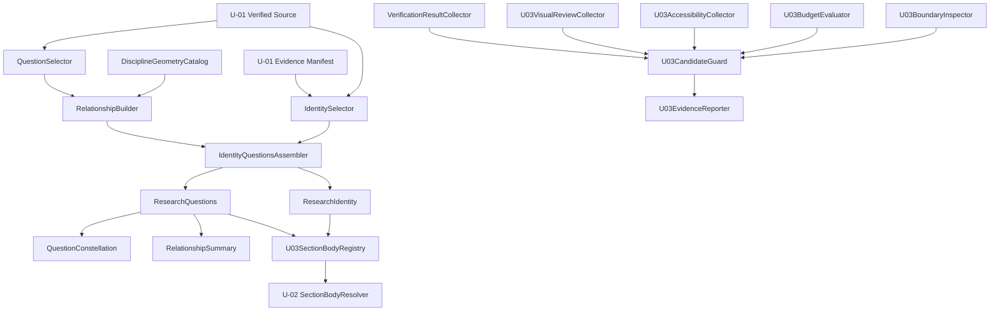

# Logical Components - U-03 Identity and Questions

## Component Model

U-03 separates pure verified-content assembly, deterministic presentation catalogs, React section bodies, the minimal U-02 registration seam, and build/test evidence. Dependencies point toward U-01 contracts and pure U-03 logic. Browser components cannot read files or build metadata, and verification adapters cannot become application imports.

## Dependency Diagram

Text alternative: the U-01 verified source and evidence manifest feed identity and question selectors. Questions combine with a closed discipline and geometry catalog in the relationship builder. The assembler produces identity and question models for their React bodies, including the constellation and relationship summary. Those two bodies enter the U-02 resolver through a U-03 registry. Separately, boundary, budget, accessibility, visual-review, and test collectors feed the U-03 candidate guard and evidence reporter.

## Execution Boundaries

| Boundary | Browser bundle | Browser globals | File/build metadata | May block U-03 acceptance |
| --- | --- | --- | --- | --- |
| Pure selectors, catalogs, and assembler | Yes | No | No | Through typed findings |
| React identity and question components | Yes | Image event only | No | Through rendered/semantic checks |
| U-03 body registry | Yes | No | No | Through ownership validation |
| U-02 resolver and shell | Existing | Existing U-02 adapters | No | Through regression evidence |
| Build and verification adapters | No | Optional test browser only | Yes | Yes |
| Evidence reporter | No | No | Approved result files | Yes |

## Pure Browser-Safe Components

## `IdentitySelector`

- **Purpose**: resolve the single verified identity, scientific direction, exploration topics, portrait, academic record, and question action target.
- **Inputs**: U-01 verified source, evidence resolver, and registered section identifiers.
- **Outputs**: `SelectionResult<ResearchIdentityViewModel>`.
- **Failure behavior**: emits stable blocking findings for missing/duplicate identity, invalid required fields, absent/unpublished transcript, or invalid questions target.
- **Boundary**: no React, DOM, network, filesystem, legacy data import, or fallback-copy generation.
- **NFRs**: AVL-001, SEC-001, REL-001, MNT-001.

## `QuestionSelector`

- **Purpose**: select exactly the approved verified questions in stable source order.
- **Inputs**: U-01 verified question records.
- **Outputs**: immutable normalized question inputs or ordered blocking findings.
- **Failure behavior**: rejects absent, empty, duplicate, or unsupported records; never silently shortens the set.
- **NFRs**: SCL-001, REL-001, MNT-001.

## `DisciplineGeometryCatalog`

- **Purpose**: provide exhaustive domain-to-discipline mapping and normalized presentation coordinates.
- **Inputs**: approved source-domain identifier.
- **Outputs**: one or more branded discipline identifiers plus frozen coordinate facts.
- **Failure behavior**: unknown domain returns a blocking finding; no runtime classifier or guessed coordinate.
- **Boundary**: coordinate values describe visual placement only and cannot be labelled as scientific measurements.
- **NFRs**: SCL-001, PER-004, REL-001, SEC-001.

## `RelationshipBuilder`

- **Purpose**: create the canonical question-coordinate relationship collection.
- **Inputs**: normalized questions and the closed catalog.
- **Outputs**: unique, ordered relationships with keyed question and discipline indices.
- **Algorithm**: one index-construction pass followed by linear question and relationship passes.
- **Failure behavior**: rejects duplicate identifiers, unknown endpoints, and questions without coordinates.
- **NFRs**: SCL-001, REL-001, REL-002, MNT-001.

## `RelationshipProjection`

- **Purpose**: derive SVG values and semantic rows from one canonical relationship collection.
- **Inputs**: relationships plus keyed question and discipline indices.
- **Outputs**: `InformationalVisualization`, SVG endpoint values, and semantic rows.
- **Invariant**: normalized visual and semantic relationship identifier sets are exactly equal.
- **NFRs**: REL-002, USE-001, MNT-001.

## `IdentityQuestionsAssembler`

- **Purpose**: coordinate pure selectors and return the two accepted presentation models or combined findings.
- **Inputs**: verified source, evidence resolver, registry facts, and frozen catalogs.
- **Outputs**: `SelectionResult<IdentityQuestionsSelection>`.
- **Failure behavior**: combines findings in stable rule order and returns no partial accepted selection when any required fact fails.
- **NFRs**: AVL-001, REL-001, MNT-001, EVD-001.

## React Identity Components

## `ResearchIdentity`

- Composes the wordmark, verified narrative, portrait aperture, exploration spectrum, and actions in one semantic source order.
- Receives a complete `ResearchIdentityViewModel`; it does not select or rewrite source content.
- Uses locally owned CSS Grid placement and one responsive DOM.
- Exposes no global state, context provider, data request, shell controller, or persistence.
- **NFRs**: PER-001/002/004, AVL-001, USE-001/002, UNI-001.

## `PortraitAperture`

- Renders the manifest-resolved image in a semantic figure with intrinsic dimensions, reserved aspect ratio, accurate alternative text, eager first-viewport eligibility, and asynchronous decoding.
- Owns one local boolean image-failure state.
- On failure, removes the broken visual surface while leaving surrounding identity and actions unchanged.
- Decorative aperture calibration marks are excluded from the accessibility tree.
- **NFRs**: PER-003/004, AVL-001, USE-001, UNI-001.

## `ExplorationSpectrum`

- Renders a labelled semantic list from approved exploration topics.
- Uses typography and spatial rhythm rather than selectable badges or generic cards.
- Has no interaction state; wide horizontal treatment becomes a vertical sequence at narrow widths.
- **NFRs**: PER-002, USE-001/002, UNI-001.

## `IdentityActions`

- Renders `Download academic record` as a native same-origin download anchor using the manifest filename.
- Renders `Explore research questions` as a native `#questions` anchor enhanced by the existing U-02 action when available.
- Adds no preload, fetch, viewer, new-tab opener, arbitrary URL, or custom button role.
- **NFRs**: PER-003, AVL-001, SEC-001, USE-001.

## React Question Components

## `ResearchQuestions`

- Composes the continuous question ledger, SVG constellation, and semantic relationship summary.
- Receives one immutable `ResearchQuestionsViewModel`; it creates no factual copy or relationship state.
- Coordinates transient emphasis through stable relationship identifiers without hiding nonmatching content.
- **NFRs**: PER-001/002/004, REL-002, USE-001/002, UNI-001.

## `QuestionLedger`

- Renders all three exact verified questions in source order with explicit `Question under exploration` status.
- Uses continuous editorial entries, not repeated boxed tiles.
- Exposes stable focusable or referenced loci only where native semantics remain appropriate.
- **NFRs**: REL-001, USE-001/002, UNI-001.

## `QuestionConstellation`

- Renders passive inline SVG from normalized geometry and canonical relationships.
- Supplies concise title/description semantics while deferring complete mapping to `RelationshipSummary`.
- Encodes connections with labels, line/marker distinctions, space, and color.
- May emphasize related paths on hover/focus; reduced motion makes the change immediate and all paths remain perceivable.
- Contains no script, remote reference, `foreignObject`, dynamic HTML, force layout, measurement loop, or canvas.
- **NFRs**: PER-001/002/004, SEC-001, REL-002, USE-001/002.

## `RelationshipSummary`

- Renders every semantic row derived from the same canonical relationship collection as the SVG.
- Uses native table semantics where visually appropriate and a CSS-reflowed labelled presentation at narrow widths without changing the data.
- Remains complete with SVG or styles unavailable.
- **NFRs**: AVL-001, REL-002, USE-001/002, CMP-001.

## Integration Components

## `U03SectionBodyRegistry`

- Exports one immutable partial registry with exactly `identity` and `questions` keys.
- Receives assembled U-03 models and constructs only their owned bodies.
- Contains no fallback for later sections and no shell controller logic.
- **NFRs**: MNT-002, UNI-001.

## U-02 `SectionBodyResolver`

- Remains the integration owner and looks up an optional registered body by approved section identifier.
- Returns the unchanged temporary body when no U-03 registration exists.
- A ten-slot fixture proves two U-03 results, eight temporary results, and unchanged order.
- **NFRs**: AVL-001, MNT-002, EVD-001.

## Build and Test Components

## `U03BoundaryInspector`

- Checks exact changed scope and the active import graph.
- Rejects direct legacy-data imports, rejected templates/styles, Chakra/Tailwind presentation, raw evidence, later-domain components, arbitrary runtime URL construction, unsafe HTML/SVG, network clients, and new shell controllers.
- Confirms dependency declarations and lockfile remain unchanged.
- Confirms the body registry contains exactly two approved keys.

## `U03BudgetEvaluator`

- Extends deterministic Vite manifest classification without entering browser code.
- Measures all initial JavaScript and CSS against 256,000 and 24,576 bytes plus inherited limits.
- Records the emitted portrait and transcript bytes separately.
- Compares a captured initial request inventory to prove the transcript is not fetched before activation.
- Adds gzip only as supplemental evidence.

## `RelationshipEquivalenceVerifier`

- Extracts normalized relationship identifiers from canonical, visual, and semantic projections.
- Requires exact set equality, valid endpoints, uniqueness, stable order, and repeat-run equality.
- Runs the six-question, twelve-relationship capacity fixture without publishing it.

## `U03AccessibilityCollector`

- Aggregates semantic component results, relationship equivalence, token contrast calculations, portrait-failure behavior, keyboard/focus review, reduced motion, text spacing, stylesheet-degraded meaning, 200-percent zoom, and 320-pixel reflow.
- Distinguishes automated, calculated, manual, and unavailable-browser evidence.
- Cannot report a P0 pass when a required state is absent.

## `U03VisualReviewCollector`

- Records the 320, 768, 1280, and 1440 CSS-pixel states in light and dark themes.
- Checks every required custom structure and prohibited original/rejected pattern.
- Confirms local action wrapping, no document overflow, readable relationships, and eight unchanged later slots.
- Records exact available browser versions and P1 limitations.

## `U03CandidateGuard`

- Accepts required-data validation, focused/full tests, lint, strict types, build, recovery, boundaries, budgets, initial requests, accessibility, responsive, uniqueness, compatibility, and warning dispositions.
- Produces `eligible-for-review` only when every P0 input passes.
- Does not convert a missing P1 measurement into a pass; it requires a documented limitation.
- Candidate eligibility still requires separate explicit user approval before U-03 completion.

## `U03EvidenceReporter`

- Writes deterministic machine-readable measurements where practical and concise Markdown summaries under the approved U-03 documentation boundary.
- Records exact commands, tool/browser versions, timestamps, changed files, outcomes, warnings, limitations, and recovery status.
- Never enters the application bundle or mutates source evidence.

## Failure Routing

| Failure | Owner | Result |
| --- | --- | --- |
| Missing identity, transcript, question, mapping, or endpoint | Pure assembler | Blocking typed finding; no accepted view model |
| Duplicate relationship | RelationshipBuilder | Blocking typed finding |
| Portrait request/decode failure | PortraitAperture | Local text-first degradation |
| SVG styling or emphasis unavailable | Native baseline | Full semantic relationship content remains |
| Enhanced questions navigation unavailable | IdentityActions | Native `#questions` navigation remains |
| Budget, boundary, test, accessibility, or uniqueness P0 failure | U03CandidateGuard | Candidate remains unapproved |
| Target browser or mobile-profile evidence unavailable | Evidence collectors | Honest P1 limitation; never reported as a pass |

## Runtime Infrastructure Decision

Runtime queues, caches, circuit breakers, workers, monitoring agents, APIs, databases, remote image services, and retry subsystems are not applicable. The deployed unit contains static browser modules and assets only. Build/test adapters are development-time components and cannot become runtime imports.

## Traceability Matrix

| NFR | Primary patterns and components |
| --- | --- |
| U03-NFR-SCL-001 | P-03; QuestionSelector, RelationshipBuilder, RelationshipProjection |
| U03-NFR-PER-001 | P-04, P-06; native components and U03BudgetEvaluator JavaScript gate |
| U03-NFR-PER-002 | P-04, P-06; CSS Modules and U03BudgetEvaluator stylesheet gate |
| U03-NFR-PER-003 | P-05; PortraitAperture, IdentityActions, and initial-request inventory |
| U03-NFR-PER-004 | P-04, P-06; reserved geometry and rendered performance evidence |
| U03-NFR-AVL-001 | P-01, P-02; pure assembler, PortraitAperture, native actions |
| U03-NFR-SEC-001 | P-07; catalogs, passive SVG, U03BoundaryInspector |
| U03-NFR-REL-001/002 | P-01, P-03; assembler, RelationshipBuilder, RelationshipEquivalenceVerifier |
| U03-NFR-MNT-001/002 | P-06, P-09, P-11; body registry, boundary inspector, candidate guard |
| U03-NFR-USE-001/002 | P-02, P-08, P-10; semantic components and evidence collectors |
| U03-NFR-CMP-001 | P-02, P-08; native baseline and available-browser review |
| U03-NFR-UNI-001 | P-09, P-10; custom bodies and visual review collector |
| U03-NFR-EVD-001 | P-11; all build/test collectors, candidate guard, evidence reporter |

## Extension Compliance

- Security Baseline: disabled and not loaded; static controls remain enforced by U03BoundaryInspector and the candidate gate.
- Property-Based Testing: disabled and not loaded; deterministic table-driven, capacity, and repeat-run verification remains enforced.
