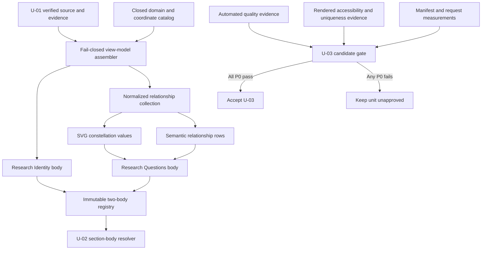

# NFR Design Patterns - U-03 Identity and Questions

## Design Objective

U-03 must replace two temporary bodies with a distinctive identity field and question constellation while preserving the verified factual boundary, U-02 shell behavior, bundle headroom, semantic availability, and exact relationship equivalence. Required content fails closed before accepted rendering; optional visual enhancement degrades to native text and anchors without retry loops or fabricated substitutes.

## Pattern Overview

Text alternative: U-01 verified content and a closed domain-coordinate catalog feed a fail-closed assembler. It produces the identity body and one normalized relationship collection. That collection supplies both the SVG values and semantic rows for the questions body. The two bodies enter the existing shell through an immutable two-entry registry. Automated tests, rendered review, and performance measurements feed a candidate gate; all P0 checks accept U-03, while any P0 failure keeps it unapproved.

## Pattern P-01 - Fail-Closed Assembly with Typed Findings

### Intent

Prevent incomplete or invented identity and question content from reaching an accepted view while separating recoverable visual failures from factual failures.

### Structure

- One pure assembler consumes only U-01 verified records, published evidence, and closed catalogs.
- It validates identity cardinality, required fields, transcript publication, three verified questions, domain mappings, unique relationships, and resolvable endpoints.
- It returns either immutable presentation models or stable, ordered, typed blocking findings.
- It performs no rendering, browser access, request, retry, logging side effect, or guessed repair.
- Portrait request/decode failure is excluded from factual assembly and handled as local recoverable presentation state.

### Retry Policy

No retry is used for deterministic record selection, mapping, endpoint resolution, duplicate detection, or model construction. Repeating the same invalid input cannot change the result. Browser-native asset loading behavior is not wrapped in an application retry subsystem.

### Supports

U03-NFR-AVL-001, U03-NFR-REL-001, U03-NFR-MNT-001, U03-NFR-EVD-001.

## Pattern P-02 - Native Baseline with Supplementary Visualization

### Intent

Keep all identity, question, relationship, and action meaning available when optional visual layers or enhancements fail.

### Structure

- Semantic headings, paragraphs, lists/table, and native anchors form the authoritative document.
- The constellation is supplementary and never the sole carrier of a question or relationship.
- The questions link keeps a valid registered hash when U-02 enhancement is unavailable.
- The academic-record link remains a native same-origin download target without a preload dependency.
- A portrait error removes only the failed image surface; it does not replace or hide text.
- Stylesheet loss leaves the semantic content in useful source order.

### Supports

U03-NFR-AVL-001, U03-NFR-REL-002, U03-NFR-USE-001, U03-NFR-CMP-001.

## Pattern P-03 - Indexed Linear Relationship Pipeline

### Intent

Guarantee bounded growth and prevent drift between visual and semantic representations.

### Structure

1. Index verified questions and closed discipline coordinates by branded identifier once.
2. Traverse approved questions in stable source order.
3. Resolve each source domain through the exhaustive catalog.
4. Emit normalized, unique question-coordinate relationships.
5. Derive SVG relationship values and semantic rows from that same collection.
6. Compare normalized identifier sets during validation and tests.

The pipeline is linear in questions plus relationships after index construction. Components receive completed collections and perform no classification or nested endpoint search in render loops. A six-question, twelve-relationship fixture uses the same contracts and algorithm.

### Supports

U03-NFR-SCL-001, U03-NFR-REL-001, U03-NFR-REL-002, U03-NFR-MNT-001.

## Pattern P-04 - Deterministic Normalized Geometry

### Intent

Create a stable scientific relationship field without runtime layout solvers, content measurements, or invented quantitative meaning.

### Structure

- A frozen catalog associates approved question and discipline identifiers with normalized presentation coordinates.
- SVG `viewBox` scaling and CSS adapt the field to available width.
- Coordinates describe layout only and are explicitly not measurements, scores, or research findings.
- Stable relationship identifiers connect endpoints and select marker/line treatments.
- Narrow layouts simplify geometry through CSS and approved coordinate variants while retaining every relationship in the semantic alternative.
- No resize listener, canvas loop, force simulation, or DOM text measurement is introduced.

### Supports

U03-NFR-PER-001, U03-NFR-PER-004, U03-NFR-REL-002, U03-NFR-USE-002.

## Pattern P-05 - Reserved First-Viewport Media

### Intent

Keep the portrait meaningful without causing avoidable layout shift or eager evidence transfer.

### Structure

- Resolve the portrait from the published manifest, declare intrinsic dimensions, reserve its aspect ratio, and retain eager first-viewport eligibility.
- Use asynchronous decoding and a figure whose text context exists independently of image success.
- Keep the transferred portrait at or below 77,650 bytes.
- Resolve the 6,817,646-byte transcript into a native download anchor only; do not use preload, prefetch, fetch, embedded object, or eager viewer markup.
- Distinguish emitted assets from initial browser requests in evidence.

### Supports

U03-NFR-PER-003, U03-NFR-PER-004, U03-NFR-AVL-001, U03-NFR-SEC-001.

## Pattern P-06 - Headroom-Preserving Native Composition

### Intent

Implement two distinct compositions while reserving initial-code capacity for U-04 through U-07.

### Controls

- Pure TypeScript assembly has no third-party runtime dependency.
- Native HTML and inline passive SVG replace UI, charting, and animation libraries.
- CSS Modules contain identity and question geometry; U-01 tokens contain theme values.
- Stable view models are assembled at the portfolio composition boundary rather than recalculated by child render loops.
- The existing Vite manifest evaluator applies the 256,000-byte JavaScript and 24,576-byte CSS checkpoints plus inherited ceilings.
- Reserved geometry, native anchors, and bounded transient state support the LCP, CLS, and 200-millisecond response targets.

### Supports

U03-NFR-PER-001 through U03-NFR-PER-004, U03-NFR-MNT-001, U03-NFR-EVD-001.

## Pattern P-07 - Static Defense in Depth

### Intent

Constrain asset destinations and passive SVG without adding runtime security infrastructure.

### Layers

- Branded identity, question, discipline, relationship, evidence, and section identifiers.
- Exact manifest and registered-section allowlists at model/action boundaries.
- React text rendering and native SVG text nodes with no unsafe HTML.
- Passive inline SVG with no script, external reference, dynamic code, or foreign content.
- Same-origin Vite-resolved portrait and transcript URLs only.
- Prohibited-pattern and import scans for raw evidence, arbitrary URL/selector construction, network clients, rejected presentation code, and later domains.
- Deployable-inventory and initial-request separation.
- Unchanged dependency declarations and lockfile.

### Supports

U03-NFR-SEC-001, U03-NFR-MNT-001, U03-NFR-MNT-002, U03-NFR-EVD-001.

## Pattern P-08 - Accessibility Evidence Pyramid

### Intent

Prove that visual customization preserves complete and equivalent access.

### Layers

1. Pure tests prove relationship-set equality, endpoint validity, deterministic order, and explicit status labels.
2. Semantic component tests query headings, figure/alternative text, native links, question structure, and relationship rows by role and name.
3. Token calculations verify required text, focus, control, and meaningful-graphic contrast pairs.
4. Failure reviews cover portrait loss, stylesheet loss, SVG de-emphasis, and unavailable enhancement.
5. Keyboard, visible-focus, reduced-motion, pointer-target, and text-spacing reviews cover interaction.
6. The eight-state width/theme matrix plus 200-percent zoom covers reflow, clipping, reading order, and alternative readability.

No automated scanner can replace set equivalence, keyboard review, contrast calculation, or rendered reflow evidence.

### Supports

U03-NFR-REL-002, U03-NFR-USE-001, U03-NFR-USE-002, U03-NFR-CMP-001, U03-NFR-EVD-001.

## Pattern P-09 - Immutable Two-Body Registration

### Intent

Integrate U-03 without modifying U-02 controller ownership or later unit bodies.

### Structure

- U-03 exports one immutable partial body registry with exactly `identity` and `questions` keys.
- The existing U-02 resolver selects a registered body or its unchanged temporary fallback.
- Shell headings, order, navigation, progress, theme, focus transfer, history, observation, and responsive masthead remain outside U-03.
- A ten-slot integration fixture asserts two U-03 bodies and eight temporary results in approved order.
- Static boundaries prohibit shell-controller, legacy-data, rejected-template, and later-domain imports from U-03.

### Supports

U03-NFR-MNT-002, U03-NFR-AVL-001, U03-NFR-UNI-001, U03-NFR-EVD-001.

## Pattern P-10 - Structural Uniqueness Guard

### Intent

Turn the user's complete-redesign requirement into an enforceable acceptance condition.

### Required evidence

- Identity uses the asymmetric specimen field, oversized type, integrated aperture, metadata sequence, exploration spectrum, and local action pair.
- Questions use a continuous ledger, shared-coordinate constellation, and adjacent semantic relationship alternative.
- Responsive transformation retains an editorial sequence rather than converting to generic cards.
- Source and DOM inspection find no centered hero, ordinary circular avatar, sidebar, drawer, layout selector, repeated-card grid, or duplicated generic panel.
- Review covers phone and desktop states in both themes before candidate approval.

### Supports

U03-NFR-USE-002, U03-NFR-UNI-001, U03-NFR-EVD-001.

## Pattern P-11 - Two-Phase Candidate Acceptance

### Phase 1 - Automated candidate gate

- Confirm exact changed scope and unchanged dependency/lockfile state.
- Run focused and full tests, strict TypeScript, lint, build, recovery, ownership, raw-evidence, unsafe-pattern, and active-graph checks.
- Measure JavaScript, CSS, portrait, transcript, and initial-request facts.
- Verify required-data failures, doubled-volume behavior, and exact visual/semantic relationship sets.

### Phase 2 - Rendered review gate

- Review the eight width/theme states plus portrait failure, reduced motion, keyboard, focus, text spacing, zoom, and stylesheet-degraded meaning.
- Record available browser versions and mobile-profile LCP, CLS, and interaction measurements; mark unavailable P1 evidence honestly.
- Present the candidate and evidence for separate explicit user approval.
- Any failed P0 result keeps U-03 unapproved and triggers an in-scope correction or explicit plan amendment.

### Supports

All U03 NFRs, with direct emphasis on U03-NFR-MNT-001, U03-NFR-UNI-001, and U03-NFR-EVD-001.

## Runtime Infrastructure

No queue, server cache, circuit breaker, worker, monitoring service, API, database, remote image processor, or retry subsystem is designed. The unit is static and deterministic. Browser-safe modules plus build/test evidence adapters satisfy the approved requirements without an operational service boundary.

## Extension Compliance

- Security Baseline: disabled and not loaded; Pattern P-07 implements the approved product-specific security controls.
- Property-Based Testing: disabled and not loaded; Pattern P-03 uses fixed doubled-volume fixtures and deterministic repeat runs.
