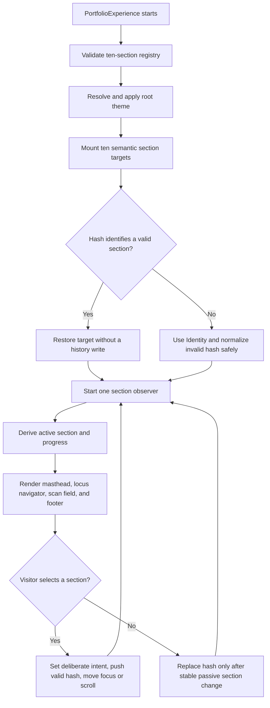

# Business Logic Model - U-02 Scientific Shell

## Scope

U-02 replaces the live template-driven frame with one continuous bioinformatics-observatory shell. Its business logic coordinates ten stable sections, deliberate navigation, passive scroll observation, browser history, progress, and theme preference. It does not compose final domain content or load journal details and full evidence.

## Shell State Model

The shell derives one immutable view state from five inputs:

1. The approved U-01 section registry.
2. The current browser hash.
3. Mounted section targets.
4. Browser capability adapters for observation, motion, media preference, history, and storage.
5. An optional deliberate navigation intent.

The derived state contains the active section, active ordinal, locus ratio, completion ratio, current label, navigation intent state, theme, capability fallbacks, and a stable ordered navigation model. Section identity never comes from visible JSX text.

## Coordination Flow

### Text Alternative

The shell validates the registry, resolves the theme, mounts all ten section targets, restores a valid incoming hash or safely selects Identity, then starts one observer. Observer facts produce the active section and progress used by the four-band shell. Deliberate navigation pushes a valid history entry and temporarily takes precedence; stable passive scrolling replaces the current hash without adding history entries.

## Workflow 1 - Bootstrap and Direct-Link Restoration

1. Validate that the registry contains the approved ten unique IDs in order.
2. Resolve theme independently so a hash or observer failure cannot block rendering.
3. Render every section target before attempting restoration.
4. Decode only a simple registered section hash. The journal namespace remains reserved for U-07.
5. For a valid hash, select that section and restore its position after target registration without adding a history entry.
6. For an empty hash, select Identity and leave the URL unchanged.
7. For an invalid non-journal hash, select Identity and replace the invalid value once; never enter a hash-change loop.
8. Start observation after restoration intent is established.

## Workflow 2 - Deliberate Navigation

1. A navigation link retains a real `href` matching its section hash.
2. Activation validates the ID against the registry and verifies that its target exists.
3. The controller records a deliberate navigation intent and updates state immediately so current-section semantics respond without delay.
4. It pushes one history entry only when the destination differs from the current valid hash.
5. It scrolls to the labelled section using instant movement when reduced motion is requested and smooth movement otherwise.
6. The intent remains authoritative until the destination becomes the observer winner or navigation is interrupted by a new deliberate action, back/forward event, or missing target.
7. Missing targets produce a deterministic fallback result and do not corrupt history.

Keyboard activation and pointer activation use the same workflow. No control depends on drag, hover, or precise pointing.

## Workflow 3 - Passive Active-Section Resolution

The observer reports visibility facts for all registered targets. The controller selects a winner deterministically:

1. Ignore unknown target IDs.
2. Prefer the current deliberate destination while it remains pending.
3. Among intersecting sections, prefer the section whose leading edge is closest to the configured reading anchor.
4. Break equal distances using the higher intersection ratio.
5. Break any remaining tie using registry order.
6. Retain the previous active section when no valid candidate is visible and the page is not at a document boundary.
7. Select Identity at the top boundary and Contact at the bottom boundary.

After a stable passive change, use `replaceState` rather than `pushState`. Passive updates never create a back-button entry for every scroll transition.

## Workflow 4 - Observer Fallback

When `IntersectionObserver` is unavailable, one throttled geometry reader evaluates the same registered targets against the same reading anchor. It runs on scroll and resize through a single controller, schedules at most one evaluation per animation frame, and removes listeners on teardown. The same deterministic winner function consumes both observer and geometry facts.

If geometry APIs are also unavailable, the last valid active section remains usable and every real hash link still provides native navigation.

## Workflow 5 - Progress Derivation

For registry length `count` and zero-based active index `index`:

- Human-readable ordinal: `index + 1` of `count`.
- Completion ratio: `(index + 1) / count`.
- Locus-position ratio: `count <= 1 ? 1 : index / (count - 1)`.

The visual track uses locus position; the concise textual state uses the ordinal. Color and marker position are redundant cues. Passive scrolling does not create repeated live announcements; a polite status update occurs only after a stable section change or deliberate navigation.

## Workflow 6 - Theme Resolution and Persistence

Theme precedence is:

1. A valid stored value, `light` or `dark`.
2. A matching system dark preference.
3. Deterministic light fallback.

The controller applies exactly one `data-theme` attribute on the document root. A toggle updates in-memory state and the root immediately, then attempts persistence. Storage read/write exceptions return typed failure facts but never prevent rendering or toggling. System preference changes affect the shell only while no explicit visitor preference is active.

## Workflow 7 - Guarded Active-Entry Migration

The U-02 Code Generation plan may switch the active composition only after these preconditions pass:

- U-01 recovery and boundary verification.
- Exact ten-section registry and mounted-target tests.
- Navigation, direct-hash, invalid-hash, back/forward, observer-fallback, and storage-failure tests.
- Semantic landmark, keyboard, current-state, and progress-text tests.
- Phone and desktop review in light and dark modes.
- Production build and post-shell entry measurement.

The switch replaces current template selection and layout-mode composition with `PortfolioExperience`. It must not import rejected shells, sidebars, drawers, layout selectors, casebook/notebook structures, or final domain implementations. If a prerequisite fails, the active entry remains unchanged and the failure is reported.

## Failure Outcomes

| Condition | Result | Blocking for entry switch |
| --- | --- | --- |
| Registry mismatch or duplicate ID | Deterministic shell validation error | Yes |
| Registered target missing | Keep real link, return target-missing finding, do not write history | Yes |
| Invalid section hash | Replace once with safe Identity state | No |
| Reserved journal hash | Preserve for U-07 route boundary | No |
| Observer unavailable | Use the single geometry fallback | No |
| Observer and geometry unavailable | Keep last valid state; native hashes remain usable | Warning |
| Storage unavailable | Use in-memory theme and deterministic preference fallback | No |
| History API unavailable | Use native hash behavior without synthetic history control | Warning |
| Reduced motion requested | Use instant navigation and suppress nonessential transitions | No |
| Verification or bundle measurement fails | Do not switch active composition | Yes |

## External Systems and Persistence

There are no backend endpoints, network requests, databases, analytics, uploads, or service workers. Theme preference is the only shell persistence and is optional. URL hashes are public navigation state, not content storage.

## Traceability

- ST-002 and FR-002/003: continuous page, directly reachable compact navigation, stable hashes, and textual progress.
- ST-003 and FR-015: first-class light/dark modes with resilient preference handling.
- FR-016 and ST-019 inheritance: 320-CSS-pixel through wide-desktop behavior without a sidebar or drawer.
- ST-016/018/020/021 inheritance: semantic operation, measured entry impact, typed fallbacks, and guarded migration.

## Extension Compliance

- Security Baseline: disabled; skipped. Product-specific safe hash, destination, and storage boundaries remain designed.
- Property-Based Testing: disabled; skipped. Deterministic example and transition-matrix tests remain required.
