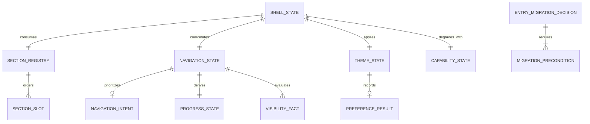

# Domain Entities - U-02 Scientific Shell

## Domain Boundary

The U-02 domain is global experience coordination. It owns where the visitor is, how they move among stable domains, how position is communicated, which color mode is active, and whether browser capabilities require fallbacks. It does not own scientific claims, domain view models, evidence contents, or journal articles.

## Relationship Model

### Text Alternative

Shell state consumes the section registry and its ordered section slots. It coordinates navigation state, which may prioritize a deliberate navigation intent, evaluates section visibility facts, and derives progress state. Shell state also applies theme state, records optional preference results, and adapts to capability state. A separate entry migration decision requires all named migration preconditions.

## `ShellState`

| Field | Type | Invariant |
| --- | --- | --- |
| sections | Read-only section registry | Exactly ten approved definitions in order. |
| navigation | `NavigationState` | Active ID always exists in the registry. |
| progress | `ProgressState` | Exactly derived from navigation and registry. |
| theme | `ThemeState` | Root-applied `light` or `dark`. |
| capabilities | `CapabilityState` | Explicit support or fallback facts. |
| status | `initializing`, `ready`, or `degraded` | `degraded` retains semantic operation. |

## `SectionSlot`

| Field | Meaning |
| --- | --- |
| definition | Approved U-01 ID, labels, hash, order, and component key. |
| headingId | Stable accessible heading relationship. |
| targetState | `pending`, `mounted`, or `missing`. |
| contentState | `temporary-marker` or `owned-domain`. |

There is one slot per registry definition. Temporary markers contain only structural labels and implementation status; they cannot become new factual sources.

## `NavigationState`

| Field | Type | Rule |
| --- | --- | --- |
| activeSectionId | Registered section ID | Never unknown or empty. |
| activeIndex | Nonnegative integer | Matches the registry index of the active ID. |
| source | `bootstrap`, `deliberate`, `observer`, `geometry`, or `history` | Explains state precedence. |
| pendingIntent | Optional `NavigationIntent` | At most one; a new intent supersedes the old one. |
| lastStableHash | Valid section hash or empty | Never contains an invalid or raw value. |

## `NavigationIntent`

- Destination: registered section ID.
- Origin: compact navigation, skip link, in-page action, or browser history.
- History mode: `push`, `replace`, or `none`.
- Motion: `smooth` or `instant` after reduced-motion resolution.
- State: `pending`, `fulfilled`, `interrupted`, or `failed`.

An intent is fulfilled when the destination becomes the resolved active target. Failure does not create a history entry.

## `VisibilityFact`

| Field | Constraint |
| --- | --- |
| sectionId | Registered target only. |
| isIntersecting | Boolean observation fact. |
| intersectionRatio | Finite value from 0 through 1. |
| anchorDistance | Finite signed CSS-pixel distance. |
| observedAt | Monotonic ordering token supplied by the controller. |

Observer and geometry adapters normalize into this same entity so winner selection remains pure and testable.

## `ProgressState`

| Field | Derivation |
| --- | --- |
| activeIndex | Registry index of active section. |
| activeOrdinal | `activeIndex + 1`. |
| sectionCount | Registry length, exactly 10. |
| locusRatio | `index / (count - 1)`, or 1 for a single-item registry. |
| completionRatio | `(index + 1) / count`. |
| label | Active section label from the registry. |
| semanticText | `{label}, section {ordinal} of {count}`. |

All ratios are clamped to 0 through 1 after validating their inputs. The semantic text is authoritative; geometry is a redundant representation.

## `ThemeState`

| Field | Values |
| --- | --- |
| theme | `light` or `dark`. |
| source | `stored`, `system`, `default`, or `visitor`. |
| hasExplicitPreference | Boolean; true after a valid stored or visitor value. |
| persistence | Optional `PreferenceResult`. |

## `PreferenceResult`

- Operation: `read` or `write`.
- Status: `succeeded`, `unavailable`, `invalid`, or `failed`.
- Value: optional valid theme.
- Diagnostic code: stable, non-sensitive maintainer fact.

It never contains raw exception objects or storage contents.

## `CapabilityState`

| Capability | States | Fallback |
| --- | --- | --- |
| IntersectionObserver | supported/unavailable | Throttled geometry controller. |
| Geometry measurement | supported/unavailable | Retain last valid state and native hashes. |
| History API | supported/unavailable | Native hash navigation. |
| Storage | supported/unavailable/failed | In-memory theme. |
| matchMedia | supported/unavailable | Light default. |
| Reduced-motion query | reduce/no-preference/unavailable | Conservative instant navigation when unavailable during programmatic restoration. |

## `EntryMigrationDecision`

Contains the source revision, U-01 recovery state, focused test result, accessibility review result, responsive review result, boundary result, build result, and post-build measurement. `canSwitch` is true only when every required precondition passes. Warnings require recorded dispositions; errors keep the current active entry.

## State Invariants

- Registry, section slot, navigation, and progress identities remain read-only.
- Browser adapters create facts; they cannot choose visual geometry or fabricate domain state.
- Theme state cannot alter section availability or DOM composition.
- No entity stores personal form data, analytics, evidence documents, or fetched content.
- Later units replace `temporary-marker` bodies without mutating shell navigation ownership.

## Extension Compliance

Security Baseline and Property-Based Testing are disabled and skipped. Product-specific capability and persistence invariants remain mandatory.
