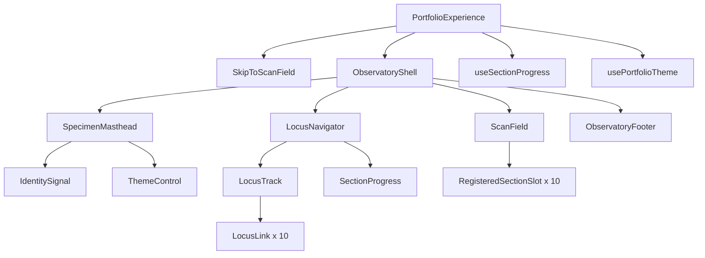

# Frontend Components - U-02 Scientific Shell

## Visible Design Contract

The U-02 shell is a full-width bioinformatics observatory, not a rearrangement of the existing template. Its visible hierarchy uses four horizontal systems:

1. A slim specimen/status masthead for identity shorthand and mode control.
2. A compact locus navigator that reads like an annotated scientific coordinate strip.
3. A continuous scan field containing ten differently owned semantic section slots.
4. A restrained terminal footer that closes the research journey without repeating navigation chrome.

There is no persistent side column, drawer, hamburger menu, layout selector, generic card grid, casebook, notebook, Quarto frame, ledger, or timeline shell.

## Component Hierarchy



### Text Alternative

PortfolioExperience renders a skip link and ObservatoryShell. The shell contains a specimen masthead with identity shorthand and theme control, a locus navigator with ten locus links and section progress, a main scan field with ten registered section slots, and a footer. Navigation and theme hooks coordinate the shell without owning domain content geometry.

## `PortfolioExperience`

### Responsibilities

- Validate and pass the U-01 registry to one shell instance.
- Create one navigation/progress controller and one theme controller.
- Route the reserved journal namespace to a later lazy boundary without interpreting it as a section.
- Supply all ten slots in registry order.
- Expose a safe migration seam for the active application entry.

### Interface

```ts
type PortfolioExperienceProps = Readonly<{
  sections: readonly SectionDefinition[]
  renderSection: (section: SectionDefinition) => ReactNode
  browser?: ShellBrowserAdapters
}>
```

Production uses default browser adapters. Tests inject history, storage, media, observer, and geometry adapters without mutating globals unnecessarily.

## `ObservatoryShell`

```ts
type ObservatoryShellProps = Readonly<{
  sections: readonly SectionDefinition[]
  navigation: NavigationController
  theme: ThemeController
  children: ReactNode
}>
```

It owns landmark order and the four-band structure. It does not know project, academic, evidence, or contact view-model shapes. Sticky behavior, if used, must reserve focus-safe scroll padding and cannot obscure headings.

## `SkipToScanField`

- Native anchor targeting the single main landmark.
- Visually hidden until focused, then placed above all sticky shell bands.
- Stable purpose-based test ID: `scientific-shell-skip-link`.
- Uses instant movement under reduced motion.

## `SpecimenMasthead`

The masthead uses a concise research identity signal, an explicit “portfolio observatory” descriptor, connection/status text, and the mode control. Its composition is linear and instrument-like, not a hero card. Full identity content belongs to U-03.

At narrow widths, status text may wrap below the identity signal. The theme control remains directly reachable and never moves into a menu.

## `LocusNavigator`

### Semantics and Interaction

- Native `nav` named “Portfolio sections”.
- Ordered registry links with real hashes.
- Active link uses `aria-current="location"` and a text/symbol marker in addition to color.
- Left/right arrow enhancement may move focus among links, but Tab reaches the strip and native link activation remains sufficient.
- The mobile strip scrolls horizontally inside its own named region; it does not cause document overflow.
- Selecting a link calls the single controller after preserving the link fallback.

### Interface

```ts
type LocusNavigatorProps = Readonly<{
  items: readonly NavigationItem[]
  activeSectionId: SectionId
  onNavigate: (id: SectionId, origin: 'navigation') => NavigationResult
}>
```

## `SectionProgress`

The progress visual resembles a genome locus ruler: ten labelled or abbreviated stops, a current marker, and a thin connecting track. It receives already derived state and performs no observation.

```ts
type SectionProgressProps = Readonly<{
  activeLabel: string
  activeOrdinal: number
  sectionCount: number
  locusRatio: number
  completionRatio: number
  reducedMotion: boolean
}>
```

- Visual geometry is `aria-hidden` when redundant.
- Text exposes “{label}, section {N} of {count}”.
- The text status is polite and updates only for stable changes.
- Marker transitions are removed under reduced motion.

## `ThemeControl`

- Native button with at least a 24-by-24-CSS-pixel target.
- Accessible name describes the action: “Use dark mode” or “Use light mode”.
- Visible state includes text or a persistent day/night symbol, not color alone.
- Stable test ID: `scientific-shell-theme-button`.
- A persistence failure does not disable the control or display a disruptive error.

## `ScanField` and `RegisteredSectionSlot`

`ScanField` is the single focusable main landmark. Each slot uses U-01 `SectionRegion`, its stable hash ID, and its own heading. Before the owning domain unit lands, its body is a restrained marker such as “Domain instrumentation pending” plus no student fact. The markers are deliberately visually subordinate and cannot look like final repeated cards.

Later domain units replace slot bodies through `renderSection`; they cannot reorder IDs or create parallel shell wrappers.

## `ObservatoryFooter`

The footer provides a concise ownership statement, direct contact fallback when available later, and build/static-delivery context. It does not repeat all ten navigation links or imitate a dashboard status panel.

## Hook Contracts

### `useSectionProgress`

```ts
type NavigationController = Readonly<{
  state: ProgressState
  navigateToSection: (id: SectionId, origin: NavigationOrigin) => NavigationResult
  registerTarget: (id: SectionId, element: HTMLElement | null) => void
}>
```

The hook has one observer/fallback lifecycle, stable callbacks, deterministic cleanup, and no component-level scroll listeners.

### `usePortfolioTheme`

```ts
type ThemeController = Readonly<{
  theme: 'light' | 'dark'
  source: 'stored' | 'system' | 'default' | 'visitor'
  toggleTheme: () => PreferenceResult
}>
```

The hook applies one root attribute and contains storage/media-query adaptation. Domain components consume semantic CSS tokens only.

## Responsive States

| Range | Masthead | Locus navigator | Scan field |
| --- | --- | --- | --- |
| 320 CSS px and small phones | Identity/status wrap; direct theme control | Horizontally scrollable local strip; no drawer | Full width with safe inline padding and no document overflow |
| Tablet | Two masthead clusters | More simultaneous locus labels | Fluid section slots |
| Laptop | One concise row | Full track with short labels | Bounded inner reading measures owned by each domain |
| Wide desktop | Increased breathing room, not more chrome | Full labels where space permits | Wide scientific visuals may expand locally; no sidebar |

## Focus and Motion

- Shell sticky offsets define `scroll-margin-block-start` for all targets.
- Focus remains visible above sticky bands in both themes.
- No focus is automatically moved during passive scrolling.
- Deliberate hash restoration scrolls but does not steal focus on initial load.
- Navigation activated from inside the page may move programmatic focus to the destination heading only when the interaction contract is explicitly tested; otherwise the real link and scroll behavior remain primary.
- Reduced motion preserves position, active state, and progress text with instant movement.

## Test Seams

- Query landmarks, navigation name, links, current location, main, section headings, status text, and button names before using test IDs.
- Inject browser adapters for valid/invalid hashes, history calls, observer facts, geometry fallback, matchMedia, and storage failures.
- Verify all ten real hashes, deterministic winner rules, one-controller cleanup, two themes, and reserved journal hashes.
- Render at representative phone and desktop constraints; confirm no document overflow and no hidden navigation.
- Compare pre/post entry manifests and reject prohibited presentation imports.

## Integration Boundaries

- Backend/API: none.
- Database/CMS: none.
- Network requests: none.
- Persistence: optional local theme preference only.
- Routing: registered section hashes now; reserved lazy journal namespace later.
- Entry integration: only through the separately approved Code Generation step.

## Extension Compliance

Security Baseline and Property-Based Testing are disabled and skipped. WCAG, hash safety, storage resilience, and boundary verification remain required product constraints.
