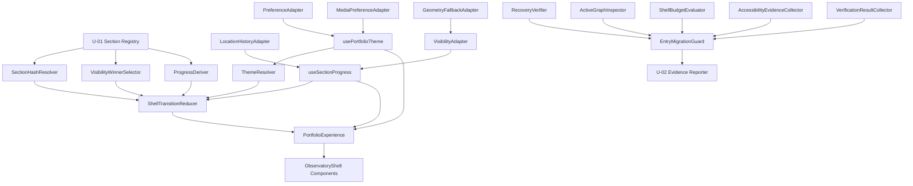

# Logical Components - U-02 Scientific Shell

## Component Model

U-02 separates pure decision logic, browser adaptation, React coordination, visible shell components, and build-time migration evidence. Dependencies point inward toward pure contracts. Browser-safe code never reads build artifacts or executes commands, and build/test adapters never become application imports.

## Dependency Diagram

### Text Alternative

The U-01 registry feeds pure hash, winner, and progress functions, which along with theme resolution feed the shell transition reducer. Location/history and visibility adapters feed the navigation hook; storage and media adapters feed the theme hook. Hooks and the reducer feed PortfolioExperience and its visible ObservatoryShell components. Separately, recovery, active-graph, budget, accessibility, and verification results feed the entry migration guard and U-02 evidence reporter.

## Execution Boundaries

| Boundary | Browser bundle | Browser globals | Files/build metadata | May block entry switch |
| --- | --- | --- | --- | --- |
| Pure shell evaluators | Yes | No | No | Through findings |
| Browser adapters | Yes | Narrow owned capability | No | Through typed failure |
| React controller hooks | Yes | Only through adapters | No | Through state/findings |
| Shell components/styles | Yes | No direct access | No | Through rendered checks |
| Migration/build inspectors | No | Optional test browser only | Yes | Yes |
| Evidence reporter | No | No | Approved result files | Yes |

## Pure Browser-Safe Components

## `SectionHashResolver`

- **Purpose**: Classify empty, registered section, reserved journal, and invalid hashes.
- **Inputs**: Raw hash and frozen registry index.
- **Outputs**: Discriminated `HashResolution` with optional normalization effect.
- **Failure behavior**: Invalid section values select Identity and at most one replace effect; they are never interpolated into selectors or markup.
- **NFRs**: SEC-002, REL-001, AVL-001.

## `VisibilityWinnerSelector`

- **Purpose**: Select one registered section from a normalized visibility batch.
- **Inputs**: Previous active ID, pending intent, monotonic batch sequence, visibility facts, and boundary facts.
- **Outputs**: Winner ID, retained state, or explicit no-capability result.
- **Algorithm**: Intent precedence, reading-anchor distance, descending intersection ratio, registry order.
- **Complexity**: Linear in normalized facts; no DOM access.
- **NFRs**: SCL-001, PER-003/004, REL-001.

## `ProgressDeriver`

- **Purpose**: Produce active index, ordinal, count, locus ratio, completion ratio, label, and semantic text.
- **Inputs**: Valid active ID and registry.
- **Outputs**: Immutable `ProgressState`.
- **Failure behavior**: Unknown active IDs are invariant violations surfaced to tests; UI never guesses.
- **NFRs**: PER-003, REL-001, USE-001.

## `ThemeResolver`

- **Purpose**: Parse stored values, system facts, visitor actions, and deterministic fallback.
- **Inputs**: Optional exact stored value, optional system preference, and optional visitor intent.
- **Outputs**: Valid theme, source, explicit-preference state, and declarative effects.
- **Failure behavior**: Invalid/unavailable stored or media facts select the next precedence source.
- **NFRs**: AVL-001, SEC-002, REL-001.

## `ShellTransitionReducer`

- **Purpose**: Enforce event priority and emit state plus effects.
- **Inputs**: Immutable `ShellState` and one normalized `ShellEvent`.
- **Outputs**: Immutable next state and ordered declarative effects.
- **Failure behavior**: Expected capability events degrade; malformed internal events surface as programmer errors.
- **Boundary**: No DOM, React, timer, storage, history, media, or observation access.
- **NFRs**: REL-001, MNT-001/002.

## Browser Adapter Components

## `LocationHistoryAdapter`

- Reads the current hash and subscribes to hash/popstate events.
- Executes only validated `push`, `replace`, or native-fallback effects.
- De-duplicates identical writes and tags self-originated effects to prevent feedback.
- Returns typed unavailable/failure facts and removes subscriptions on teardown.

## `VisibilityAdapter`

- Owns one observer factory and all registered section targets.
- Emits normalized batches with monotonic sequence values.
- Delegates to `GeometryFallbackAdapter` only when observer creation is unavailable or fails.
- Disconnects and invalidates callbacks during teardown.

## `GeometryFallbackAdapter`

- Owns constant-count passive scroll/resize listeners.
- Schedules at most one animation-frame measurement batch.
- Reads geometry before emitting facts and performs no DOM writes.
- Cancels frames and removes listeners during teardown.

## `PreferenceAdapter`

- Reads and writes only one documented theme key with exact valid values.
- Converts storage exceptions into typed results without exposing raw values or errors.
- Contains no content, evidence, contact, or analytics persistence.

## `MediaPreferenceAdapter`

- Normalizes dark-mode and reduced-motion queries.
- Subscribes using supported modern listener APIs and supplies an explicit compatibility fallback if needed.
- Removes every subscription on teardown.

## React Coordination Components

## `useSectionProgress`

- Creates one target registry and one visibility adapter lifecycle.
- Subscribes to location/history once.
- Dispatches normalized events to the transition reducer.
- Interprets ordered effects through adapters after state decisions.
- Exposes stable target registration, navigation action, state, and findings.
- Avoids state updates for an unchanged winner and remains Strict Mode safe.

## `usePortfolioTheme`

- Resolves initial theme through the pure resolver.
- Applies state and the root attribute before attempting persistence.
- Subscribes to system theme only without an explicit preference.
- Exposes stable theme, source, toggle action, and optional persistence result.
- Removes media subscriptions during teardown.

## `PortfolioExperience`

- Composes the two hooks and supplies their typed results to the shell.
- Renders all ten registered section slots in order.
- Recognizes but does not eagerly load the reserved journal detail boundary.
- Does not access history, storage, observation, or media globals directly.
- Is the only U-02 component eligible for the plan-controlled active entry.

## Visible Shell Components

## `ObservatoryShell`

- Renders `SkipToScanField`, `SpecimenMasthead`, `LocusNavigator`, `SectionProgress`, `ScanField`, and `ObservatoryFooter` in order.
- Owns the full-width four-band layout and sticky-offset contract.
- Receives state and actions; it does not derive section activity or theme preference.

## `LocusNavigator`

- Maps the immutable navigation model into ten real links.
- Uses `aria-current="location"`, persistent text/symbol state, and a labelled local overflow strip.
- Calls one navigation action and never owns an observer, history, or global listener.

## `SectionProgress`

- Renders redundant locus geometry from `locusRatio` and authoritative concise text from `semanticText`.
- Uses no live update for purely visual movement and a controlled polite status for stable changes.
- Disables nonessential transitions through reduced-motion styles and state.

## `ThemeControl`

- Uses a native button with an action-oriented name and persistent visible state.
- Remains enabled when persistence fails.
- Owns no storage or media access.

## `RegisteredSectionSlot`

- Uses U-01 `SectionRegion` with a registered ID and visible heading.
- Registers its target through the controller callback.
- Receives an owned body from later domain units or a non-factual temporary marker.
- Cannot reorder sections or introduce a parallel shell.

## Build/Test Components

## `ActiveGraphInspector`

- Extends the U-01 boundary scope to the active entry and U-02 shell.
- Rejects Chakra, Tailwind presentation, templates, legacy layout hooks, rejected CSS, raw evidence, journal detail, and later domain modules in the eager graph.
- Reconciles source imports with the Vite manifest rather than relying only on string matching.

## `ShellBudgetEvaluator`

- Consumes deterministic Vite manifest facts and exact file sizes.
- Applies 307,200-byte JavaScript, 51,200-byte CSS, and greater-than-10-percent regression rules.
- Separates initial, lazy, evidence, build metadata, and other deployable categories.
- Records gzip values only as supplemental evidence.

## `InteractionTimingVerifier`

- Uses fake clocks for the 100-millisecond state and 200-millisecond settlement contracts.
- Counts scheduled frames, state transitions, and no-op suppression.
- Adds a documented rendered local sample with environment and method.

## `AccessibilityEvidenceCollector`

- Combines semantic test results, token contrast calculations, keyboard/focus review, reduced-motion checks, zoom/reflow results, and the eight-state viewport/theme matrix.
- Distinguishes automated, calculated, manual, and deferred browser evidence.
- Cannot report pass when a required P0 state is absent.

## `EntryMigrationGuard`

- Accepts recovery, tests, lint, build, boundary, budget, timing, accessibility, responsive, dependency, and rollback results.
- Validates completeness and warning dispositions.
- Produces `canSwitch: true` only when all P0 requirements pass.
- Performs no source mutation itself; the approved Code Generation step interprets the decision.

## `U02EvidenceReporter`

- Writes versioned machine-readable verification data and concise Markdown review documentation at build/test time.
- Records exact commands, versions, changed files, measurements, matrices, warnings, and rollback status.
- Does not enter the browser bundle or contain private source evidence.

## Failure Isolation Matrix

| Failure | Owner | Result |
| --- | --- | --- |
| Invalid hash | SectionHashResolver | Identity fallback plus one optional replace effect |
| History unavailable | LocationHistoryAdapter | Native anchor behavior |
| Observer unavailable | VisibilityAdapter | Geometry fallback |
| Geometry unavailable | GeometryFallbackAdapter | Last valid state and native hashes |
| Storage read/write failure | PreferenceAdapter | In-memory theme and typed warning |
| Media unavailable | MediaPreferenceAdapter | Light default and conservative motion |
| Missing registered target | useSectionProgress | Blocking finding; no history write |
| Budget or boundary failure | EntryMigrationGuard | `canSwitch: false` |
| Rendered accessibility failure | AccessibilityEvidenceCollector | Incomplete P0 evidence; `canSwitch: false` |
| Unexpected pure invariant failure | Pure component/test boundary | Visible test/build failure; no swallowed exception |

## Scalability and Performance Boundaries

- Registry and target lookup are keyed.
- Winner selection is one linear pass per normalized batch.
- Observer/listener/subscription counts do not grow per section.
- Geometry reads are one scheduled batch per frame.
- The active runtime imports no build/test adapter.
- No journal detail, full evidence, later domain body, rejected UI framework, or parallel theme/navigation tree is eager.

## Runtime Infrastructure

Runtime queue, cache, circuit breaker, worker, event broker, database, API gateway, monitoring/analytics agent, and retry service are not applicable and prohibited for U-02. GitHub Pages deployment remains unchanged, so Infrastructure Design is skipped.

## NFR Coverage

| Logical components | NFR coverage |
| --- | --- |
| Hash, winner, progress, theme, reducer | SCL-001, PER-003/004, SEC-002, REL-001, MNT-001 |
| Location, visibility, geometry, preference, media adapters | AVL-001, REL-002, CMP-001 |
| Navigation/theme hooks | PER-003/004, AVL-001, REL-001/002, MNT-002 |
| Shell components | USE-001/002, MNT-002 |
| Active graph and budget tools | PER-001/002/004, SEC-003, EVD-001 |
| Timing and accessibility collectors | PER-003/004, USE-001/002, CMP-001, EVD-001 |
| Entry guard and reporter | AVL-002, MNT-001, EVD-001 and all P0 evidence |

## Extension Compliance

- Security Baseline: disabled; skipped. Product-specific security controls are represented by the resolver, adapters, inspector, and guard.
- Property-Based Testing: disabled; skipped. Deterministic transition, repeated-run, failure-matrix, and doubled-volume fixtures remain required.
