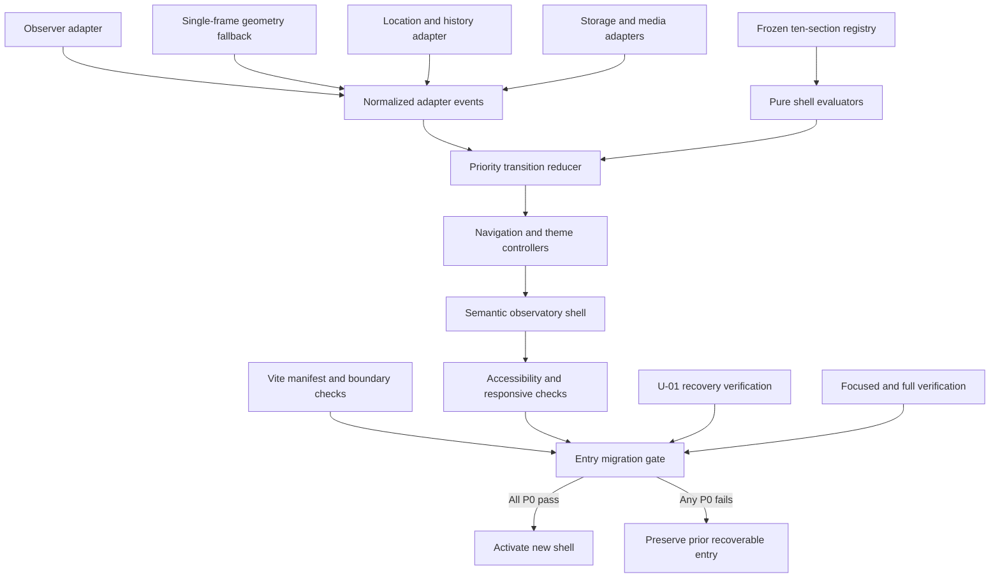

# NFR Design Patterns - U-02 Scientific Shell

## Design Objective

U-02 must replace the active template structure without sacrificing recovery, accessibility, determinism, or bundle headroom. Browser APIs are treated as optional adapters around a small pure state core. Every active-entry precondition is evidence-backed and fail-closed; ordinary capability loss degrades to native links and in-memory state rather than blanking the shell.

## Pattern Overview

### Text Alternative

The frozen registry and normalized browser events feed pure evaluators and a priority transition reducer. Observer, geometry, hash/history, storage, and media behavior enter through adapters. Controllers render the semantic observatory shell. Accessibility, responsive, build, boundary, recovery, and test evidence feed an entry migration gate. All P0 checks activate the shell; any P0 failure preserves the prior recoverable entry.

## Pattern P-01 - Pure Transition Core with Typed Degradation

### Intent

Isolate expected browser capability failures while keeping state transitions deterministic and programmer errors visible.

### Structure

- Pure functions parse section hashes, resolve theme precedence, select visibility winners, derive progress, and reduce normalized events.
- The reducer accepts the previous immutable state and one discriminated event and returns the next state plus declarative effects.
- Effects describe history writes, scrolling, root-theme application, preference writes, observation startup, and cleanup; the reducer performs none directly.
- Expected capability failures become typed `degraded` facts with a usable next state.
- Invalid required registry or target state becomes a blocking finding and produces no entry-switch approval.
- Unexpected invariant violations throw at test/build boundaries rather than becoming warnings.

### Retry Policy

No retry is used for deterministic parsing, derivation, state transitions, DOM target resolution, history writes, media queries, or storage. A repeated local operation cannot repair invalid input. Capability failures select a defined fallback once; they do not loop.

### Supports

U02-NFR-AVL-001, U02-NFR-REL-001, U02-NFR-SEC-002, U02-NFR-MNT-001.

## Pattern P-02 - Single-Intent Event Arbitration

### Intent

Prevent deliberate navigation, passive observation, geometry fallback, and browser history from fighting over the active section.

### Priority

1. A browser back/forward event interrupts any pending intent and resolves its validated hash.
2. A newer deliberate navigation supersedes the prior deliberate intent.
3. The pending deliberate destination remains active until fulfilled, interrupted, or failed.
4. Stable observer or geometry winners control passive state when no intent is pending.
5. No-candidate batches retain the last valid state except at explicit document boundaries.

Each visibility batch carries a monotonic sequence value. Stale batches are ignored. History effects are idempotent: deliberate destination changes request one push; passive winner changes request a replace; identical hashes request no write.

### Supports

U02-NFR-PER-003, U02-NFR-REL-001, U02-NFR-USE-001.

## Pattern P-03 - Shared Visibility Normalization

### Intent

Provide identical active-section semantics with and without `IntersectionObserver`.

### Structure

- One `VisibilityAdapter` owns target registration and emits normalized facts.
- The observer implementation uses one observer instance for all targets.
- If unavailable, one geometry implementation attaches constant-count passive listeners and schedules at most one read batch per animation frame.
- Both implementations emit registered ID, intersection state, ratio, anchor distance, boundary facts, and sequence.
- One pure winner selector applies distance, ratio, and registry-order tie-breaking.
- Teardown disconnects the observer, removes listeners, cancels the scheduled frame, and invalidates pending callbacks.

### Supports

U02-NFR-SCL-001, U02-NFR-PER-004, U02-NFR-AVL-001, U02-NFR-REL-002.

## Pattern P-04 - Progressive Native Navigation

### Intent

Retain meaningful navigation when script enhancement or History API behavior is unavailable.

### Structure

- Every locus item is a real anchor with a registry-owned hash.
- Enhancement validates the destination and mounted target before suppressing default behavior.
- Valid deliberate navigation emits immediate state, an optional push effect, and reduced-motion-aware scroll effect.
- Direct-link restoration waits for target registration and performs no history write.
- Invalid non-journal hashes resolve to Identity and request at most one replace effect.
- The journal namespace is classified separately and left intact for U-07.
- When History API is absent, native hash navigation remains the fallback.

### Supports

U02-NFR-AVL-001, U02-NFR-SEC-002, U02-NFR-REL-001, U02-NFR-USE-001, U02-NFR-CMP-001.

## Pattern P-05 - Theme Apply-First, Persist-Second

### Intent

Make the theme control immediate and reliable without turning optional storage into an availability dependency.

### Structure

1. Parse a stored value through an exact `light`/`dark` allowlist.
2. If absent or invalid, inspect the system preference through a media adapter.
3. If media is absent or fails, select light.
4. Apply state and the one root `data-theme` attribute synchronously.
5. Attempt storage after the visitor changes the theme.
6. Return a typed persistence result without reverting the selected theme on failure.
7. Listen for system changes only while no stored or visitor preference is active.

The system uses one DOM tree and semantic token roles; no component branches its content by mode.

### Supports

U02-NFR-PER-003, U02-NFR-AVL-001, U02-NFR-SEC-001/002, U02-NFR-REL-002, U02-NFR-USE-001.

## Pattern P-06 - Frozen Registry and Bounded Batch Work

### Intent

Maintain one global shell controller and predictable work as structural fixtures grow.

### Structure

- The approved registry is read-only and indexed by ID once.
- One target map stores mounted elements; registration replaces only the matching ID reference.
- Visibility is evaluated in one linear batch and updates state only when the selected ID changes.
- Navigation and progress models are derived once per relevant state change.
- Listener, observer, theme subscription, and history subscription counts remain constant with section count.
- Doubled-volume fixtures verify architecture but do not alter the approved ten visible domains.

### Supports

U02-NFR-SCL-001, U02-NFR-PER-004, U02-NFR-MNT-002.

## Pattern P-07 - Headroom-First Active Graph

### Intent

Use the shell switch to remove rejected runtime weight and reserve budget for later scientific domains.

### Controls

- The active entry imports only React, U-01 contracts/styles, and U-02 shell modules.
- Chakra providers/components, Tailwind presentation composition, template registries, layout-mode hooks, rejected global styles, journal detail, evidence documents, and later domain presentation stay outside the eager graph.
- Native semantics replace UI framework primitives.
- One locally owned CSS Module defines shell geometry; theme changes use tokens rather than duplicate CSS trees.
- The Vite manifest classifier measures all eager code and CSS before and after activation.
- JavaScript above 307,200 bytes, CSS above 51,200 bytes, or an unexplained greater-than-10-percent regression blocks activation.
- Fake-time and rendered checks enforce 100-millisecond state response and 200-millisecond stable progress settlement.

### Supports

U02-NFR-PER-001, U02-NFR-PER-002, U02-NFR-PER-003, U02-NFR-PER-004, U02-NFR-SEC-003, U02-NFR-EVD-001.

## Pattern P-08 - Static Defense in Depth

### Intent

Protect navigation, privacy, and the active graph without adding runtime security infrastructure.

### Layers

- Compile-time typed section and theme unions.
- Runtime exact allowlists at browser input boundaries.
- Registry-keyed element resolution rather than arbitrary selector interpolation.
- React text rendering with no unsafe HTML path.
- Real local anchors and safe future external-link contracts.
- Theme-only storage with no visitor or content values.
- Prohibited import, raw asset, unsafe scheme, rejected selector, and routine-`!important` checks.
- Vite active-manifest reachability review plus dependency inventory and available audit evidence.
- No runtime request, analytics, authentication, API, database, secret, or form persistence.

### Supports

U02-NFR-SEC-001 through U02-NFR-SEC-003, U02-NFR-MNT-001.

## Pattern P-09 - Accessibility and Responsive Acceptance Pyramid

### Intent

Make WCAG and responsive quality a migration precondition rather than a post-switch repair task.

### Layers

1. Pure tests validate progress text, motion decisions, and current-state transitions.
2. Semantic component tests query the skip link, named navigation, main, sections, current link, status, and mode control.
3. Token calculations prove declared text and meaningful-graphic contrast pairs.
4. Rendered checks cover keyboard order, focus visibility/obstruction, sticky offsets, reduced motion, and theme parity.
5. The eight-state 320/768/1280/1440 by light/dark matrix covers local strip scrolling, document overflow, wrapping, and wide-layout uniqueness.
6. Manual 200-percent zoom and available browser checks cover behavior not proven by jsdom.

An automated scanner may supplement but never replace these layers.

### Supports

U02-NFR-USE-001, U02-NFR-USE-002, U02-NFR-CMP-001, U02-NFR-EVD-001.

## Pattern P-10 - Two-Phase Entry Migration Gate

### Intent

Prevent an incomplete or unrecoverable visible switch.

### Phase 1 - Candidate Verification

- Generate the shell behind an inactive export.
- Pass pure, hook, component, boundary, strict-type, focused, and full tests.
- Verify U-01 recovery and the raw-source inventory.
- Review all viewport/theme states and performance timing.
- Build a candidate entry in an isolated configuration or plan-approved seam and measure its manifest.

### Phase 2 - Controlled Activation

- Confirm every P0 result and warning disposition.
- Modify only the exact entry/style files named in the approved Code Generation plan.
- Build again and verify the active manifest contains the shell and excludes rejected runtime modules.
- Repeat recovery, boundary, responsive, accessibility, and performance checks.
- If any post-switch P0 result fails, do not delete rejected sources; use the verified recovery/change record to restore or revise before approval.

### Supports

U02-NFR-AVL-002, U02-NFR-MNT-001, U02-NFR-EVD-001 and all migration acceptance methods.

## Runtime Infrastructure Decision

Runtime infrastructure is not applicable. No queue, cache server, circuit breaker, worker, monitoring/analytics agent, API, database, event broker, or retry service is introduced. The state machine and browser adapters are local modules; build/test evidence adapters run only during approved verification.

## Requirement Coverage

| Pattern | Primary U-02 NFR coverage |
| --- | --- |
| P-01 | AVL-001, REL-001, SEC-002, MNT-001 |
| P-02 | PER-003, REL-001, USE-001 |
| P-03 | SCL-001, PER-004, AVL-001, REL-002 |
| P-04 | AVL-001, SEC-002, REL-001, USE-001, CMP-001 |
| P-05 | PER-003, AVL-001, SEC-001/002, REL-002, USE-001 |
| P-06 | SCL-001, PER-004, MNT-002 |
| P-07 | PER-001 through PER-004, SEC-003, EVD-001 |
| P-08 | SEC-001 through SEC-003, MNT-001 |
| P-09 | USE-001/002, CMP-001, EVD-001 |
| P-10 | AVL-002, MNT-001, EVD-001 |

## Extension Compliance

- Security Baseline: disabled; skipped. Static product controls remain mandatory through P-08.
- Property-Based Testing: disabled; skipped. Transition matrices, repeated runs, and doubled-volume fixtures remain mandatory.
