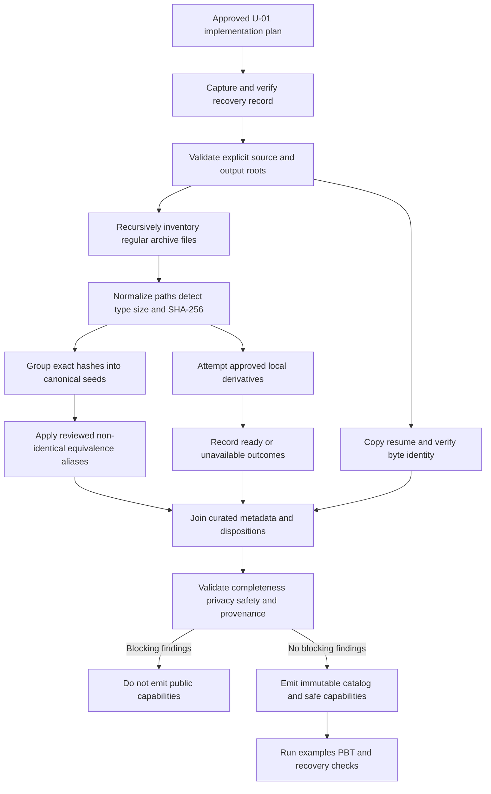

# U-01 Business Logic Model

## Purpose

U-01 converts approved local sources into deterministic, privacy-safe facts and capabilities. It establishes the logical workflows for recovery capture, physical inventory, exact-content canonicalization, reviewed equivalence, metadata joining, resume copying, derivative outcomes, source admission, validation, and test evidence. It does not render or activate new visitor-facing UI.

## Inputs and Outputs

### Inputs

- Explicit archive root containing 122 source files: 94 JPG, 20 PDF, 3 PNG, 3 HEIC, 1 SVG, and 1 DOCX.
- Supplied external four-page resume PDF.
- Existing reviewed evidence records and approved content provenance.
- Human-reviewed curated metadata and non-identical equivalence declarations.
- Current repository revision, tracked changes, relevant untracked files, and approved output roots.

### Outputs

- Recovery record proving the pre-mutation state and restoration procedure.
- Byte-identical bundled resume capability with stable download filename.
- Physical asset inventory with normalized repository-relative paths and SHA-256 hashes.
- Canonical asset seeds with complete physical membership.
- Validated curated catalog and publication dispositions.
- Derivative manifest with deterministic ready/unavailable outcomes.
- Safe local/approved-HTTPS media capabilities or typed rejections.
- Validation report with blocking and warning findings.
- Reusable property-test generator and replay contracts.

## End-to-End Workflow

### Text Alternative

After the U-01 implementation plan is approved, the workflow first captures and verifies recovery evidence and explicit roots. It copies the resume and inventories the archive. Inventory facts are hashed, canonicalized by exact content, optionally joined through reviewed non-identical aliases, and passed to local derivative generation. Curated metadata, derivative outcomes, and the resume capability are joined. Validation either blocks publication capabilities or emits immutable safe results, which then pass example, property, and recovery verification.

## Workflow 1 - Recovery Capture

1. Resolve the workspace revision without modifying it.
2. Capture tracked diff metadata and content required for exact restoration.
3. Enumerate relevant untracked files and record their repository-relative locators, bytes, and SHA-256 hashes.
4. Record the approved source roots, proposed write targets, and files explicitly prohibited from deletion.
5. Produce restoration instructions that do not rely on broad destructive commands.
6. Verify the record can identify every planned mutation target and the pre-change content expected at that target.
7. If any planned target lacks recoverable pre-change evidence, emit a blocking `REC` finding and stop before mutation.

The recovery record describes state; it does not itself authorize cleanup, deletion, reset, or deployment.

## Workflow 2 - Resume Copy and Privacy Boundary

1. Confirm the supplied input is a readable regular PDF at the explicitly approved source location.
2. Compute its byte length and SHA-256.
3. Copy it to the approved application asset target using a stable internal locator.
4. Recompute the copied file's byte length and SHA-256.
5. Require source and copy to match exactly.
6. Assign the public download filename `Tran-Gia-Minh-Tam-Resume.pdf` independently of its internal asset name.
7. Create only a local PDF capability containing safe path, title, media type, and filename.
8. Do not extract the phone number into the capability, source records, catalog metadata, diagnostics, fixtures, or rendered text.
9. Treat a byte mismatch, non-PDF input, unreadable source, or privacy leak as blocking.

The original external file remains untouched. Its embedded phone number is permitted only inside the unchanged approved PDF bytes.

## Workflow 3 - Physical Inventory

For every regular file recursively reachable from the explicit archive root:

1. Resolve and normalize its path relative to the repository root using `/` separators.
2. Reject absolute output locators, traversal segments, root escape, and symbolic-link escape.
3. Derive a stable physical ID from the normalized repository-relative path.
4. Determine media type from approved extension plus signature/type verification where available.
5. Read byte size and compute SHA-256 over exact bytes.
6. Record the fact immutably.
7. Sort facts by normalized repository-relative path for deterministic manifest generation.

Generated derivative roots are outside the source archive root and are not counted as physical source files. Unreadable or unstable files produce blocking findings rather than disappearing from the scan.

## Workflow 4 - Exact Canonicalization

1. Partition all physical facts by SHA-256.
2. For each partition, retain every physical member.
3. Select no “preferred path” through scan order; canonical identity is supplied by reviewed metadata or a stable content-linked seed.
4. Require each physical ID to occur in exactly one exact-hash partition.
5. Sort partition members by physical ID.
6. Sort canonical seeds by stable canonical identity.

Running canonicalization again over its normalized physical membership must produce an observably equivalent result. Input permutation must not affect partitions, membership, or ordering.

## Workflow 5 - Reviewed Equivalence

Exact SHA-256 equality is the only automatic duplicate rule. When two non-identical representations describe the same reviewed item:

1. A human-reviewed alias declaration names the canonical ID and each participating exact-hash seed.
2. The declaration states the relationship, such as source/curated export or alternate file representation.
3. Every referenced seed must exist and must not already be assigned to a conflicting canonical item.
4. Filename, size, directory, visual similarity, or approximate text cannot create equivalence automatically.
5. A conflicting or dangling alias emits a blocking finding.

The final canonical item retains every physical member and every exact content hash that participates through the reviewed declaration.

## Workflow 6 - Curated Metadata Join

For each canonical item intended for review or publication:

1. Resolve exactly one reviewed metadata record by canonical ID.
2. Require readable title, factual caption, group, explicit order, source authority, accessibility treatment, and publication disposition.
3. Require either descriptive accessible text or an explicit decorative designation where appropriate.
4. Normalize display text only through reviewed content; raw filenames cannot establish facts.
5. Join original and derivative capabilities only after source-policy validation.
6. Preserve internal repository-relative provenance for every physical member but do not expose unsafe local filesystem paths.
7. Keep incomplete items in the internal inventory with blocking review findings; do not emit interactive public capabilities for them.

## Workflow 7 - Derivative Outcomes

For each item whose format or presentation needs a derivative:

1. Select a derivative purpose from `web-display`, `thumbnail`, `pdf-first-page`, or `document-preview`.
2. Derive a deterministic output name from canonical identity, content hash fragment, purpose, and approved web format.
3. Require the resolved output to remain within the separate managed derivative root.
4. Invoke only an approved local converter adapter with no network transmission.
5. On success, verify output existence, non-zero size, expected media type, and declared dimensions where applicable.
6. Record source hash, tool/adapter identity, purpose, output locator, output hash, dimensions, and `ready` state.
7. On unsupported tooling or conversion failure, record `unavailable` with a stable non-sensitive reason code.
8. Preserve the original in every outcome and never overwrite a source.

A failed derivative is non-blocking only when reviewed metadata defines a safe honest fallback, such as original download or metadata-only representation. Otherwise, publication readiness is blocked.

## Workflow 8 - Media Source Admission

Every candidate interactive source is evaluated before it becomes a capability:

1. Parse the candidate without executing or resolving remote content.
2. Accept a bundled local asset only when it maps to a validated catalog/resume record and remains inside the approved public asset boundary.
3. Accept HTTPS only when its origin is explicitly approved and its intended media role matches policy.
4. Reject malformed sources and all `javascript:`, `file:`, unapproved schemes, document-bearing `data:`, traversal, or unknown-origin inputs.
5. Return a discriminated safe capability or typed rejection.
6. Expose only a generic public message; preserve a stable code for maintainers and tests.

No later unit may bypass this workflow by passing raw strings to preview, download, iframe, object, image, or new-tab elements.

## Workflow 9 - Privacy Verification

1. Derive the sensitive phone marker from a protected local verification input, not from a public fixture.
2. Scan public TypeScript/JavaScript source, generated catalog data, curated metadata, test fixtures, diagnostics, rendered markup snapshots, and text-bearing production build artifacts.
3. Exclude only the exact approved bundled resume PDF bytes from the content scan.
4. Reject obfuscated public representations that reconstruct the same phone value.
5. Record paths using repository-relative safe locators.
6. Any unexpected match is blocking.

The scan must not print the sensitive value itself into logs or reports.

## Workflow 10 - Validation and Emission

Validation aggregates findings by stable code, severity, safe target, public-neutral message, and maintainer resolution. It sets `canProceed` to true only when blocking count is zero.

Blocking categories include:

- Recovery evidence incomplete.
- Root/path escape or unreadable source.
- Physical ID, content hash, or canonical ID collision.
- Lost or multiply assigned physical provenance.
- Missing reviewed metadata/disposition for an eligible item.
- Conflicting equivalence alias.
- Resume byte mismatch or privacy leak.
- Unsafe or unapproved media source.
- Required derivative without a safe fallback.
- Manifest parse/validation failure.

Warnings are permitted only for explicitly optional limitations with an approved fallback, such as an unavailable preview when safe original access remains.

## Workflow 11 - Test Evidence

1. Run concrete examples for the current 122-file composition, three HEIC inputs, one DOCX input, supplied resume equality, known duplicate groups, approved fallbacks, unsafe schemes, and privacy boundary.
2. Run property tests over domain-constrained generators.
3. Keep shrinking enabled.
4. Record seed and shrunk counterexample on failure.
5. Add a permanent concrete regression for every newly discovered minimal business-critical case.
6. Never silently retry a failing property.

## Testable Properties

This section satisfies PBT-01 for U-01.

| Property ID | Component/operation | Category | Formal property |
| --- | --- | --- | --- |
| U01-P01 | Manifest serialization/parsing | Round-trip | For every valid catalog `x`, `parse(serialize(x))` is structurally equal to canonicalized `x`. |
| U01-P02 | Physical inventory normalization | Invariant | Normalization preserves one output fact per valid input file and emits no absolute/traversal public locator. |
| U01-P03 | Exact canonicalization | Invariant | Union of all canonical physical members equals the input physical-ID multiset exactly once. |
| U01-P04 | Exact canonicalization | Idempotence | `canonicalize(canonicalizeFacts(x))` is observably equal to `canonicalizeFacts(x)`. |
| U01-P05 | Exact canonicalization | Oracle | Production grouping equals a simple reference grouping by SHA-256 for every generated valid inventory. |
| U01-P06 | Deterministic ordering | Invariant | Any permutation of valid inputs produces the same ordered canonical/member representation. |
| U01-P07 | Metadata join | Invariant | Every emitted public capability maps to one approved canonical item and every source member remains internally reachable. |
| U01-P08 | Safe media resolution | Invariant | Output `ok: true` implies source is bundled local or explicitly approved HTTPS and contains no prohibited scheme/path. |
| U01-P09 | Privacy filter | Invariant | No generated public model contains a document-only claim or sensitive phone marker. |
| U01-P10 | Finding aggregation | Invariant | `canProceed` is true if and only if blocking finding count is zero. |
| U01-P11 | Finding normalization | Idempotence | Normalizing the same finding set twice equals one normalization. |
| U01-P12 | Reviewed alias join | Easy verification | Every alias reference resolves, every seed has at most one final canonical owner, and all physical membership is preserved. |

### PBT Applicability Decisions

- **Round-trip**: Applicable when a generated manifest is serialized.
- **Invariant**: Applicable to inventory, membership, order, eligibility, safety, and privacy.
- **Idempotence**: Applicable to canonicalization/finding normalization.
- **Commutativity**: N/A; no business operation is documented as order-commutative, while permutation independence is expressed as a deterministic invariant.
- **Oracle**: Applicable to exact hash grouping.
- **Induction**: N/A; workflows are iterative collections with stronger direct membership invariants.
- **Easy verification**: Applicable to alias graph validity and provenance reachability.
- **Stateful PBT**: N/A for U-01 business logic because outputs are immutable pure transformations; filesystem/converter effects use examples/integration tests rather than randomized destructive command sequences.

## Safe Failure Matrix

| Scenario | Finding severity | Output behavior |
| --- | --- | --- |
| Unreadable source file | Blocking | Inventory incomplete; no catalog emission. |
| Path or symlink escapes root | Blocking | Reject source and stop affected emission. |
| Exact duplicate hash | Normal | One exact canonical seed; preserve all members. |
| Non-identical likely duplicate without reviewed alias | Blocking review | Keep separate internal seeds; do not guess equivalence. |
| Metadata missing | Blocking review | Retain inventory fact; no public capability. |
| Optional derivative fails with approved original fallback | Warning | Emit fallback capability only. |
| Required derivative fails without safe fallback | Blocking | No public capability. |
| Resume copy hash differs | Blocking | Do not expose download capability. |
| Unsafe media URL | Blocking | Reject capability; generic public failure only. |
| Phone marker outside approved PDF | Blocking | Stop candidate emission. |
| Property test fails | Blocking | Report seed/shrunk input; no silent retry. |

## Functional Boundary

U-01 may generate design-approved facts and capabilities during later Code Generation, but it never activates the masthead, archive explorer, PDF/image viewer, or new content. Runtime persistence, external uploads, APIs, analytics, and destructive cleanup remain prohibited.
