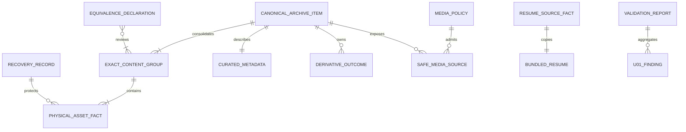

# U-01 Domain Entities

## Modeling Principles

- Entities and value objects are immutable.
- IDs are branded logical values, never scan-order integers.
- Filesystem facts, curated metadata, and runtime capabilities are separate models.
- Expected validation failures use discriminated results and stable findings.
- Absolute filesystem paths and sensitive phone data are excluded from public/runtime entities.

## Identity Value Objects

### `PhysicalAssetId`

- **Meaning**: Stable identity of one physical source path.
- **Derivation**: Canonical encoding/hash of normalized repository-relative path.
- **Invariant**: Two different normalized paths never intentionally share an ID.

### `ContentHash`

- **Meaning**: SHA-256 of exact source bytes.
- **Format**: Lowercase 64-character hexadecimal value.
- **Invariant**: Automatic content equivalence uses equality of this value only.

### `CanonicalAssetId`

- **Meaning**: Stable reviewed identity for one published conceptual item.
- **Invariant**: Independent of scan order, display order, and preferred path.

### `DerivativeId`

- **Meaning**: Stable identity of a derivative purpose/output for a canonical item.
- **Derivation inputs**: Canonical ID, source content hash, purpose, and output format.

### `ArchiveGroupId`

- **Meaning**: Stable category used by later archive discovery.
- **Constraint**: Must resolve to reviewed group metadata; directory name alone is not sufficient.

## Path and Source Value Objects

### `RepositoryRelativePath`

- Uses `/` separators.
- Is relative to the approved repository root.
- Contains no empty segment, `.`/`..` traversal, null byte, or absolute prefix.
- May identify internal provenance but is not automatically suitable for public display.

### `ApprovedRoot`

- Identifies the resolved archive source, derivative output, or resume target boundary.
- Includes an intended role and must not overlap in a way that makes derivatives appear as originals.

### `LocalAssetSource`

- References a validated bundled asset using an application-safe locator.
- Carries declared media role: PDF, image, or download.
- Never contains an absolute local path.

### `ApprovedHttpsSource`

- Contains a normalized HTTPS URL and approved-origin identifier.
- Carries declared media role.
- Cannot be created from a URL until policy approval succeeds.

### `SafeMediaSource`

Discriminated union of `LocalAssetSource` and `ApprovedHttpsSource`. Later UI components accept only this union.

## Physical Inventory Entity

### `PhysicalAssetFact`

| Field | Type | Constraint |
| --- | --- | --- |
| `id` | `PhysicalAssetId` | Derived from normalized repository-relative path. |
| `repositoryPath` | `RepositoryRelativePath` | Must remain inside approved archive root. |
| `mediaType` | `ArchiveMediaType` | PDF, JPEG, PNG, HEIC, SVG, or DOCX for current scope. |
| `bytes` | positive integer | Exact byte count at hash time. |
| `sha256` | `ContentHash` | Exact byte identity. |
| `inventoryRole` | `'source'` | Derivatives cannot enter the source inventory. |

### Invariants

- One fact per regular source file.
- Physical IDs are unique.
- Every fact has one exact content hash.
- Facts contain no display title/caption inference.
- The set is stable-sorted by repository path when serialized.

## Exact Content Group Entity

### `ExactContentGroup`

| Field | Type | Constraint |
| --- | --- | --- |
| `contentHash` | `ContentHash` | Group key. |
| `members` | non-empty readonly `PhysicalAssetFact[]` | Every member has the group hash. |

### Invariants

- Every physical fact belongs to exactly one group.
- Members are unique and sorted by physical ID.
- Groups are independent of input enumeration order.

## Reviewed Equivalence Entity

### `EquivalenceDeclaration`

| Field | Type | Constraint |
| --- | --- | --- |
| `canonicalId` | `CanonicalAssetId` | Reviewed stable owner. |
| `contentHashes` | non-empty readonly `ContentHash[]` | Every hash resolves to an exact group. |
| `relationship` | `'exact-export' \| 'source-and-curated' \| 'alternate-representation'` | Human-reviewed rationale. |
| `reviewReference` | string | Non-sensitive audit locator. |

### Invariants

- A content hash belongs to at most one final canonical owner.
- Declarations cannot infer equivalence from names or size.
- Dangling, conflicting, or empty declarations are invalid.

## Curated Metadata Entity

### `CuratedArchiveMetadata`

| Field | Type | Constraint |
| --- | --- | --- |
| `canonicalId` | `CanonicalAssetId` | Joins one canonical item. |
| `title` | reviewed non-empty string | Human-readable, not raw filename fallback. |
| `caption` | reviewed non-empty string | Factual and source-supported. |
| `accessibleText` | optional string | Required unless explicitly decorative. |
| `decorative` | boolean | Explicit decision, not inferred. |
| `groupId` | `ArchiveGroupId` | Approved category. |
| `order` | non-negative integer | Stable curated order. |
| `authority` | `'evidence' \| 'resume' \| 'owner-reviewed'` | Source authority. |
| `disposition` | `PublicationDisposition` | One primary public treatment. |
| `reviewState` | `'approved' \| 'pending' \| 'conflicted'` | Only approved can emit capabilities. |

### Invariants

- Exactly one metadata record per canonical ID.
- `decorative: false` requires accessible text.
- Pending/conflicted records remain internal and block public capability emission.
- Metadata has no phone field and no absolute source path.

## Canonical Archive Entity

### `CanonicalArchiveItem`

| Field | Type | Constraint |
| --- | --- | --- |
| `id` | `CanonicalAssetId` | Stable reviewed identity. |
| `contentGroups` | non-empty readonly `ExactContentGroup[]` | Exact and reviewed-equivalent representations. |
| `physicalSources` | non-empty readonly `PhysicalAssetFact[]` | Complete flattened membership. |
| `metadata` | `CuratedArchiveMetadata` | Approved for public emission. |
| `originalCapabilities` | readonly `SafeMediaSource[]` | Validated safe sources only. |
| `derivatives` | readonly `DerivativeOutcome[]` | Ready or unavailable by purpose. |

### Invariants

- Every physical source occurs once within the item.
- No physical source occurs in another canonical item.
- The item has exactly one primary disposition.
- Public capabilities exist only when metadata and source policy pass.
- Ordering is metadata order then canonical ID.

## Derivative Entities

### `DerivativePurpose`

`'web-display' | 'thumbnail' | 'pdf-first-page' | 'document-preview'`

### `ReadyDerivative`

| Field | Type | Constraint |
| --- | --- | --- |
| `id` | `DerivativeId` | Deterministic from approved inputs. |
| `canonicalId` | `CanonicalAssetId` | Owning item. |
| `sourceHash` | `ContentHash` | Exact source version. |
| `purpose` | `DerivativePurpose` | One declared role. |
| `output` | `LocalAssetSource` | Inside managed derivative root. |
| `outputHash` | `ContentHash` | Integrity of derivative bytes. |
| `mediaType` | web-compatible media type | Matches purpose/policy. |
| `bytes` | positive integer | Non-empty output. |
| `width` / `height` | optional positive integers | Required for raster display derivatives. |
| `processor` | reviewed adapter identity | No arbitrary command detail exposed publicly. |

### `UnavailableDerivative`

| Field | Type | Constraint |
| --- | --- | --- |
| `id` | `DerivativeId` | Expected derivative identity. |
| `canonicalId` | `CanonicalAssetId` | Owning item. |
| `sourceHash` | `ContentHash` | Attempted source version. |
| `purpose` | `DerivativePurpose` | Requested role. |
| `reason` | stable reason code | Unsupported, tool-unavailable, invalid-source, conversion-failed, or validation-failed. |
| `fallback` | optional `FallbackDisposition` | Must be reviewed and safe. |

### `DerivativeOutcome`

Discriminated union of ready and unavailable derivatives. There is at most one current outcome per canonical ID, source hash, and purpose.

## Resume Entities

### `ResumeSourceFact`

| Field | Type | Constraint |
| --- | --- | --- |
| `sourceHash` | `ContentHash` | Hash of supplied external PDF. |
| `bytes` | positive integer | Source byte count. |
| `pageCount` | `4` | Reviewed current source fact. |
| `sourceRole` | `'external-approved-input'` | Not a public locator. |

### `BundledResume`

| Field | Type | Constraint |
| --- | --- | --- |
| `sourceHash` | `ContentHash` | Must equal copied hash. |
| `copiedHash` | `ContentHash` | Must equal source hash. |
| `source` | `LocalAssetSource` | Bundled local PDF. |
| `downloadFilename` | `'Tran-Gia-Minh-Tam-Resume.pdf'` | Stable visitor-facing name. |
| `title` | string | Public title without private contact data. |

### Invariants

- Source/copy byte length and hash are equal.
- Entity contains no extracted phone value.
- Absolute external path is never emitted to runtime/public data.

## Media Policy Entities

### `MediaSourceCandidate`

Untrusted candidate with raw value, intended media role, origin classification, and optional catalog ID. It is never accepted directly by presentation.

### `MediaPolicy`

| Field | Type | Constraint |
| --- | --- | --- |
| `localRoots` | readonly approved root IDs | Bundled asset boundaries. |
| `httpsOrigins` | readonly approved origins | Explicit allowlist. |
| `roles` | readonly media roles | PDF, image, download. |
| `prohibitedSchemes` | readonly scheme names | Includes script/file/unsafe data behavior. |

### `SafeMediaResolution`

- `ok: true` with `SafeMediaSource`; or
- `ok: false` with stable rejection code and generic public message.

The rejection contains no sensitive candidate echo or absolute path.

## Validation Entities

### `U01FindingCode`

Families:

- `U01-REC-*` recovery.
- `U01-INV-*` inventory/path/type.
- `U01-CAN-*` canonicalization/equivalence.
- `U01-META-*` metadata/eligibility.
- `U01-RES-*` resume copy/privacy.
- `U01-DER-*` derivative outcome.
- `U01-SRC-*` media source policy.
- `U01-PBT-*` property-test evidence.

### `U01Finding`

| Field | Type | Constraint |
| --- | --- | --- |
| `code` | `U01FindingCode` | Stable machine-readable code. |
| `severity` | `'blocking' \| 'warning'` | Warning only with approved fallback. |
| `target` | repository-safe identifier | No absolute path or sensitive value. |
| `message` | non-sensitive string | Factual summary. |
| `resolution` | non-sensitive string | Required action. |

### `U01ValidationReport`

| Field | Type | Constraint |
| --- | --- | --- |
| `findings` | readonly `U01Finding[]` | Deduplicated deterministic order. |
| `counts` | blocking/warning counts | Derived from findings. |
| `canProceed` | boolean | True exactly when blocking count is zero. |

## Recovery Entity

### `RecoveryRecord`

| Field | Type | Constraint |
| --- | --- | --- |
| `captureId` | stable ID | Identifies this pre-mutation boundary. |
| `sourceRevision` | revision string | Current repository basis. |
| `trackedDiffHash` | `ContentHash` | Integrity of captured relevant diff. |
| `untrackedFacts` | readonly safe file facts | Relevant untracked pre-state. |
| `plannedTargets` | readonly repository-relative paths | Exact mutation scope. |
| `protectedSources` | readonly repository-relative paths | Must not be deleted/overwritten. |
| `restorationSteps` | readonly explicit instructions | No broad destructive operation. |
| `verificationState` | `'pending' \| 'verified' \| 'invalid'` | Mutation requires verified. |

## Entity Relationships

### Text Alternative

A recovery record protects physical sources. Exact content groups contain physical facts. Reviewed equivalence declarations can join multiple exact groups into a canonical item. Each canonical item has one curated metadata record and may own derivative outcomes and safe media sources. The resume source maps one-to-one to a byte-identical bundled resume. The media policy admits safe sources, and the validation report aggregates U-01 findings.

## Lifecycle States

### Physical/Canonical Lifecycle

`discovered → hashed → exact-grouped → reviewed-equivalence → metadata-joined → validated → capability-eligible`

- Any integrity failure transitions to `blocked`.
- A blocked item remains in internal accountability reports.
- No state transition deletes source membership.

### Derivative Lifecycle

`planned → processing → ready | unavailable`

- `ready` requires validation.
- `unavailable` requires a reason and optional reviewed fallback.
- Reprocessing a changed source creates a new source-hash-linked outcome.

### Resume Lifecycle

`approved-external → copied → hash-verified → local-capability`

- Any mismatch transitions to `blocked` and no public action is emitted.

### Recovery Lifecycle

`pending → verified | invalid`

- Only `verified` permits later Code Generation mutation.

## Aggregate Boundaries

- **Inventory aggregate**: Physical facts keyed by physical ID.
- **Canonical catalog aggregate**: Canonical items with exact groups, metadata, derivatives, and safe capabilities.
- **Resume aggregate**: External source fact and byte-identical bundled capability.
- **Policy aggregate**: Approved local roots/origins and source-resolution decisions.
- **Recovery aggregate**: One verified pre-mutation boundary for the approved code plan.

No aggregate includes browser dialog state, layout state, theme state, section content mapping, deployment configuration, or runtime persistence.

## Test Generator Domains

Reusable PBT generators must model:

- Valid repository-relative paths plus isolated invalid traversal/scheme cases.
- Unique and duplicate physical IDs.
- Valid 64-character SHA-256 values and repeated content groups.
- Exact content sets with empty, singleton, and multi-member boundaries where valid.
- Reviewed alias declarations, including dangling/conflicting invalid cases.
- Metadata across all dispositions, authority states, and accessibility treatments.
- Ready/unavailable derivative outcomes and fallback combinations.
- Local/HTTPS/unsafe media candidates.
- Finding sets with duplicates and mixed severity.
- Resume source/copy pairs with equal and unequal hashes.

Generators must avoid embedding the real phone value or absolute local user paths.

## Domain Exclusions

- No database entity, network service entity, account, session, analytics event, upload object, or server log.
- No visible component state or modal state.
- No inferred fact entity based only on filename/document content.
