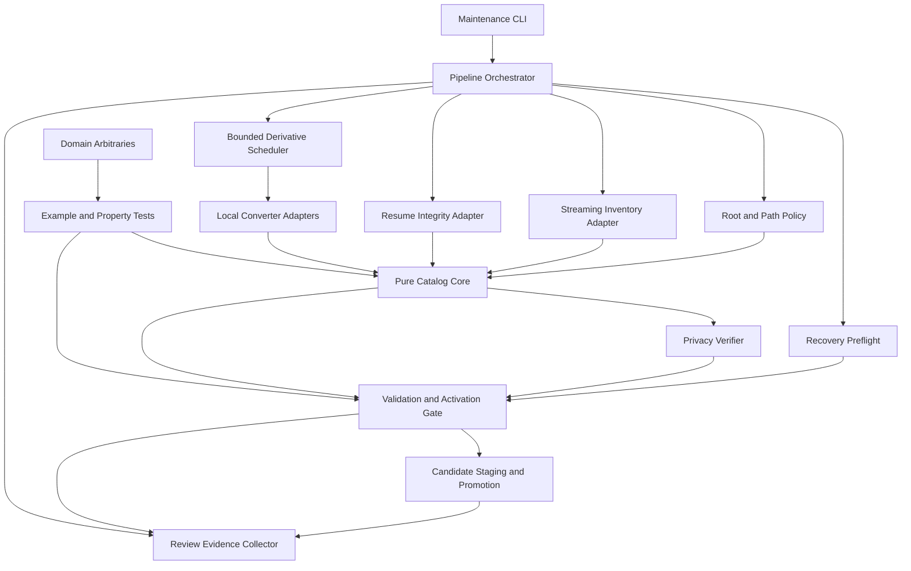
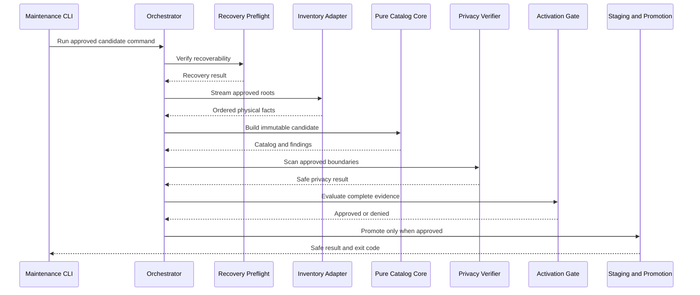

# U-01 Logical Components

## Design Intent

U-01 is a build/maintenance boundary around a pure deterministic domain core. Filesystem, hashing, converter, privacy-input, clock, process, and evidence effects are isolated behind local adapters. Browser-facing code receives only validated generated capabilities. No runtime infrastructure component is added.

## Logical Architecture

### Text Alternative

The maintenance CLI calls the pipeline orchestrator. The orchestrator coordinates recovery preflight, root/path policy, streaming inventory, resume integrity, and the bounded derivative scheduler. The scheduler invokes only reviewed local converter adapters. Inventory, resume, converter outcomes, and path-policy results feed the pure catalog core. The core result passes through the privacy verifier and then the validation/activation gate together with recovery evidence. Approved candidates move through staging and promotion. A review-evidence collector records non-sensitive outcomes. Reusable domain arbitraries feed separate example and property-test suites that exercise the pure core and activation gate. Browser code is not part of this tooling graph.

## Component Catalog

### LC-01 Maintenance CLI

- **Responsibility**: Provide explicit maintainer commands for preflight, inventory, candidate generation, validation, property tests, promotion, and evidence reporting.
- **Inputs**: Approved command name, configuration locator, optional non-public privacy input reference, and explicit roots.
- **Outputs**: Process exit code plus safe concise status; structured evidence is delegated to LC-15.
- **Dependencies**: LC-02 and LC-16 only.
- **Failure behavior**: Unknown commands/configuration fail before effects. The top-level handler catches unexpected failures, emits a stable safe code, and exits non-zero without printing stack traces, sensitive values, absolute paths, or converter commands.
- **Boundary**: Node-only; never imported by browser code.

### LC-02 Pipeline Orchestrator

- **Responsibility**: Execute approved phases in a fixed sequence and stop before unsafe downstream effects.
- **Inputs**: Validated configuration and phase implementations.
- **Outputs**: Immutable pipeline result containing phase results, normalized findings, activation decision, and safe evidence facts.
- **Dependencies**: LC-03 through LC-15 through explicit interfaces.
- **Failure behavior**: No automatic retry for deterministic work. Expected failures remain typed; unexpected failures reach LC-01. Promotion is not invoked unless all blocking findings are absent.
- **Performance**: Keeps compact results only and never buffers source-file bytes.

### LC-03 Configuration and Root Policy

- **Responsibility**: Parse schema-versioned configuration, resolve approved source/staging/public/evidence roots, and prove their allowed relationships.
- **Inputs**: Repository-relative configuration and workspace root capability.
- **Outputs**: Branded approved-root and repository-relative-path values or blocking findings.
- **Dependencies**: Node path/filesystem adapter for read-only resolution.
- **Failure behavior**: Rejects absolute public locators, traversal, null/control ambiguity, overlap that violates role separation, broad write targets, symlink escape, and output collision without echoing resolved absolute paths.
- **Owner**: Single owner for path normalization and confinement policy.

### LC-04 Recovery Preflight

- **Responsibility**: Capture revision/diff evidence, relevant untracked hashes, planned targets, protected sources, and restorable prior content/absence states; rehearse restoration against an isolated target.
- **Inputs**: Approved mutation plan, explicit roots, and repository inspection facts.
- **Outputs**: Immutable `RecoveryRecord`, rehearsal result, recovery duration, and safe findings.
- **Dependencies**: LC-03, LC-06 hashing, and a read-only repository inspection adapter.
- **Failure behavior**: Any uncovered target or failed rehearsal blocks all implementation mutation/promotion.
- **Acceptance**: Restoration is achievable within 30 minutes without editor history or an external backup service.

### LC-05 Streaming Inventory Adapter

- **Responsibility**: Recursively enumerate regular source files, validate reachability/type, detect source instability, and feed exact bytes to streaming hashing.
- **Inputs**: Approved archive root and supported-type policy.
- **Outputs**: Sorted immutable physical facts or blocking safe findings.
- **Dependencies**: LC-03 and LC-06.
- **Failure behavior**: Unreadable, unstable, escaped, unsupported/conflicting-type, or ambiguous inputs remain accountable through findings and cannot silently disappear.
- **Performance**: Stream-based, linear in total bytes; no full-file or aggregate-byte cache.

### LC-06 Integrity and Hash Adapter

- **Responsibility**: Compute SHA-256 over exact streamed bytes and verify file stability around the read.
- **Inputs**: Confined regular-file capability.
- **Outputs**: Branded content hash, bytes read, stability evidence, or typed failure.
- **Dependencies**: Node standard-library streams and cryptography only.
- **Failure behavior**: Read/stability errors return typed findings; no partial trusted hash is emitted.
- **Owner**: Single owner for source and derivative hash semantics.

### LC-07 Resume Integrity Adapter

- **Responsibility**: Validate the supplied PDF, copy it only during an approved generation run, verify source/destination bytes and SHA-256, and produce the stable download capability.
- **Inputs**: Explicit external resume file, approved staging destination, and stable browser filename policy.
- **Outputs**: Byte-identical staged resume plus local PDF/download capability, or blocking finding.
- **Dependencies**: LC-03, LC-06, LC-13, and LC-14.
- **Failure behavior**: Missing/unreadable/non-PDF input, copy failure, hash/length mismatch, unsafe destination, or privacy leakage blocks capability emission and preserves the source.
- **Privacy**: Contains no extracted phone value; the unchanged verified PDF bytes are the sole content exception.

### LC-08 Pure Catalog Core

- **Responsibility**: Own pure normalization, exact grouping, reviewed-alias resolution, curated metadata join, capability projection, and deterministic canonical representation.
- **Inputs**: Immutable physical facts, reviewed aliases/metadata, resume fact, derivative outcomes, and source policy.
- **Outputs**: Immutable canonical catalog candidate and findings.
- **Dependencies**: Pure domain types plus LC-09 and LC-10 policies; no filesystem/process/clock/network dependency.
- **Failure behavior**: Returns complete blocking/warning findings without partial public capability activation.
- **Performance**: Hash-indexed linear passes plus stable `O(n log n)` ordering.
- **PBT ownership**: U01-P02 through U01-P09 and U01-P12.

### LC-09 Media Source Policy

- **Responsibility**: Admit only catalog-owned bundled local assets or explicitly approved HTTPS origins and return discriminated safe capabilities.
- **Inputs**: Typed media candidate and immutable allowlist policy.
- **Outputs**: `SafeMediaSource` or typed rejection with a generic public message and stable maintainer code.
- **Dependencies**: LC-03 for local confinement; standards-based URL parsing for HTTPS candidates.
- **Failure behavior**: Malformed, traversal, `javascript:`, `file:`, document-bearing `data:`, unknown scheme/origin, or unowned local sources fail closed.
- **Owner**: Single owner for media admission; downstream rendering cannot bypass it with raw strings.
- **PBT ownership**: U01-P08.

### LC-10 Finding Aggregator and Schema Codec

- **Responsibility**: Normalize/deduplicate/order findings, compute `canProceed`, validate schema versions, and parse/serialize canonical JSON deterministically.
- **Inputs**: Typed findings and valid catalog structures.
- **Outputs**: `U01ValidationReport` and canonical bytes with one terminal newline.
- **Dependencies**: Pure domain/schema modules only.
- **Failure behavior**: Unknown schema version, invalid structure, or serialization inconsistency is blocking.
- **PBT ownership**: U01-P01, U01-P10, and U01-P11.

### LC-11 Bounded Derivative Scheduler

- **Responsibility**: Sort derivative requests, run at most two adapter jobs concurrently, enforce per-item timeouts of at most 120 seconds, and preserve deterministic result ordering.
- **Inputs**: Validated derivative requests and available LC-12 adapters.
- **Outputs**: Ordered `ready` or `unavailable` outcomes.
- **Dependencies**: LC-03, LC-12, LC-13, and LC-14.
- **Failure behavior**: Timeout, tool absence, adapter error, or invalid output produces cleanup plus typed unavailability; no source is modified and no unrelated task is retried.
- **Performance**: Current reviewed archive target is 15 minutes when adapters are available.

### LC-12 Local Converter Adapter Registry

- **Responsibility**: Probe and select explicitly reviewed local adapters for raster/HEIC display, thumbnails, PDF first pages, and DOCX document preview.
- **Inputs**: Approved adapter policy, executable/library candidates, input capability, purpose, and staged output capability.
- **Outputs**: Versioned adapter capability and raw bounded execution result for LC-13 validation.
- **Dependencies**: Local process/library adapter only; no network.
- **Failure behavior**: Missing/unsupported adapter returns typed unavailability. Process invocation uses an executable plus argument array without a shell. Partial outputs are removed in finalization.
- **Compatibility**: Capability probing allows macOS/Linux differences without changing catalog semantics.

### LC-13 Derivative Validator

- **Responsibility**: Validate staged output signature/type, bytes, dimensions/pages, source/output hash linkage, locator, purpose ceiling, and adapter identity/version.
- **Inputs**: Raw adapter result, source fact, purpose policy, and staged output capability.
- **Outputs**: `ReadyDerivative` or stable `UnavailableDerivative`.
- **Dependencies**: LC-03 and LC-06 plus local media/PDF inspection adapters selected during Code Generation.
- **Failure behavior**: Empty, malformed, over-limit, mismatched, stale, escaped, or colliding outputs are invalidated and removed from staging.
- **Bounds**: Enforces 640 px/512 KiB thumbnails; 1920 px/2 MiB web images; 1600 by 2200 px/2 MiB PDF first-page images; 100-page/20 MiB document-preview PDFs.

### LC-14 Privacy Verifier

- **Responsibility**: Scan approved text-bearing boundaries for the protected phone marker without storing or echoing it, while excluding only the hash-verified resume PDF bytes.
- **Inputs**: Non-committed local marker capability, verified resume hash, and explicit scan targets.
- **Outputs**: Safe target/code/count findings only.
- **Dependencies**: LC-03 and LC-06.
- **Failure behavior**: Missing required marker input, unexpected match, excluded-file hash mismatch, unreadable target, or scan-boundary gap is blocking. Neither values nor excerpts are emitted.
- **Coverage**: Public/generated source, curated data, fixtures, diagnostics, snapshots, rendered markup, and text-bearing production output.

### LC-15 Validation and Activation Gate

- **Responsibility**: Combine recovery, catalog, adapter, privacy, integrity, bundle-isolation, and schema results into the sole activation decision.
- **Inputs**: Normalized reports from LC-04, LC-08, LC-10, LC-13, LC-14, and LC-18.
- **Outputs**: `approved` candidate token only when blocking count is zero, otherwise a denied result.
- **Dependencies**: LC-10.
- **Failure behavior**: Any absent required evidence or unexpected exception is denial. Warnings permit activation only for explicitly optional behavior with an approved safe fallback.
- **Owner**: Single owner for fail-closed activation semantics.

### LC-16 Candidate Staging and Promotion

- **Responsibility**: Write complete candidates outside active/public roots, validate them, and promote only an LC-15-approved set.
- **Inputs**: Approved target manifest, staged bytes, recovery record, and activation token.
- **Outputs**: Verified promotion result or safe failure result.
- **Dependencies**: LC-03, LC-04, LC-06, LC-15, and filesystem adapter.
- **Failure behavior**: Active outputs remain unchanged until approval. Partial candidates are cleaned or quarantined; promotion failure invokes target-specific recovery and blocks activation.
- **Determinism**: Run timestamps/IDs do not enter final canonical bytes or locators.

### LC-17 Review Evidence Collector

- **Responsibility**: Produce machine-readable JSON and human-readable Markdown evidence without contaminating canonical output.
- **Inputs**: Safe phase summaries, versions, counts, durations, peak memory, hashes, findings, fallbacks, seeds, bundle checks, and recovery results.
- **Outputs**: Non-public evidence artifacts with stable schema plus variable run metadata.
- **Dependencies**: LC-02 and all components only through safe result interfaces.
- **Failure behavior**: Required evidence omission is blocking; sensitive or absolute-path content fails validation before writing.
- **Runtime impact**: None; it is local/CI tooling, not telemetry.

### LC-18 Import and Bundle Boundary Verifier

- **Responsibility**: Prove that Node-only tooling, PBT generators, and original archive assets do not enter browser chunks or the initial request graph.
- **Inputs**: Module graph, Vite production manifest, built text artifacts, and approved browser entry roots.
- **Outputs**: Boundary report and safe findings.
- **Dependencies**: Existing TypeScript/Vite build metadata; no browser runtime code.
- **Failure behavior**: Tool-to-browser import, unexpected archive inclusion, or unexplained initial JS/CSS ceiling increase blocks activation.

### LC-19 Domain Arbitraries and Test Harness

- **Responsibility**: Centralize `fast-check` domain arbitraries, seed/replay configuration, property ownership, and separation from concrete example/integration suites.
- **Inputs**: Domain constraints, U01-P01 through U01-P12, and test configuration.
- **Outputs**: Reproducible property results with shrinking plus permanent regression candidates.
- **Dependencies**: Vitest and the approved Code Generation installation of `fast-check`; imports pure components only.
- **Failure behavior**: Property failure blocks activation and reports framework seed/path with a non-sensitive shrunk counterexample. No silent retry is allowed.
- **Boundary**: Test-only; excluded from production browser chunks.

## Component Interaction Sequences

### Inventory and Candidate Sequence

#### Text Alternative

The maintainer starts an approved candidate command. The orchestrator first verifies recovery, then streams the approved inventory and sends immutable facts to the pure catalog core. The privacy verifier scans the approved boundaries. The activation gate evaluates complete recovery, catalog, privacy, integrity, and boundary evidence. Promotion is called only for an approved candidate; otherwise the command returns a safe non-zero result without changing active outputs.

### Optional Conversion Sequence

1. LC-08 identifies a reviewed derivative request and purpose.
2. LC-11 sorts requests and admits no more than two concurrent jobs.
3. LC-12 probes/selects a reviewed local adapter and executes it with an argument array inside approved roots.
4. LC-13 validates media signature, dimensions/pages, byte ceiling, hashes, linkage, and locator.
5. LC-11 returns an ordered `ready` or `unavailable` result to LC-08.
6. LC-15 allows an unavailable result only when curated metadata names an approved honest fallback.

## Dependency Rules

| From | May depend on | Must not depend on |
| --- | --- | --- |
| Browser capability consumers | Generated public capability contracts | Node filesystem, crypto, converters, privacy scanner, evidence collector, PBT generators, raw archive facts |
| Pure catalog core | Domain types, pure policies, immutable input facts | Filesystem, process, network, clock, mutable globals, UI components |
| Effect adapters | Approved root capabilities and narrow interfaces | Raw UI state, remote conversion, unreviewed shell strings |
| Test harness | Pure modules and explicit integration adapters | Production browser entries, sensitive committed fixtures |
| Evidence collector | Safe result projections | Source contents, sensitive values, absolute paths, raw stack traces |

Automated boundary tests enforce these one-way dependencies. A later unit may consume generated contracts but must not duplicate physical identity, canonicalization, source admission, severity, or generator ownership.

## Concurrency, Time, and Memory Controls

- Inventory hashing streams one file at a time by default; any later parallelism requires measured bounded-memory proof.
- Conversion uses one deterministic queue with a hard concurrency of two.
- Each adapter job has an abort/termination deadline no greater than 120 seconds.
- The orchestrator retains compact records, not file bytes.
- Current approximately 293 MB inventory/canonicalization target: at most 60 seconds and 512 MiB peak RSS on documented Node 20 reference conditions.
- Current derivative target: at most 15 minutes when required reviewed adapters are available.
- Evidence records actual platform/runtime/tool conditions so deviations are reviewable rather than hidden.

## Failure Ownership

| Failure family | Detecting owner | Normalized result owner | Cleanup/recovery owner |
| --- | --- | --- | --- |
| Root/path/source escape | LC-03/LC-05 | LC-10 | LC-02 stops before effects |
| Unreadable/unstable source | LC-05/LC-06 | LC-10 | LC-02 stops candidate |
| Alias/metadata/provenance conflict | LC-08 | LC-10 | No side effect exists |
| Adapter absence/timeout/error | LC-11/LC-12 | LC-13 | LC-12/LC-16 cleans staging |
| Invalid/oversized derivative | LC-13 | LC-10 | LC-16 cleans staging |
| Sensitive match | LC-14 | LC-10 | LC-15 denies activation |
| Schema/hash/bundle mismatch | LC-10/LC-18 | LC-10 | LC-15 denies activation |
| Promotion interruption | LC-16 | LC-10 | LC-04 target restoration |
| Unexpected exception | LC-01 | LC-10 safe top-level code | LC-16 finalization where applicable |

## Property Ownership

| Property | Owner | Test form |
| --- | --- | --- |
| U01-P01 manifest round trip | LC-10 | `fast-check` round-trip property |
| U01-P02 inventory normalization | LC-05/LC-08 | Generated valid/adversarial paths and membership invariant |
| U01-P03 complete physical membership | LC-08 | Multiset invariant |
| U01-P04 canonicalization idempotence | LC-08 | Idempotence property |
| U01-P05 exact-grouping oracle | LC-08 | Production vs simple hash-map oracle |
| U01-P06 permutation independence | LC-08 | Generated permutations with structural equality |
| U01-P07 metadata/capability reachability | LC-08 | Capability/provenance invariant |
| U01-P08 safe media resolution | LC-09 | Allowed-source invariant with adversarial candidates |
| U01-P09 privacy-safe public model | LC-08/LC-14 | Marker exclusion invariant plus concrete scan cases |
| U01-P10 `canProceed` equivalence | LC-10/LC-15 | Blocking-count invariant |
| U01-P11 finding normalization idempotence | LC-10 | Idempotence property |
| U01-P12 alias validity/provenance | LC-08 | Easy-verification property |

PBT-06 is N/A because these owners expose immutable transformations rather than mutable domain state. Adapter lifecycle behavior is covered by deterministic examples and integration fixtures.

## Deployment and Infrastructure Boundary

U-01 requires no infrastructure design. It creates local/CI tooling and generated static contracts only. It does not change GitHub Pages topology, DNS, TLS, CDN, response headers, IAM, storage services, network rules, secrets systems, server logging, monitoring, alerting, or deployment authorization. Applicable hosting/security-header and delivery controls remain assigned to U-06 Security, Delivery, and Integrated Acceptance.

## Component Acceptance Matrix

| Acceptance concern | Responsible components | Evidence |
| --- | --- | --- |
| Zero source loss and 30-minute recovery | LC-04, LC-16 | Pre/post hashes and isolated restoration rehearsal |
| Complete 122-file current inventory | LC-05, LC-06, LC-08 | Reconciled inventory report and concrete test |
| 500-file/1-GiB architecture capacity | LC-05, LC-08 | Capacity fixture and measurement |
| 60-second/512-MiB inventory target | LC-02, LC-05, LC-17 | Timed run and peak-RSS evidence |
| Deterministic canonical bytes | LC-08, LC-10, LC-16 | Two-run byte comparison |
| Converter bounds and honest fallback | LC-11 through LC-13 | Timeout/absence/invalid-output examples and manifest outcomes |
| Phone privacy | LC-07, LC-14, LC-15 | Non-echoing scan and exact-PDF exception proof |
| Safe media and generic failures | LC-09, LC-10 | Example/PBT unsafe-source coverage and snapshots |
| Production-bundle isolation | LC-18 | Import graph, Vite manifest, and initial-request inspection |
| Reproducible PBT | LC-19 | Focused CI command, seed/path evidence, shrinking demonstration |
| Review usability | LC-17 | JSON plus Markdown report with counts, hashes, timings, fallbacks, and gate result |

## Security and PBT Gate Summary

The components implement the applicable SECURITY-09, SECURITY-10, SECURITY-11, SECURITY-13, and SECURITY-15 controls. SECURITY-01 through SECURITY-08, SECURITY-12, and SECURITY-14 are N/A to U-01 because it introduces no persistence service, intermediary, API, IAM/network configuration, authenticated endpoint, credentials/session, or deployed monitoring boundary; SECURITY-04 is deferred to U-06 hosting design. The design assigns every applicable U01-P01 through U01-P12 property to a logical owner, with PBT-06 explicitly N/A due to immutable stateless business components. No blocking security or PBT design finding remains.
