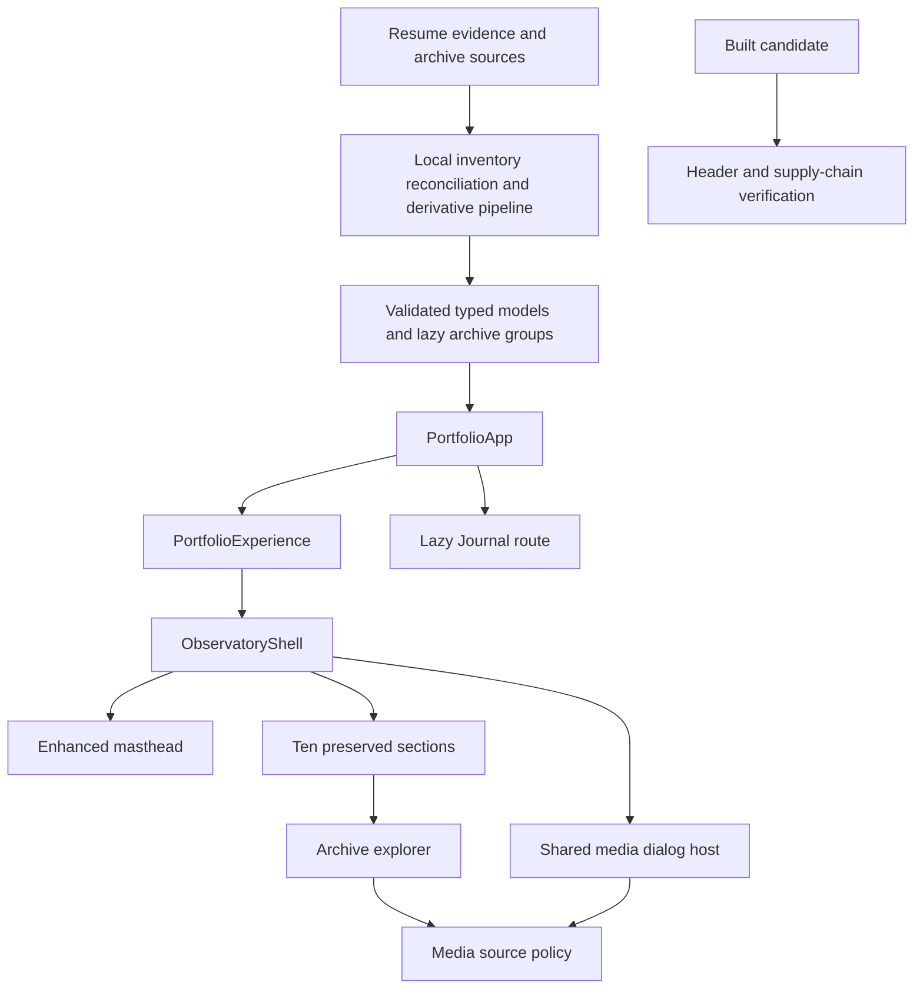

# Consolidated Application Design: Header, Content, Evidence, and Resume Refinement

## Design Objective

Extend the existing scientific portfolio into a complete, resume-led, media-rich experience while preserving its ten-section architecture, Journal route, theme/navigation behavior, privacy posture, static delivery model, and recoverability. The design corrects the masthead and six supplied layout problems, removes visible semantic tables accessibly, represents every reviewed archive item, and introduces secure on-demand PDF and image inspection without forcing the approximately 293 MB source archive into initial loading.

## Approved Decisions

The user approved Option A for all twelve Application Design questions:

1. Deterministic generated physical facts joined to reviewed public metadata.
2. Provenance-aware resume/evidence source records projected through pure section selectors.
3. Existing feature-first domains plus focused shared archive, media-viewer, and resume boundaries.
4. One typed allowlist policy for every interactive media source.
5. One accessible modal host with PDF- and image-specific bodies.
6. Eager compact group summaries, lazy group catalogs/thumbnails, and on-demand originals.
7. Deterministic local derivative generation before Vite build.
8. Shell-integrated responsive masthead with injected theme and resume actions.
9. Reusable visually hidden semantic summaries paired with affected visuals.
10. Typed safe failure results with generic visitor messages and retained safe actions.
11. Hosting-neutral application design plus a blocking deployed-header contract in Infrastructure Design.
12. Pure transformation/state seams with shared `fast-check` generators and role/action rendering tests.

## Architecture Overview

### Text Alternative

The supplied resume, existing evidence, and full archive enter a local build pipeline that inventories, reconciles, converts, and validates them into typed models and lazy archive groups. `PortfolioApp` preserves the Journal route and renders `PortfolioExperience`. The experience supplies state to the shell, which renders the enhanced masthead, ten sections, and one media-dialog host. Archive and viewer media pass through a central source policy. The built candidate separately passes response-header and supply-chain verification.

## Runtime Composition

- `PortfolioApp` continues composing the existing domain body registries inside `JournalRoute`.
- `PortfolioExperience` retains theme and section progress and adds one media-dialog controller.
- `ObservatoryShell` receives validated masthead data, renders the theme control within the masthead, preserves the sticky navigation below it, and mounts one dialog host.
- Existing domains keep their section IDs and semantic source order.
- Evidence Library receives archive summaries initially and lazy-loads the selected group.
- Narrative sections may reference representative canonical items through the same archive and media capabilities.
- The local-only contact handoff and lazy fact-only Journal behavior remain unchanged.

## Source and Content Design

### Source Authority

1. Reviewed evidence controls the facts it directly supports.
2. The supplied resume controls personal information architecture and resume-only claims.
3. Conflicts remain explicit review findings; no selector silently chooses contradictory wording.
4. Resume-only statements are labeled by authority and are never described as document-verified.
5. Source-document text remains data only and cannot direct project behavior.

### Privacy

- The bundled resume PDF may retain its supplied email and phone number.
- Public TypeScript records, rendered markup, structured data, tests, diagnostics, and generated metadata have no phone field or phone value.
- A release privacy scan blocks activation if the number appears outside the approved downloadable PDF bytes.

### Section Mapping

Pure selectors map all approved resume categories into the preserved ten sections. Selectors accept reconciled claims and produce immutable view models. They preserve dates, organizations, award levels, quantities, and contribution boundaries and cannot synthesize unsupported outcomes.

## Archive Design

### Generated Facts

The inventory pipeline records a stable physical ID, repository-relative path, detected media type, byte size, and SHA-256 hash for every file under `src/assets/minh-tam/`. The pipeline is read-only toward source assets and rejects path escape.

### Canonicalization

Files with identical hashes resolve to one canonical seed. Each seed retains every physical source member. A curated overlay supplies readable title, caption, accessibility treatment, group, explicit order, source authority, and publication disposition. The join blocks dropped sources, orphan metadata, duplicate IDs, unsafe paths, and reviewed items without a disposition.

### Derivatives

Local deterministic tooling attempts HEIC and DOCX conversion and creates approved PDF/image previews. Originals remain untouched. Each attempt creates a success or explicit unavailable outcome. Conversion failure can use an honest metadata/download fallback when safe; it never removes the item from inventory or provenance.

### Loading

Only group IDs, labels, counts, and short descriptions enter the initial archive surface. Group item modules load after visitor activation. Thumbnails are dimensioned and lazy. Full PDFs and original images load only after an explicit preview, dialog, download, or new-tab action.

## Masthead and Layout Design

- The masthead becomes a restrained scientific identity panel with an accent field, subtle decorative grid/specimen marks, clear name/field/status hierarchy, top-right theme control, and resume download.
- Theme state remains in the existing controller; the control only changes location.
- The Identity section repeats the same validated resume action.
- Shared container, grid, gap, measure, and action-row tokens align the six supplied examples and related section layouts.
- Wide layouts share clear grid lines; narrow layouts use the logical DOM order.
- Acceptance widths are 320, 768, 1280, and 1440 CSS pixels in both themes, plus 200-percent zoom and increased text spacing.
- No design relies on fixed height for text-bearing cards and no document-level horizontal overflow is permitted.

## Semantic Summary Design

Existing visible relationship/count tables are removed from sighted layouts. Each corresponding visual receives a reusable `SemanticSummary` with a visually hidden heading and semantic list or description structure. It consumes the same projected source as the visual, follows the same ordering, remains in the accessibility tree, and occupies no visual layout space. `display: none`, offscreen overflow that causes scrolling, and image-only alternatives are prohibited.

## Media Review Design

### PDF Preview

- Every canonical published PDF plus the resume receives a responsive first-page preview capability.
- The preview uses browser-native embedding only after the source is validated and the group/card is activated.
- Unsupported or failed embeds retain title, description, Download, and Open actions when safe.

### Shared Dialog

- One host uses a native dialog-equivalent accessible contract with name and description.
- The host owns initial focus, focus containment, background inertness, Escape/backdrop dismissal, scroll containment, cleanup, and trigger-focus restoration.
- A pure discriminated reducer owns closed, PDF, image, and safe-failure state.

### PDF Body

The PDF body renders a full-height validated viewer plus title, description, Download, Open in new tab, and Close actions. Failure keeps the modal operable and discloses no implementation detail.

### Image Body

The image body renders the selected group item with title, caption, safe provenance, original access, and bounded previous/next actions. It follows deterministic catalog order and retains metadata when image loading fails.

## Media Security Design

All preview, viewer, download, and new-tab sources pass through `MediaSourcePolicy`. The policy accepts bundled assets and explicitly approved HTTPS origins only. It rejects script, document-bearing data, file, malformed, and unapproved sources. React text and attributes render all metadata; unsafe HTML injection is prohibited. Visitor errors are generic, while maintainers receive stable non-sensitive codes.

## Failure and Recovery Design

- Pure domain services return discriminated success/failure results instead of throwing for expected invalid data.
- Runtime media failures downgrade to safe metadata/action states and remain dismissible.
- Unexpected React failures remain covered by top-level safe boundaries; production output never exposes stack traces or local paths.
- Inventory and conversion tools use explicit validated roots and preserve sources.
- Candidate activation is blocked by catalog incompleteness, privacy leaks, inaccessible dialog behavior, failed required security headers, broken recovery evidence, or other blocking gates.
- Exact pre-change hashes and patchable registration/configuration content are captured before activation because the worktree is uncommitted.

## Performance Design

- Existing JavaScript and CSS measurements remain the baseline.
- Archive summaries are eager; group catalogs, thumbnails, media bodies, and originals are split or lazy where useful.
- The request manifest must prove that the initial page did not request all originals.
- Dimensions/aspect ratios are declared for images and preview surfaces.
- No budget ceiling is increased without a separate explicit approval.

## Test Architecture

### Example-Based Coverage

- All six supplied alignment defects at representative widths and themes.
- Theme control location and next-action label.
- Both resume actions and absence of the phone number in markup.
- Inline PDF fallback and full modal actions.
- Dialog focus, keyboard dismissal, backdrop dismissal, and focus restoration.
- Image previous/next boundaries and failure fallback.
- Ten hashes, progress, Journal, contact, theme persistence, and base paths.
- HEIC/DOCX success and failure dispositions.

### Property-Based Coverage

`fast-check` with Vitest is the selected direction, pending the NFR Requirements dependency gate. Functional Design must finalize properties per unit. Current seams include:

- Canonicalization idempotence and complete provenance membership.
- Deduplication equivalence to a simple hash-group oracle.
- Manifest parse/serialize round trip when serialization exists.
- Deterministic group/order behavior under input permutations.
- Resume-category completeness, non-invention, and privacy invariants.
- Media allowlist invariants against malformed and unsafe schemes.
- Dialog index bounds and stateful reducer/model equivalence.
- Semantic projection membership and ordering invariants.

Generators are centralized, domain-constrained, shrinkable, and seed-reproducible. Property tests complement rather than replace concrete business scenarios.

## Deployment and Supply-Chain Design

- Application modules remain hosting-neutral.
- A deployment contract requires CSP, one-year HSTS with subdomains, `nosniff`, DENY or justified SAMEORIGIN framing, and strict-origin referrer policy on actual HTML responses.
- Infrastructure Design must determine whether a compliant edge or hosting change is necessary; HTML meta tags cannot satisfy all response-header requirements.
- The release gate verifies lockfile integrity, vulnerability audit, unused dependencies, trusted sources, SBOM generation, and CI action/tooling pinning.
- Deployment or hosting migration remains outside implementation authority until separately approved.

## Requirement Traceability

| Requirement group | Primary design owners |
| --- | --- |
| FR-001 through FR-006 | Masthead Composition, Resume Action, Shell |
| FR-007 through FR-012 | Semantic Summary, Responsive Layout Contract, domain visuals |
| FR-013 through FR-017 | Resume Content, Content Integrity, ten domain selectors |
| FR-018 through FR-025 | Inventory, Canonical Archive, Derivative Pipeline, Archive Explorer |
| FR-026 through FR-031 | Media Policy, PDF Preview, Dialog Host, PDF Body |
| FR-032 through FR-035 | Image Thumbnail, Dialog Controller, Image Body |
| FR-036 through FR-038 | Portfolio Composition, existing controllers/routes, Recovery Gate |
| NFR-001 through NFR-004 | Dialog Host, Semantic Summary, accessibility tests |
| NFR-005 through NFR-007 | Responsive Layout Contract and rendered review |
| NFR-008 through NFR-012 | Archive Discovery, lazy boundaries, measurement gate |
| NFR-013 through NFR-016 | Resume privacy, provenance, media policy, integrity scans |
| NFR-017 through NFR-020 | Pure selectors, focused modules, example tests, PBT seams |
| PBT-R01 through PBT-R10 | Property Testing Service plus per-unit Functional Design and Code Generation |
| SEC-R01 through SEC-R08 | Deployment Security, Media Policy, safe failures, Supply Chain, Release Gate |

## User-Story Traceability

| Stories | Primary design owners |
| --- | --- |
| US-001 through US-003 | Masthead, Theme Control, Resume Action |
| US-004 through US-007 | Resume Content and domain selectors |
| US-008 through US-009 | Semantic Summary and Responsive Layout Contract |
| US-010 through US-013 | Inventory, Canonical Archive, Derivatives, Archive Explorer |
| US-014 through US-016 | PDF/Image preview bodies, Dialog Controller and Host |
| US-017 | Lazy archive/media boundaries and performance gate |
| US-018 | Portfolio Composition and existing route/contact/theme contracts |
| US-019 | Media Policy and typed safe-failure contracts |
| US-020 | Deployment Security and Supply Chain services |
| US-021 | Property Testing Service and pure transformation/state seams |

## Security Compliance

| Rule | Status | Application Design rationale |
| --- | --- | --- |
| SECURITY-01 | N/A | No database, object store, cache, or project-controlled persistence is introduced; bundled public files are static application artifacts. |
| SECURITY-02 | N/A | No project-controlled load balancer, gateway, or CDN exists yet; any future edge selected in Infrastructure Design must reevaluate logging. |
| SECURITY-03 | N/A | No deployed server application or centralized telemetry is introduced; private data is intentionally not logged. |
| SECURITY-04 | Compliant in design | Required response headers form a blocking deployed-response contract and Infrastructure Design decision; no meta-tag equivalence is claimed. |
| SECURITY-05 | N/A | No API endpoint is introduced. |
| SECURITY-06 | N/A | No IAM role or policy is introduced. |
| SECURITY-07 | N/A | No network or firewall configuration is introduced. |
| SECURITY-08 | N/A | The portfolio is intentionally public and has no protected resource endpoint. |
| SECURITY-09 | Compliant | Visitor-safe errors, no stack/path disclosure, minimal active dependencies, and explicit hardening boundaries are designed. |
| SECURITY-10 | Compliant in design | Lockfile, vulnerability audit, unused-dependency review, trusted sources, SBOM, and CI pin review are release gates. |
| SECURITY-11 | Compliant | Media policy and conversion are isolated; misuse cases include malicious paths, unsafe schemes, oversized/unsupported media, enumeration, and dialog abuse. |
| SECURITY-12 | N/A | No authentication, credentials, or session is introduced. |
| SECURITY-13 | Compliant | Hash inventory, local sources, derivative manifests, CI review, and prohibition of unverified external resources protect integrity. |
| SECURITY-14 | N/A | No authentication/authorization events or server monitoring stream exists; reevaluate if Infrastructure Design introduces an edge with applicable logs. |
| SECURITY-15 | Compliant | Typed failures, fail-closed URL admission, safe runtime fallback, explicit tool cleanup, global React safety boundary, and blocking release gates are designed. |

No blocking Application Design security finding remains.

## PBT Compliance

| Rule | Status | Application Design rationale |
| --- | --- | --- |
| PBT-01 | Planned for applicable stage | Pure business/transformation/state seams are identified; every unit's Functional Design must list formal properties or an N/A rationale. |
| PBT-02 | Designed seam | Manifest serialization round trips are identified if serialization is implemented. |
| PBT-03 | Designed seam | Membership, ordering, privacy, bounds, allowlist, and category-completeness invariants are identified. |
| PBT-04 | Designed seam | Canonicalization/deduplication and close/normalization idempotence candidates are identified. |
| PBT-05 | Designed seam | A simple hash-group oracle and dialog state model are available for equivalence checks. |
| PBT-06 | Designed seam | Dialog reducer command sequences are identified for stateful model testing. |
| PBT-07 | Designed seam | Central domain-constrained arbitrary interfaces are defined. |
| PBT-08 | Planned | Shrinking and seed replay are required in Property Testing and Build Integrity services. |
| PBT-09 | Planned for NFR Requirements | `fast-check` with Vitest is selected in design but is not installed before its approved dependency gate. |
| PBT-10 | Compliant in design | Explicit example-based coverage remains required for all critical user paths and shrunk regressions. |

Application Design is not an enforcement stage for generated PBT code; no blocking PBT finding exists here. Later stages inherit every listed obligation.

## Explicit Exclusions

- Backend, database, account, authentication, upload, analytics, remote conversion, or server-side contact behavior.
- Runtime filesystem enumeration or direct raw-path rendering.
- Browser-side HEIC/DOCX conversion.
- Duplicate modal/focus implementations in domain sections.
- Replacement of the ten-section architecture or Journal route.
- Deployment provider migration without a separate approval.
- Destructive source/legacy cleanup without an exact later plan.

## Artifact Index

- `components.md`: Component boundaries, responsibilities, ownership, and proposed structure.
- `component-methods.md`: High-level types, method signatures, inputs, outputs, and failure contracts.
- `services.md`: Runtime/build-time orchestration and service responsibilities.
- `component-dependency.md`: Dependency rules, matrices, flows, state ownership, and test boundaries.
- `application-design.md`: Consolidated decisions, traceability, security/PBT compliance, and architecture.
