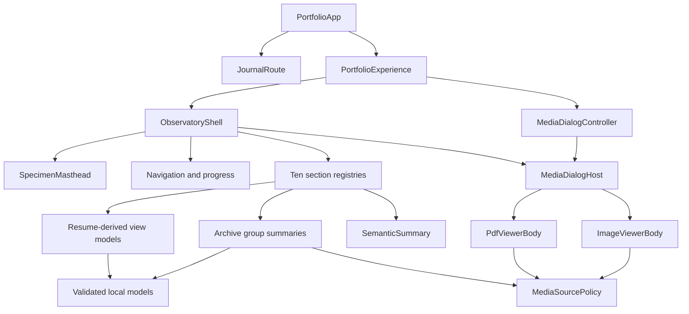
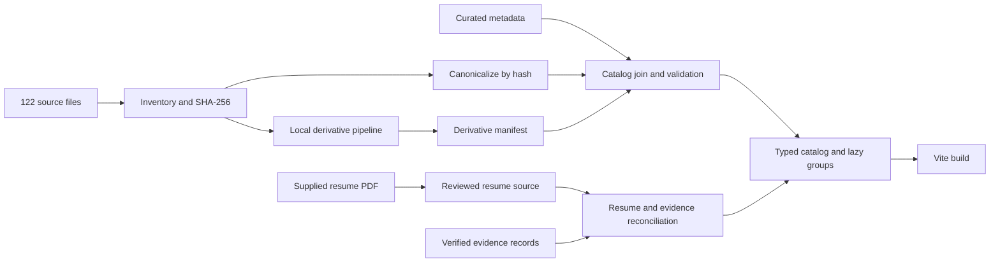
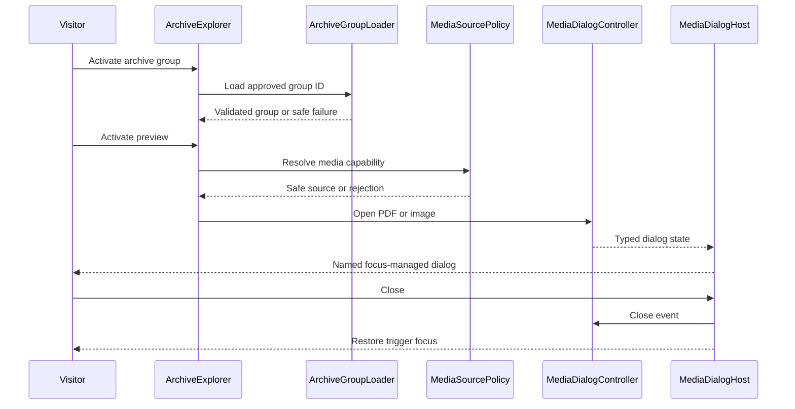
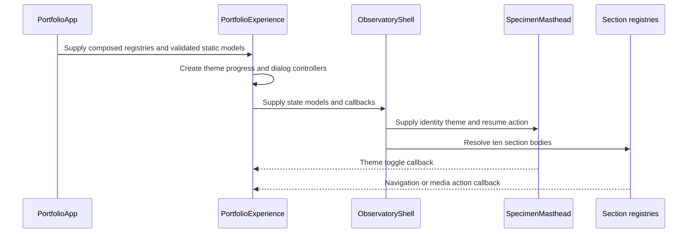

# Component Dependencies and Communication

## Dependency Direction

### Text Alternative

`PortfolioApp` retains Journal and portfolio composition. `PortfolioExperience` supplies state to `ObservatoryShell` and the media-dialog controller. The shell renders the masthead, navigation, ten section registries, and one dialog host. Sections consume resume and archive view models plus hidden semantic summaries. Archive and dialog media pass through the central media-source policy before rendering. All view models depend on validated local models, never raw paths.

## Allowed Layer Order

1. **Generated facts and reviewed source data**: no React imports.
2. **Domain types and pure selectors**: depend only on lower-level types/data.
3. **Policy and orchestration services**: depend on types/selectors, not presentation.
4. **Feature presentation**: depends on validated view models and action interfaces.
5. **Shell composition**: depends on feature registries and shared UI boundaries.
6. **Application root**: composes shell and Journal route.
7. **Build tooling**: may read source data and emit generated modules but is never imported by browser code.

Circular imports, domain-to-shell imports, presentation-to-tooling imports, and raw archive-to-component imports are prohibited.

## Component Dependency Matrix

| Consumer | Allowed dependencies | Prohibited dependencies |
| --- | --- | --- |
| `PortfolioApp` | Domain registries, Journal, `PortfolioExperience` | Raw resume, raw archive files, conversion tools |
| `PortfolioExperience` | Theme/progress hooks, dialog controller, shell | Domain filesystem facts, derivative tools |
| `ObservatoryShell` | Masthead, navigation, progress, registry resolver, dialog host | Domain selectors, raw media paths |
| `SpecimenMasthead` | Masthead view model, Theme Control, Resume Action | Resume parsing, local storage access |
| Domain sections | Domain view models, Archive Explorer, Semantic Summary, media triggers | Raw filesystem inventory, focus-trap internals |
| Archive Explorer | Group summaries, group loader, preview cards | Every group module eagerly, conversion executables |
| Preview cards | Validated media capabilities, dialog commands | Unvalidated strings, dialog focus implementation |
| `MediaDialogHost` | Dialog state/actions, specialized bodies | Catalog transformation, resume selectors |
| PDF/Image bodies | Validated capabilities, safe actions | Raw paths, unsafe HTML, group mutation |
| Resume selectors | Resume/evidence types, verified source | React, browser APIs, filesystem APIs |
| Archive selectors | Generated facts, curated metadata, derivative manifest | React, shell, browser APIs |
| Inventory/derivative tooling | Explicit filesystem roots and tool adapters | React runtime, network upload services |
| Deployment verifier | Candidate HTTPS endpoint, required header contract | HTML-meta substitution, app presentation |

## Build-Time Data Flow

### Text Alternative

The 122 source files are inventoried and hashed, then canonicalized. The same inventory feeds a local derivative pipeline and derivative manifest. Curated metadata, canonical identities, and derivative outcomes are joined and validated. Separately, the reviewed resume source is reconciled with verified evidence. Both validated results emit typed catalogs and lazy group modules consumed by the Vite build.

## Runtime Archive and Viewer Flow

### Text Alternative

The visitor activates an archive group, and the loader returns only that validated group or a safe failure. Activating a preview sends its source through the media policy. A valid capability opens typed dialog state in the single dialog host. The host manages accessibility and restores focus to the triggering control when closed.

## Shell Communication

### Text Alternative

The application supplies composed registries and validated static models to the experience layer. The experience creates theme, progress, and dialog controllers and passes state and callbacks to the shell. The shell supplies the masthead and ten section bodies. User theme, navigation, and media actions return through typed callbacks rather than shared mutable state.

## Lazy-Loading Boundaries

| Boundary | Eager | Lazy/on demand |
| --- | --- | --- |
| Shell | Masthead, navigation, progress, section registry | Dialog body modules may be interaction-loaded |
| Resume | Download metadata and link | PDF bytes requested only by download/open/preview interaction |
| Archive | Group IDs, labels, counts, compact descriptions | Group item catalogs, thumbnails, full originals |
| PDF | Card metadata and fallback action | Embedded preview source and full dialog source |
| Images | Dimensions, alternative text, thumbnail locator | Thumbnail request by viewport; full source by dialog/original action |
| Journal | Route parser and loading boundary | Existing `JournalRouteEntry` |

## State Ownership

| State | Owner | Persistence | Communication |
| --- | --- | --- | --- |
| Theme | Existing theme controller | Local storage for non-sensitive preference | Props/callback |
| Active section and progress | Existing progress controller | URL hash/browser state | Props/callback |
| Active archive group | `ArchiveExplorer` | None required | Local reducer or hook |
| Dialog kind/item/index | Media dialog controller | None | Props/actions |
| Dialog focus/scroll effects | `MediaDialogHost` | None | DOM effects with cleanup |
| Catalog and resume content | Generated immutable modules | Build artifact | Pure imports/selectors |
| Conversion status | Derivative manifest | Build artifact | Catalog join |

## Security Boundaries

1. Raw path input stops at inventory tooling.
2. Public catalog paths are repository-safe and are never absolute filesystem locators.
3. Every interactive URL crosses `MediaSourcePolicy`.
4. React renders titles and descriptions as text/attributes only; unsafe HTML is prohibited.
5. Conversion runs locally with explicit source/output roots and no network upload.
6. Dialog failures remain closable and cannot bypass safe-source validation.
7. Required response headers are verified against the deployed candidate rather than inferred from source files.
8. Dependency, SBOM, and CI integrity evidence is required at the release gate.

## Accessibility Boundaries

1. Visual components own visual layout only; `SemanticSummary` owns their equivalent hidden meaning.
2. `MediaDialogHost` alone owns dialog focus, inert background, dismissal, and restoration.
3. Specialized viewer bodies supply content labels and controls but do not implement their own traps.
4. DOM reading order follows the narrow-layout order; CSS repositions only at wider widths.
5. All loading and failure states use appropriate status semantics without repeated noisy announcements.

## Property-Testing Boundaries

| Pure/state boundary | Candidate properties for later Functional Design |
| --- | --- |
| Canonicalization | Idempotence, membership preservation, deterministic equivalence to a simple hash-group oracle |
| Manifest serialization | Parse/serialize round trip and canonical formatting |
| Grouping/order | Element preservation, stable ordering, deterministic output under input permutation |
| Resume mapping | Category completeness, no unsupported claim, privacy invariant |
| Media policy | Allowlist invariant and rejection of unsafe schemes |
| Dialog reducer | Bounds invariants, close idempotence, model-based command sequences |
| Semantic projection | Order and relationship membership preservation |

Actual PBT properties and N/A decisions must be documented in each unit's Functional Design.

## Dependency Validation Rules

- Browser code cannot import Node filesystem, hashing, or conversion packages.
- Archive summary modules cannot statically import all group modules or originals.
- Domain features cannot import each other solely to reach archive or viewer behavior; they use shared boundaries.
- Viewer components cannot consume raw `string` URLs.
- `SemanticSummary` cannot derive new domain relationships.
- Resume public view models cannot contain phone-number fields.
- GitHub Pages configuration cannot be described as header-compliant without an actual passing response report.
- `fast-check` generators live in shared test utilities and do not enter production bundles.
