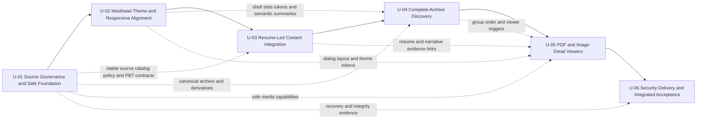
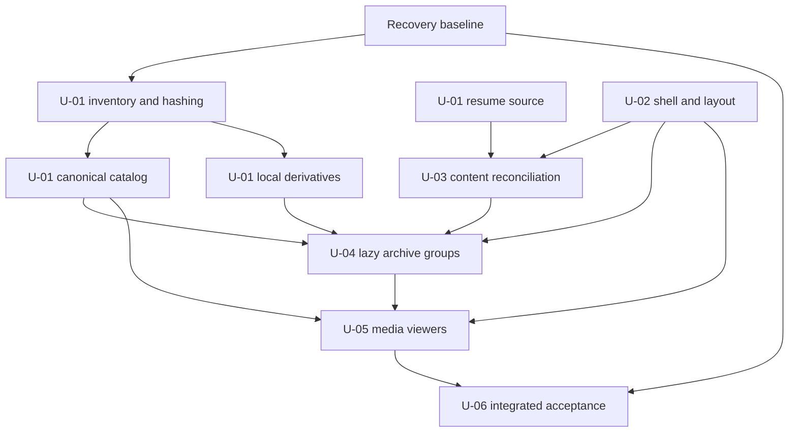
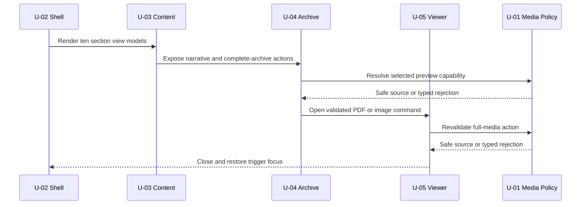

# Unit Dependencies: Header, Content, Evidence, and Resume Refinement

## Dependency Diagram

## Text Alternative

The required approval sequence is U-01 Source Governance and Safe Foundation, U-02 Masthead, Theme, and Responsive Alignment, U-03 Resume-Led Content Integration, U-04 Complete Archive Discovery, U-05 PDF and Image Detail Viewers, and U-06 Security, Delivery, and Integrated Acceptance. U-01 supplies stable source, catalog, policy, derivative, PBT, and recovery contracts to later units. U-02 supplies shell, token, and semantic-summary contracts. U-03 supplies resume and narrative evidence models. U-04 supplies group order and media triggers to U-05. All outputs converge in U-06.

## Dependency Matrix

Legend: `P` means prerequisite approval, `C` means a stable contract is consumed, `R` means focused regression verification is required, and `I` means integrated acceptance input.

| Consumer | U-01 | U-02 | U-03 | U-04 | U-05 | U-06 |
| --- | --- | --- | --- | --- | --- | --- |
| U-01 | - | - | - | - | - | - |
| U-02 | P/C | - | - | - | - | - |
| U-03 | P/C | P/C | - | - | - | - |
| U-04 | P/C | P/C | P/C | - | - | - |
| U-05 | P/C | P/C | P/C | P/C | - | - |
| U-06 | P/I | P/I | P/I | P/I | P/I | - |

Every downstream unit also reruns relevant upstream contract tests (`R`) when it proposes an approved contract amendment. No matrix entry authorizes importing another unit's presentation component.

## Contract Ownership Matrix

| Contract | Owner | Consumers | Change rule |
| --- | --- | --- | --- |
| Recovery baseline and explicit source roots | U-01 | U-02 through U-06 | Exact paths/hashes may change only through an approved plan. |
| Physical inventory and canonical identity | U-01 | U-04, U-05, U-06 | Membership/hash invariants and regression tests are mandatory. |
| Curated metadata and derivative manifest | U-01 | U-03 through U-06 | Later units consume validated records and cannot infer facts from filenames. |
| Resume source and privacy contract | U-01 | U-02, U-03, U-05, U-06 | Phone remains document-only; any schema change requires privacy regression. |
| Media source policy | U-01 | U-04, U-05, U-06 | Unsafe-scheme allowlist cannot be bypassed locally. |
| Shared PBT generators | U-01 | U-03 through U-06 | Unit-specific generators may extend but not duplicate core domains. |
| Masthead slots and theme integration | U-02 | U-03, U-06 | Theme state remains shell-owned; content passes typed capabilities. |
| Responsive tokens and semantic summaries | U-02 | U-03 through U-06 | Domains own content geometry but preserve shared acceptance rules. |
| Resume-led section view models | U-03 | U-04, U-05, U-06 | Source authority and non-invention remain mandatory. |
| Archive group summaries/loaders/order | U-04 | U-05, U-06 | U-05 consumes group capabilities and does not reorder raw records. |
| Dialog state, host, and viewer capabilities | U-05 | U-06 | One host only; source policy and focus contract remain centralized. |
| Deployment security contract and release report | U-06 | Final Build and Test | Actual response evidence is required; no false compliance. |

## Sequencing Rules

1. Only one unit is active in Construction at a time.
2. A unit enters Functional Design only after the prior unit's post-generation approval.
3. U-01 establishes data/tooling contracts without switching visible presentation.
4. U-02 through U-05 use candidate-first activation and focused rendered approval.
5. A later unit may consume approved interfaces but cannot import upstream presentation solely to access data or behavior.
6. U-06 integrates all units and runs Infrastructure Design before any hosting/edge decision.
7. Final Build and Test begins only after U-06 is approved.

## Communication Boundaries

- **Source facts**: Filesystem tooling emits generated repository-safe facts; runtime components never enumerate files.
- **Resume facts**: Reviewed claims flow through reconciliation and section selectors; JSX does not parse the PDF.
- **Archive**: Catalog selectors provide eager summaries and lazy group capabilities; domains do not import all originals.
- **Media**: Cards send validated capabilities and typed commands to one dialog controller/host.
- **Theme/navigation**: Existing shell controllers remain the only owners; domain units receive state and callbacks.
- **Semantics**: Domain models provide verified semantic rows; U-02's shared component renders hidden equivalents.
- **Security**: U-01 owns source admission; U-05 owns safe runtime failures; U-06 owns delivery and supply-chain evidence.
- **Testing**: Each unit owns focused examples and PBT obligations and supplies results to U-06.

## Build-Time Dependency Flow

### Text Alternative

U-01 captures recovery, inventories and hashes files, builds canonical records, derives local media, and defines the resume source. U-02 supplies shell and layout contracts. U-03 reconciles resume content. Those outputs feed U-04 lazy archive groups and then U-05 viewers. All unit outputs plus the original recovery baseline feed U-06 integrated acceptance.

## Runtime Dependency Flow

### Text Alternative

The U-02 shell renders U-03 section models. Content exposes narrative and complete-archive actions to U-04. Archive selection crosses U-01's media policy before opening U-05. The viewer reuses the same policy for full media and returns focus to the trigger within the shell on close.

## Shared Contract Change Protocol

Any later-unit request to amend an upstream contract must:

1. Name the owning unit and exact interface.
2. Demonstrate the assigned story or requirement cannot be met through the approved interface.
3. Document security, privacy, accessibility, PBT, performance, and recovery impact.
4. Preserve dependency direction and avoid duplicated models or presentation imports.
5. Add focused regression checks for the owning unit and all affected consumers.
6. Receive approval in the current design and Code Generation gates before mutation.

## Prohibited Dependency Patterns

- Circular or reverse unit dependency.
- Runtime imports from inventory, hashing, or conversion scripts.
- Domain-to-domain presentation imports.
- Raw string URLs passed directly to preview, viewer, download, or new-tab elements.
- Full archive group/original imports in the initial shell or archive-summary module.
- Duplicated theme, dialog-focus, resume-authority, catalog, or media-policy state.
- Browser-side HEIC/DOCX conversion or remote source upload.
- U-06 deployment changes without approved Infrastructure Design.

## Single-Deployment Integration

All six units compile into one Vite artifact. Unit boundaries control responsibility, dependency direction, review scope, and construction order. They do not create packages, processes, network APIs, databases, or independent deployments. Lazy chunks and local preprocessing are implementation techniques within the same application and build pipeline.

## Extension Compliance

- **Security Baseline**: Each unit carries applicable security requirements; U-01, U-05, and U-06 have primary security ownership. No unit may defer an applicable blocking finding.
- **Property-Based Testing**: U-01 establishes framework/generators and core transformation properties; U-03, U-04, and U-05 own domain properties; U-06 verifies seed reporting, CI inclusion, regression capture, and complementary examples.
- **Current findings**: No blocking Units Generation security or PBT finding remains.
