# Execution Plan: Header, Content, Evidence, and Resume Refinement

> **Status: Workflow Planning complete; explicit approval required.**

## Planning Checklist

- [x] Load current reverse-engineering artifacts.
- [x] Load approved requirements and answered requirement questions.
- [x] Load approved personas, user stories, and story-generation plan.
- [x] Assess brownfield transformation scope, dependencies, NFRs, risk, and rollback constraints.
- [x] Determine execute/skip decisions for every remaining AI-DLC stage.
- [x] Define the recommended package and unit update sequence.
- [x] Generate and validate the workflow visualization and text alternative.
- [x] Evaluate enabled Security Baseline and Property-Based Testing constraints.
- [x] Validate Markdown, Mermaid identifiers/connections, tables, links, and paths.
- [x] Update workflow state and log the review gate.

## Detailed Analysis Summary

### Transformation Scope

- **Project type**: Brownfield single-package React 19 and Vite static portfolio.
- **Transformation type**: Major multi-component enhancement within the active scientific-portfolio architecture.
- **Primary changes**: Masthead composition, theme-control placement, hidden semantic summaries, responsive alignment, resume-led content models, complete archive catalog, media derivatives, PDF/image dialogs, property tests, security verification, and build controls.
- **Architecture retained**: `PortfolioApp`, ten canonical section identifiers, composed body registries, observatory shell, hash navigation, theme persistence, lazy Journal route, local-only contact, Vite, and GitHub Pages base-path behavior.
- **Architecture extended**: Shared media viewer, canonical archive manifest, conversion/inventory tooling, resume content mapping, lazy archive group boundaries, and verification scripts.
- **Architecture not introduced**: Backend, database, authentication, analytics, upload API, or server-side contact handling.

### Change Impact Assessment

| Area | Impact | Description |
| --- | --- | --- |
| User experience | Major | Masthead, controls, six named layouts, complete content, archive discovery, and media dialogs change. |
| Component structure | Major | New shared media and catalog boundaries plus shell/component prop changes are required. |
| Data models | Major | Resume entries, physical assets, canonical evidence, provenance, derivatives, and publication dispositions require typed models. |
| Public API | None | No network API or backend is introduced. |
| Internal contracts | Major | Evidence capabilities, section content, viewer state, and registry composition expand. |
| Performance | High | Approximately 293 MB of source assets must not become initial requests. |
| Accessibility | High | Hidden summaries, dialog focus, keyboard media navigation, reflow, and fallbacks are blocking. |
| Security | High | Unsafe schemes, path disclosure, PDF framing, response headers, dependencies, CI integrity, and SBOM are in scope. |
| Infrastructure | Focused | Static hosting remains preferred, but security-header delivery requires explicit design and verification. |

### Component Relationships

- **Primary entry**: `src/App.tsx` composes domain registries and the Journal route.
- **Shell**: `src/portfolio/shell/` owns masthead, theme, navigation, progress, and section composition.
- **Shared model**: `src/portfolio/model/` owns canonical sections, verified sources, evidence manifests, and validation.
- **Domain presentations**: identity, research, academics, impact, contact, and journal consume shared models and presentation primitives.
- **Media boundary**: a new shared viewer/catalog layer will be consumed by research and academic/evidence presentations.
- **Tooling**: `scripts/portfolio/` will inventory, hash, classify, convert, verify, measure, and preserve recovery state.
- **Build/deployment**: Vite emits the static site; GitHub Actions and Pages remain the baseline pending security-header design.

### Risk Assessment

- **Risk level**: High.
- **Rollback complexity**: Difficult because the worktree is large and uncommitted; exact preflight hashes and recoverable registration/configuration content are mandatory.
- **Testing complexity**: Complex across file inventory, content authority, conversions, dialogs, focus, responsive layouts, themes, performance, security, and existing routes.
- **Highest risks**: Publishing private phone data, losing or duplicating archive sources, eager-loading large evidence, unsafe viewer URLs, inaccessible dialogs, broken routing, false header compliance, and destructive edits to retained source files.
- **Controls**: Application Design, Units Generation, per-unit design/NFR gates, plan-approved candidate-first implementation, property tests, explicit rendered review, security gates, and exact recovery evidence.

## Workflow Visualization

```mermaid
flowchart TD
    Start["Expanded visual and content request"] --> WD["Workspace Detection - COMPLETED"]
    WD --> RE["Reverse Engineering - COMPLETED"]
    RE --> RA["Requirements Analysis - COMPLETED"]
    RA --> US["User Stories - COMPLETED"]
    US --> WP["Workflow Planning - REVIEW"]
    WP --> AD["Application Design - EXECUTE"]
    AD --> UG["Units Generation - EXECUTE"]
    UG --> FD["Functional Design per unit - EXECUTE"]
    FD --> NR["NFR Requirements per unit - EXECUTE"]
    NR --> ND["NFR Design per unit - EXECUTE"]
    ND --> ID["Infrastructure Design - EXECUTE where applicable"]
    ID --> CG["Code Generation planning and implementation - EXECUTE"]
    CG --> Review["Rendered and technical unit review"]
    Review --> More{"More units"}
    More -->|Yes| FD
    More -->|No| BT["Build and Test - EXECUTE"]
    BT --> OPS["Operations - PLACEHOLDER"]
    OPS --> End["Workflow complete"]

    style WD fill:#4CAF50,stroke:#1B5E20,stroke-width:3px,color:#fff
    style RE fill:#4CAF50,stroke:#1B5E20,stroke-width:3px,color:#fff
    style RA fill:#4CAF50,stroke:#1B5E20,stroke-width:3px,color:#fff
    style US fill:#4CAF50,stroke:#1B5E20,stroke-width:3px,color:#fff
    style WP fill:#FFA726,stroke:#E65100,stroke-width:3px,stroke-dasharray:5 5,color:#000
    style AD fill:#FFA726,stroke:#E65100,stroke-width:3px,stroke-dasharray:5 5,color:#000
    style UG fill:#FFA726,stroke:#E65100,stroke-width:3px,stroke-dasharray:5 5,color:#000
    style FD fill:#FFA726,stroke:#E65100,stroke-width:3px,stroke-dasharray:5 5,color:#000
    style NR fill:#FFA726,stroke:#E65100,stroke-width:3px,stroke-dasharray:5 5,color:#000
    style ND fill:#FFA726,stroke:#E65100,stroke-width:3px,stroke-dasharray:5 5,color:#000
    style ID fill:#FFA726,stroke:#E65100,stroke-width:3px,stroke-dasharray:5 5,color:#000
    style CG fill:#4CAF50,stroke:#1B5E20,stroke-width:3px,color:#fff
    style BT fill:#4CAF50,stroke:#1B5E20,stroke-width:3px,color:#fff
    style OPS fill:#BDBDBD,stroke:#424242,stroke-width:2px,stroke-dasharray:5 5,color:#000
    style Start fill:#CE93D8,stroke:#6A1B9A,stroke-width:3px,color:#000
    style End fill:#CE93D8,stroke:#6A1B9A,stroke-width:3px,color:#000
    linkStyle default stroke:#333,stroke-width:2px
```

### Text Alternative

Workspace Detection, Reverse Engineering, Requirements Analysis, and User Stories are complete. Workflow Planning is under review. After approval, Application Design and Units Generation execute. Each generated unit passes through Functional Design, NFR Requirements, NFR Design, applicable Infrastructure Design, Code Generation planning, implementation, and rendered/technical review. After all units, Build and Test executes. Operations remains a placeholder.

## Phase Decisions

### Inception Phase

- [x] Workspace Detection - **COMPLETED**.
- [x] Reverse Engineering - **COMPLETED and approved**.
- [x] Requirements Analysis - **COMPLETED and approved**.
- [x] User Stories - **COMPLETED and approved**.
- [x] Workflow Planning - **COMPLETED; review gate active**.
- [ ] Application Design - **EXECUTE at comprehensive depth**.
  - **Rationale**: New archive, media viewer, resume mapping, masthead action, modal state, derivative, validation, and component dependency contracts must be designed.
- [ ] Units Generation - **EXECUTE at comprehensive depth**.
  - **Rationale**: The work spans source governance, shell/layout, content domains, media interactions, security/infrastructure, and integration; safe sequential review boundaries are required.

### Construction Phase

- [ ] Functional Design - **EXECUTE per unit**.
  - **Rationale**: Canonicalization, deduplication, resume mapping, conversion disposition, viewer navigation, focus state, fallbacks, and recovery have business rules. PBT-01 requires explicit testable-property identification.
- [ ] NFR Requirements - **EXECUTE per unit**.
  - **Rationale**: Accessibility, performance, privacy, security, browser compatibility, maintainability, and `fast-check` selection are blocking.
- [ ] NFR Design - **EXECUTE per unit**.
  - **Rationale**: Concrete lazy-loading, dialog, CSP/framing, conversion, seed reporting, bundle-budget, and safe-failure patterns must be defined.
- [ ] Infrastructure Design - **EXECUTE for the security/delivery unit; skip as N/A for unaffected units**.
  - **Rationale**: SECURITY-04 requires an honest design for required response headers. GitHub Pages capability must be verified and a compliant edge/hosting alternative documented before any deployment decision.
- [ ] Code Generation Part 1 - **EXECUTE per unit**.
  - **Rationale**: Each unit requires an exact checkbox plan, source boundary, candidate gate, verification commands, and recovery procedure before application mutation.
- [ ] Code Generation Part 2 - **EXECUTE per unit**.
  - **Rationale**: Implement only approved scope, update checkboxes immediately, and stop at explicit rendered/technical review gates.
- [ ] Build and Test - **EXECUTE after all units**.
  - **Rationale**: Consolidate strict TypeScript, lint, example tests, PBT with seed evidence, accessibility, security, boundaries, conversions, production build, manifest/request inspection, SBOM, budgets, and recovery.

### Operations Phase

- [ ] Operations - **PLACEHOLDER**.
  - **Rationale**: Deployment execution, DNS, monitoring, and hosting migration require a separate explicit request.

## Preliminary Unit Sequence

The definitive contracts will be generated during Units Generation.

1. **U-01 Source Governance and Safe Foundation**
   - Capture recovery hashes and the 122-file inventory.
   - Copy the supplied resume into the application boundary without altering the external file.
   - Define typed resume/archive records, hash-based canonicalization, provenance, publication dispositions, conversions, safe schemes, and reusable `fast-check` generators.
   - Produce HEIC/DOCX derivatives or explicit fallbacks under plan-governed output paths.

2. **U-02 Masthead, Theme, and Responsive Alignment**
   - Redesign the masthead, move the theme control, add resume actions, hide visual relationship tables accessibly, and correct all six supplied layouts plus related section alignment.
   - Preserve section hashes, progress, themes, responsive navigation, and existing routes.

3. **U-03 Resume-Led Content Integration**
   - Map all resume categories into the preserved ten sections.
   - Reconcile evidence-backed and resume-only claims, protect the phone number, preserve contact behavior, and expand identity, academics, research, tools, leadership, activities, and sports.

4. **U-04 Complete Archive Discovery**
   - Publish every canonical reviewed item through grouped galleries, document collections, narrative placements, or explicit original access.
   - Add category navigation, normalized titles/captions, counts, lazy thumbnails, and complete provenance without raw machine paths.

5. **U-05 PDF and Image Detail Viewers**
   - Add inline first-page PDF previews, focus-managed PDF modal, grouped image modal, previous/next navigation, safe fallbacks, and on-demand loading.
   - Reuse interaction value from the retained original template without reactivating its presentation layer.

6. **U-06 Security, Delivery, and Integrated Acceptance**
   - Verify safe source schemes, CSP/framing implications, required headers, dependency audit, unused dependencies, SBOM, CI integrity, bundle/request budgets, all prior behavior, complete tests, candidate activation, and exact recovery.
   - Infrastructure Design is applicable only here unless Units Generation identifies another delivery dependency.

## Package Update Strategy

- **Approach**: Sequential within one npm package, with parallel analysis only where it cannot mutate shared files.
- **Critical path**: U-01 contracts and recovery boundary → U-02 shell/layout → U-03 content → U-04 archive → U-05 viewers → U-06 integrated security/delivery acceptance.
- **Shared coordination points**: Evidence types, content identifiers, section registries, CSS tokens, viewer contracts, Vite asset behavior, test utilities, package dependencies, and build scripts.
- **Testing checkpoints**: Focused tests after each plan step, inactive candidate verification before activation, explicit rendered review for visible units, and complete post-activation verification.
- **Rollback**: Exact pre-change hashes and patchable registration/configuration content must exist before each activation. Source archive deletion is prohibited.

## Approval Gates

1. Workflow Planning approval.
2. Application Design approval.
3. Units Generation approval.
4. For every generated unit:
   - Functional Design approval when applicable.
   - NFR Requirements approval when applicable.
   - NFR Design approval when applicable.
   - Infrastructure Design approval when applicable.
   - Code Generation Part 1 approval.
   - Candidate/rendered approval before activation where visible behavior changes.
   - Code Generation completion approval.
5. Build and Test approval.

Approval of one gate does not imply approval of another.

## Timeline Model

- **Remaining stage types after Workflow Planning**: Application Design, Units Generation, four conditional per-unit design stages, Code Generation, and Build and Test.
- **Preliminary units**: Six.
- **Calendar estimate**: Not assigned. Progress is evidence- and approval-driven.

## Success Criteria

- All 38 functional, 20 non-functional, 10 PBT, and 8 security requirements are traceable and satisfied or explicitly marked N/A with rationale.
- All 21 user stories pass their acceptance criteria.
- Every physical archive file is inventoried; every unique reviewed item has a canonical presentation or honest fallback disposition.
- No page markup exposes the resume phone number.
- All unique published PDFs plus the resume have preview and accessible detail behavior.
- All reviewed images have lazy grouped discovery and accessible detail behavior.
- The six supplied alignment defects and the full responsive audit pass in both themes.
- Existing hashes, progress, Journal, contact, theme, GitHub Pages base paths, and recovery behavior remain functional.
- Strict TypeScript, ESLint, example tests, PBT, security checks, production build, request/bundle budgets, SBOM, and recovery verification pass.

## Security Compliance at Workflow Planning

| Rule group | Status | Rationale |
| --- | --- | --- |
| SECURITY-01 through SECURITY-03 | N/A | No controlled persistence, intermediary, backend, or centralized logging is introduced. |
| SECURITY-04 | Compliant in plan | Infrastructure Design and U-06 explicitly verify response-header delivery and block false compliance. |
| SECURITY-05 through SECURITY-08 | N/A | No API, IAM, private network, authentication, or protected endpoint exists. |
| SECURITY-09 | Compliant in plan | U-01 and U-05 define safe media and viewer fallbacks without internal disclosure. |
| SECURITY-10 | Compliant in plan | U-06 includes audit, unused-dependency review, SBOM, lockfile, and CI integrity. |
| SECURITY-11 | Compliant in plan | U-01/U-05 cover malformed paths, unsafe schemes, oversized media, and dialog misuse. |
| SECURITY-12 | N/A | No authentication or credentials exist. |
| SECURITY-13 | Compliant in plan | U-01 restricts sources and U-06 verifies artifact and CI integrity. |
| SECURITY-14 | N/A | No authentication/backend security events or application logging stream exists. |
| SECURITY-15 | Compliant in plan | U-01, U-05, and U-06 require fail-safe conversion, viewer, activation, and recovery behavior. |

No blocking Workflow Planning security finding remains.

## PBT Compliance at Workflow Planning

- **PBT-01**: Scheduled for every Functional Design stage with explicit property categories or an N/A rationale.
- **PBT-02 through PBT-08 and PBT-10**: Scheduled in U-01/U-04/U-05 code plans and final Build and Test for round trips, invariants, idempotence, oracle/equivalence, viewer state, domain generators, shrinking, seeds, and complementary examples.
- **PBT-09**: `fast-check` selection and dependency approval are scheduled for NFR Requirements before installation.

No blocking Workflow Planning PBT finding remains.
