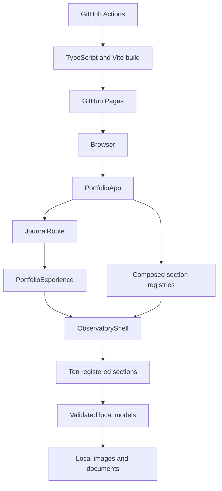
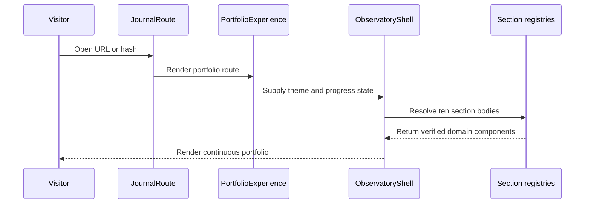

# System Architecture

## System Overview

This is a single-package static React 19 and TypeScript portfolio built by Vite. `PortfolioApp` composes five domain registries into ten section bodies and wraps the continuous portfolio in a lazy Journal hash route. `PortfolioExperience` owns theme and section-progress hooks. `ObservatoryShell` renders the masthead, sticky navigation, progress, registered sections, and footer. Local typed records, CSS Modules, images, and documents supply all content. There is no backend, database, authentication layer, or runtime application API.

## Architecture Diagram

Text alternative: the app routes between the continuous portfolio and lazy Journal page. The portfolio experience supplies state to the shell, which resolves ten section bodies from composed registries backed by validated local models and assets. GitHub Actions builds and deploys the static site.

## Component Descriptions

### React Application

- **Purpose**: Static portfolio entry point.
- **Responsibilities**: Compose domain registries and route between the portfolio and Journal.
- **Dependencies**: React, domain registry modules, Journal route, and portfolio shell.
- **Type**: Application.

### Shell and Navigation

- **Purpose**: Present the branded continuous portfolio frame.
- **Responsibilities**: Masthead, sticky section rail, theme control, progress, hash navigation, registered sections, and footer.
- **Dependencies**: Browser APIs, section registry, theme/progress hooks, and CSS tokens.
- **Type**: Presentation and client state.

### Domain Modules

- **Purpose**: Present verified identity, research, academic, evidence, impact, contact, and journal content.
- **Responsibilities**: Validate records, create view models, render accessible content, and expose focused verification boundaries.
- **Dependencies**: React, CSS Modules, shared primitives, typed source records, and local evidence.
- **Type**: Model and presentation.

### Journal Route

- **Purpose**: Load the fact-only research note outside the initial portfolio bundle.
- **Responsibilities**: Parse the journal hash, lazy-load the route entry, handle loading/error/not-found states, and return to the portfolio.
- **Dependencies**: React lazy loading, browser hashes, and research-note catalog.
- **Type**: Client route.

### Evidence Preview and Modal Boundary

- **Current active behavior**: `TextDocumentPreview` renders metadata and an external-link action; it intentionally renders no `iframe`, `object`, or modal.
- **Original-template behavior**: retained `Skills.tsx` renders first-page PDF `<object>` previews and a viewport-sized `<iframe>` modal with close and new-tab actions.
- **Reusable behavior**: retained Gallery components already implement keyboard-triggered image dialogs.
- **Requested direction**: adapt the proven preview/modal interaction to the active scientific portfolio without reactivating the legacy template.

### Resume and Full Archive Inputs

- **Resume source**: `/Users/nhamhhung/ASEAN/Resume_Minh Tam.pdf`, a four-page, 165 KB Canva PDF.
- **Archive source**: `src/assets/minh-tam/`, containing 122 files and approximately 293 MB.
- **Archive mix**: 94 JPEG, 20 PDF, 3 PNG, 3 HEIC, 1 SVG, and 1 DOCX file.
- **Current publication boundary**: the active evidence manifest publishes ten curated evidence records rather than the full source archive.
- **Constraint**: the resume must be copied into the workspace during implementation before it can become a downloadable Vite asset.

### GitHub Pages Pipeline

- **Purpose**: Build and publish the static application.
- **Responsibilities**: Install dependencies, derive the Vite base path, build, upload, and deploy.
- **Dependencies**: GitHub Actions, Node.js 20, npm, TypeScript, and Vite.
- **Type**: Infrastructure automation.

## Data Flow

Text alternative: the Journal route selects the portfolio, the experience supplies client state, and the shell resolves ten verified section bodies before rendering them to the visitor.

## Integration Points

- **External APIs and databases**: None.
- **Static hosting**: GitHub Pages.
- **External links**: Verified evidence and configured portfolio actions.
- **Email client**: Encoded local `mailto:` handoff; no site-side submission.
- **Browser APIs**: History, hash, local storage, scrolling, IntersectionObserver, and images.
- **Embedded document viewer**: Browser-native PDF rendering through `<object>` or `<iframe>`, with a fallback and new-tab access when unsupported.

## Infrastructure Components

- **Server infrastructure**: None.
- **Deployment model**: GitHub Actions builds `dist/` and publishes it to GitHub Pages.
- **Environment configuration**: `VITE_BASE_PATH` supports root and project Pages URLs.
