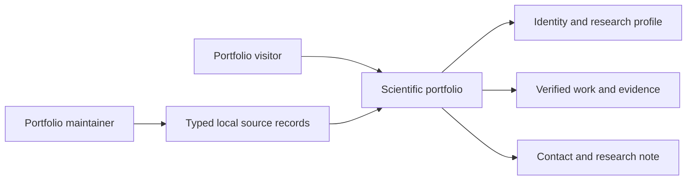

# Business Overview

## Business Context

Text alternative: a visitor uses the portfolio to understand Minh Tam's identity, research work, evidence, and contact options. The maintainer supplies typed local records that drive the published portfolio.

## Business Description

- **Purpose**: Present Tran Gia Minh Tam's science, data science, bioinformatics, academic, fieldwork, and contact profile as a verified static portfolio.
- **Primary visitors**: Admissions reviewers, educators, research mentors, collaborators, and other interested visitors.
- **Business boundary**: The site publishes local, verified content. It has no backend, accounts, database, analytics submission, or server-side contact processing.

## Business Transactions

1. Browse ten ordered portfolio sections through the continuous page and hash navigation.
2. Review identity, research questions, computational work, laboratory work, data stories, academics, evidence, tools, fieldwork, and contact information.
3. Inspect supporting evidence through safe local or external links.
4. Toggle the persistent light or dark presentation theme.
5. Open a fact-only lazy research note through a hash route and return to the portfolio.
6. Validate contact details locally and hand an encoded message to the visitor's email client.
7. Download Minh Tam's four-page resume from the portfolio.
8. Browse a structured, complete account of education, awards, research, leadership, volunteering, sports, skills, and interests derived from the supplied resume and verified assets.
9. Preview published PDFs in the page and open an accessible enlarged document viewer without losing portfolio context.
10. Browse the Minh Tam media archive through curated, labeled groupings rather than exposing raw filenames or unsupported claims.

## Business Dictionary

- **Section body**: The content component registered for one canonical portfolio section.
- **Relationship summary**: A semantic table that duplicates relationships already represented visually for accessibility and verification.
- **Evidence**: A verified local asset or safe external reference attached to a claim.
- **Research note**: A separately loaded, fact-constrained long-form page.
- **Field theme**: The site's light or dark visual mode.
- **Curated derivative**: A web-ready copy or representative asset selected from the retained source archive.
- **Document preview**: An embedded first-page PDF view with a fallback and enlarged-view action.
- **Complete content**: All supported resume categories and all reviewed asset groups represented without requiring every duplicate photograph to load eagerly.

## Component-Level Business Descriptions

- **Shell**: Presents brand, navigation, progress, theme control, and the continuous reading frame.
- **Identity and Questions**: Introduces the student and current research interests.
- **Research**: Presents computational, laboratory, and data projects with verified relationships and evidence.
- **Academics and Evidence**: Presents academic trajectory and supporting documents.
- **Tools and Fieldwork**: Connects demonstrated methods to projects and records field or leadership activity.
- **Contact and Journal**: Provides local-only contact handoff and a fact-only research note.
- **Resume**: Supplies a downloadable source document and a structure for education, honors, research, leadership, activities, sports, skills, languages, and interests.
- **Evidence archive**: Presents images and documents with provenance, captions, responsive previews, and detail views.
