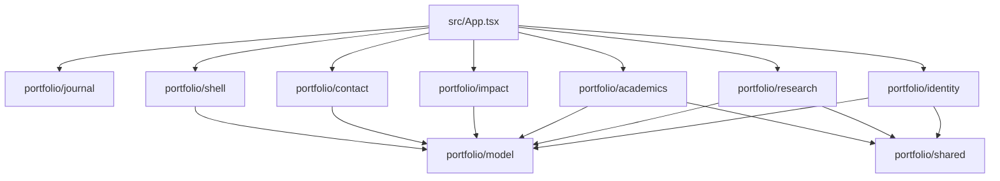

# Code Structure

## Build System

- **Package**: One npm package at the workspace root.
- **Build**: `tsc -b && vite build`.
- **Quality**: ESLint and Vitest.
- **Configuration**: `package.json`, `vite.config.ts`, TypeScript configs, ESLint config, and `.github/workflows/deploy.yml`.

## Module Hierarchy

Text alternative: the app composes Journal, Shell, Identity, Research, Academics, Impact, and Contact modules. Domain modules share portfolio models and reusable presentation primitives.

## Existing Source Inventory

- `src/App.tsx` - Active composition entry.
- `src/main.tsx` and `src/index.css` - Browser mount and global imports.
- `src/portfolio/model/` - Section definitions, verified sources, catalogs, indexes, validation, and evidence manifests.
- `src/portfolio/shell/` - Masthead, theme control, navigation, progress, body resolution, browser adapters, and state hooks.
- `src/portfolio/identity/` - Identity and research-question bodies, visual constellation, and semantic relationship summary.
- `src/portfolio/research/` - Computational, laboratory, and data-story bodies, project models, evidence, and semantic relationship summary.
- `src/portfolio/academics/` - Academic trajectory, evidence library, previews, and relationship summaries.
- `src/portfolio/impact/` - Methods/tools and fieldwork/leadership bodies.
- `src/portfolio/contact/` - Local contact validation and email-client handoff.
- `src/portfolio/journal/` - Lazy research-note route and states.
- `src/portfolio/shared/` and `src/portfolio/visualization/` - Shared accessible primitives and visualization validation.
- `src/portfolio/styles/` - Tokens and global scientific-portfolio foundations.
- `src/assets/minh-tam/` - Curated and retained source evidence.
- `src/components/`, `src/templates/`, `src/data/`, `src/hooks/`, `src/utils/`, and `src/types/` - Retained legacy presentation and supporting modules outside the active `PortfolioApp` composition.
- `scripts/portfolio/` - Boundary, recovery, candidate, measurement, and unit-specific verification tooling.

## Design Patterns

- **Registry composition**: Each domain owns distinct section bodies; composition rejects duplicate ownership.
- **Validated view models**: Pure model builders separate fact validation from rendering.
- **Progressive loading**: Journal code is lazy-loaded while the ten-section portfolio remains continuous.
- **Tokenized theming**: Root `data-theme` selects CSS custom-property values.
- **Accessibility equivalence**: Visual relationships are paired with semantic summaries; both are currently visible.
- **Candidate-first verification**: Scripts preserve boundaries, budgets, recovery hashes, and active composition.

## Critical Dependencies

- React 19 and React DOM for rendering.
- Vite 7 and TypeScript 5.9 for build and type safety.
- Vitest, Testing Library, jest-dom, and jsdom for automated verification.
- React Markdown for the research note.
- CSS Modules and custom properties for active styling.
