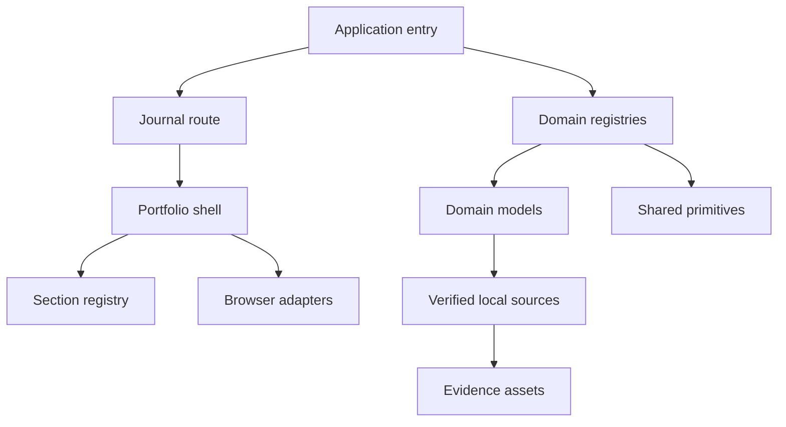

# Dependencies

## Internal Dependencies

Text alternative: the application entry uses the Journal route and domain registries. The route renders the shell; registries use domain models and shared primitives; the shell uses the section registry and browser adapters; models use verified local sources and evidence assets.

## External Runtime Dependencies

- `react` and `react-dom` 19.2.3 - active UI rendering.
- `react-markdown` 10.1.0 - active research-note rendering.
- `@chakra-ui/react`, `@chakra-ui/icons`, `@emotion/react`, `next-themes`, `react-icons`, `tailwindcss`, and `@tailwindcss/vite` - installed dependencies retained mainly for legacy presentation or build integration.

## Development Dependencies

- TypeScript, Vite, SWC React, and vite-tsconfig-paths - compilation and bundling.
- ESLint and TypeScript ESLint packages - static quality checks.
- Vitest, Testing Library, jest-dom, and jsdom - model and DOM verification.
- Prettier - formatting compatibility.

## Infrastructure Dependencies

- GitHub Actions checkout, Node setup, Pages configuration, artifact upload, and Pages deployment actions.
- No runtime server, cloud SDK, database client, or network service dependency.
