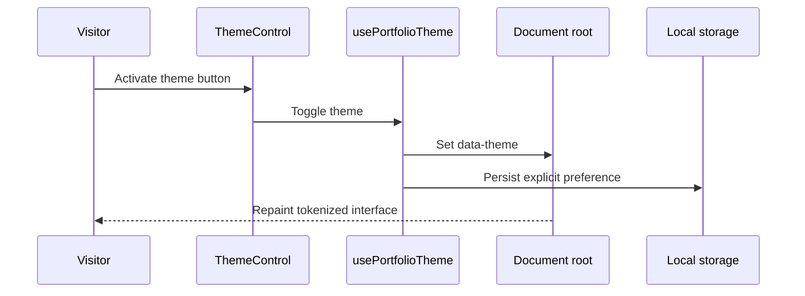
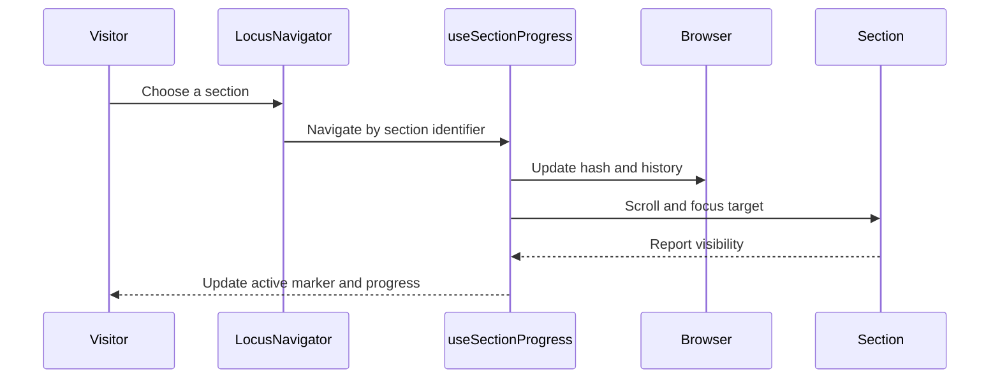
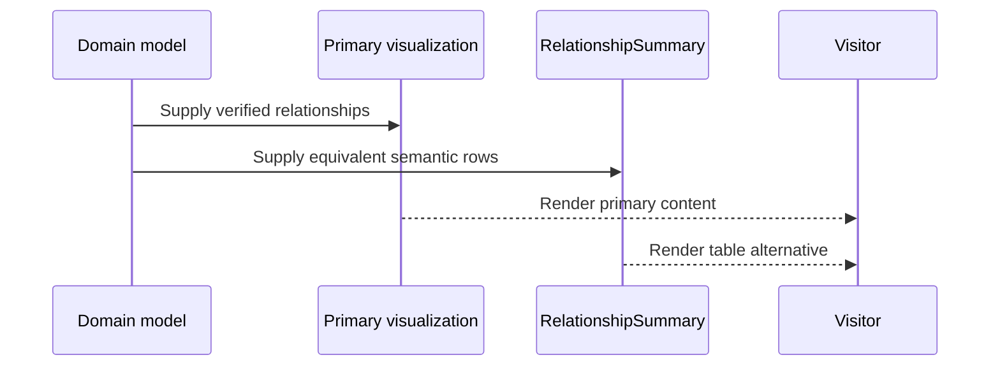

# Interaction Diagrams

## Theme Selection

Text alternative: activating the theme button toggles the theme hook, updates the root theme attribute, persists the preference when possible, and repaints the tokenized interface.

## Section Navigation

Text alternative: choosing a section updates the browser hash, moves to the registered target, and uses visibility observations to refresh the active navigation marker and progress.

## Relationship Summary Rendering

Text alternative: the domain model supplies the same relationships to primary visual content and a semantic table alternative. Both are currently visible.
